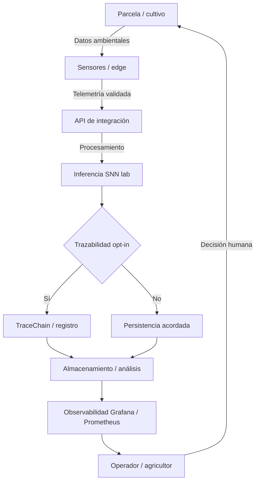

# Prontuario maestro — integración biológica-digital (2026)

*Sistema de **equivalencias técnicas y éticas** para agricultura digital soberana: cada fila indica **qué existe en CASTÚO**, **qué es analogía** y **dónde corta la comparación**. No sustituye DPIA, agrónomo ni datasheet de sensores.*

**Relación:** [PRONTUARIO-MAESTRO-ECOLOGIA-DIGITAL-AGRICOLA-2026.md](./PRONTUARIO-MAESTRO-ECOLOGIA-DIGITAL-AGRICOLA-2026.md) *(marco ecológico amplio)* · [NEUROMORPHIC-MEMRISTOR-ORIENTACION-2026.md](../integrations/NEUROMORPHIC-MEMRISTOR-ORIENTACION-2026.md) · [PRONTUARIO-MAESTRO-REFUERZO-INTEGRAL-2026.md](./PRONTUARIO-MAESTRO-REFUERZO-INTEGRAL-2026.md) · [TraceChain-Compliance-2026.md](../legal/TraceChain-Compliance-2026.md) · [CHECKLIST-INTEGRACION-BIODIGITAL.md](./CHECKLIST-INTEGRACION-BIODIGITAL.md) · [MAPA-REDES-SIMBIOTICAS.md](./MAPA-REDES-SIMBIOTICAS.md) · [PRONTUARIO-ECOLOGIA-DIGITAL.md](./PRONTUARIO-ECOLOGIA-DIGITAL.md)

---

## 📋 1. Principios de integración honesta

1. **Analogías explícitas** — Cada equivalencia biológica enlaza a **componente o patrón real** (código, API, doc) o se marca como **solo pedagógica**.  
2. **Límite visible** — Donde termina la metáfora y empieza la ingeniería debe ser **una frase** en la tabla, no un pie de página perdido.  
3. **Ética agrícola** — Priorizar decisiones que **no contradigan** ciclos hídricos y edáficos sin evidencia; el software **recomienda**, el territorio **decide**.  
4. **Soberanía tecnológica** — Preferir FOSS auditables y proveedores **UE/EEE** cuando haya paridad; inventario contractual aparte.  
5. **Datos como recurso** — Minimización, retención y calidad alineadas a [DPIA-Robotics-2026.md](../legal/DPIA-Robotics-2026.md).

---

## 🔧 2. Matriz de equivalencias técnicas

### 2.1 Proceso biológico ↔ componente digital *(con límites)*

| Proceso biológico | Equivalente digital | Implementación real en CASTÚO *(cuando aplica)* | Límite de la analogía |
|-------------------|---------------------|---------------------------------------------------|------------------------|
| Fotosíntesis | Inferencia en tiempo real con señales ambientales | Lab **SNN** + JSON de sensores (`neuromorphic_edge`) | **No** hay conversión química de CO₂; solo procesamiento de datos. |
| Sistema radicular | Red de captación distribuida | Sensores en edge/gateway *(despliegue propio)* | **No** hay IoT subterráneo ni SNN en raíz en este repositorio; sin nanopartículas ni MG. |
| Micorrizas | Intercambio planta–medio vía interfaz | APIs REST / contratos OpenAPI entre módulos | **Sin** interfaz física con rizosfera; es intercambio **lógico**. |
| Ciclo de nutrientes | Flujo de datos entre servicios | Microservicios / módulos backend | **Pedagogía** de flujo; **no** equivalencia química N-P-K en CPU. |
| Defensas vegetales | Controles de seguridad | Hardening LLMNR/mDNS, firewall, playbook | **No** es metabolismo de defensa; reduce abuso en la **capa digital**. |
| Crecimiento vegetal | Escalado y mejora continua | Métricas, SLO, optimización de carga | **No** hormonas; es **capacidad** y **estabilidad** del servicio. |

---

## 📊 3. Nutrientes como analogía pedagógica

### 3.1 Tabla de “nutrientes digitales” *(no bioquímica)*

| Nutriente agrícola | Equivalente digital | Función en el sistema | Fuente / anclaje real |
|--------------------|--------------------|-----------------------|------------------------|
| N | Información estructurada | Decisiones coherentes | Esquemas **Pydantic**, SQL; **TraceChain** = trazabilidad/registro opt-in, **no** sustituto de BD relacional. |
| P | Capacidad de cómputo pico | Inferencia bajo demanda | Procesos backend + **SNN sim**; caché **Redis** en rutas lab *(si configurado)*. |
| K | Flujo entre módulos | Regulación de comunicación | APIs, colas, rate limits *(según despliegue)*. |
| Ca | Integridad estructural | Consistencia y no repudio | Transacciones DB, hashes, cadena opt-in — [TraceChain-Compliance-2026.md](../legal/TraceChain-Compliance-2026.md). |
| Mg | Núcleo operativo | Servicios críticos en ejecución | FastAPI / workers principales; “neuromorphic edge” en repo = **procesamiento software**, no silicio neuromórfico de campo. |

**Nota:** Estas filas son **herramientas didácticas**. El software **no** realiza procesos bioquímicos ni altera el metabolismo de las plantas.

---

## 🔬 4. Procesadores vegetales y técnicos

| Proceso vegetal | Equivalente digital | Implementación real | Límite técnico |
|-----------------|---------------------|---------------------|----------------|
| Fotosíntesis | Pipeline de inferencia | SNN + sensores en payload | Solo datos; sin fijación de carbono real. |
| Transpiración | Disipación de carga térmica / backpressure | Infra de refrigeración, límites de cola | Clima de DC o invernadero **físico** es expediente aparte. |
| Respiración radicular | Uso de memoria / I/O | Política de caché Redis, TTL | Gestión de recursos **informáticos**. |
| Translocación | Enrutamiento | Microservicios, gateways | Flujo **de mensajes**, no xilema/floema. |
| Senescencia | Fin de vida de datos | Archivado, borrado, minimización RGPD | Política de retención, no muerte celular. |

---

## 🌐 5. Protocolos de comunicación

### 5.1 Red simbiótica *(vista lógica — validar contra despliegue)*

### 5.2 Protocolos digitales reales

| Señal biológica *(metáfora)* | Patrón digital | Implementación típica |
|------------------------------|----------------|------------------------|
| Química | API síncrona | REST/OpenAPI entre módulos |
| Eléctrica / rápida | Eventos / spikes | Colas, WebSockets; **SNN con spikes simulados** en software |
| Hormonal | Orquestación | Arquitectura orientada a eventos *(si se adopta)* |

---

## 📈 6. Métricas reales del sistema

### 6.1 Parcela *(agronomía)* vs plataforma *(software)*

| Métrica agrícola | Fuente en campo | Métrica / indicador digital relacionado | Baseline |
|------------------|-----------------|----------------------------------------|----------|
| Humedad sustrato/suelo (%) | Sensores IoT calibrados | Disponibilidad del servicio, latencia de ingestión | Definir en Prometheus/Grafana |
| pH solución/suelo | Sensores de calidad | Ratio de rechazos **422** (validación), deriva de sensor | Logs API + alertas |
| CE (conductividad eléctrica) | Sensor de nutrición | **No** confundir con “tráfico de red”; si se usa analogía, documentar como **pedagogía**. En ops: throughput o error rate | Medir en vuestro entorno |
| Materia orgánica (%) | Análisis de suelo | Volumen y calidad de históricos útiles vs ruido | Política de datos + informes |
| Nutrientes (N-P-K en lab/suelo) | Laboratorio / sondas | CPU/RAM/colas como **capacidad** — analogía débil; preferir métricas directas (`castuo_neuro_hydro_infer_seconds`, etc.) | Archivar primera medición |

*No fijar objetivos numéricos en el git sin medición previa.*

---

## 📜 7. Documentación y recursos

| Documento | Propósito | Enlace |
|-----------|-----------|--------|
| **Este prontuario** | Carta de equivalencias honestas | *(este archivo)* |
| Ecología digital agrícola | Marco ecológico amplio | [PRONTUARIO-MAESTRO-ECOLOGIA-DIGITAL-AGRICOLA-2026.md](./PRONTUARIO-MAESTRO-ECOLOGIA-DIGITAL-AGRICOLA-2026.md) |
| Índice | Entrada rápida | [PRONTUARIO-ECOLOGIA-DIGITAL.md](./PRONTUARIO-ECOLOGIA-DIGITAL.md) |
| Checklist | Evidencia en integración | [CHECKLIST-INTEGRACION-BIODIGITAL.md](./CHECKLIST-INTEGRACION-BIODIGITAL.md) |
| Mapa | Diagramas | [MAPA-REDES-SIMBIOTICAS.md](./MAPA-REDES-SIMBIOTICAS.md) |

---

## 🎯 8. Conclusión y recomendaciones

### 8.1 Top 3 acciones prioritarias

1. **Ingesta honesta** — Sensores reales con validación y calibración documentada.  
2. **Intercambio seguro** — APIs, TLS, secretos y hardening de red según [refuerzo integral](./PRONTUARIO-MAESTRO-REFUERZO-INTEGRAL-2026.md).  
3. **Observabilidad** — Dashboards con métricas **medidas**, no solo analogías en tablas.

### 8.2 Plan de integración responsable *(orientativo)*

| Fase | Objetivo | Resultado esperado |
|------|----------|-------------------|
| Meses 1–2 | Base técnica y límites escritos | Equipo alineado: qué es metáfora y qué es código |
| Meses 3–4 | Flujos de datos y calidad | Baselines archivados; menos decisiones sobre datos basura |
| Meses 5–6 | Documentación y revisión ética | Actualización DPIA si cambia tratamiento; checklist cerrada con evidencia |

---

🚜 *Pa'lante, campeón.* 🌱

*Integración honesta: el mapa advierte del pantano; la analogía no sustituye la bota de campo.*
