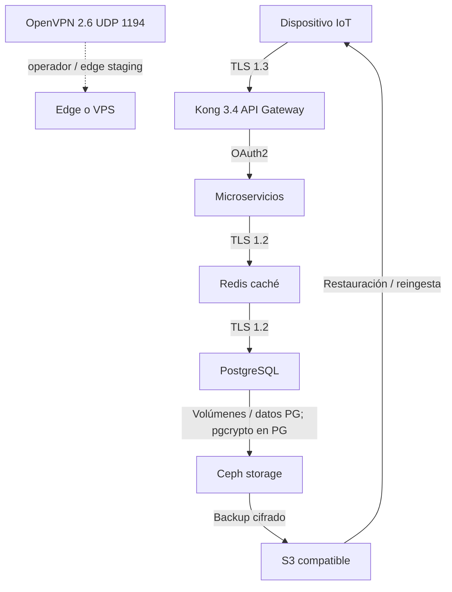
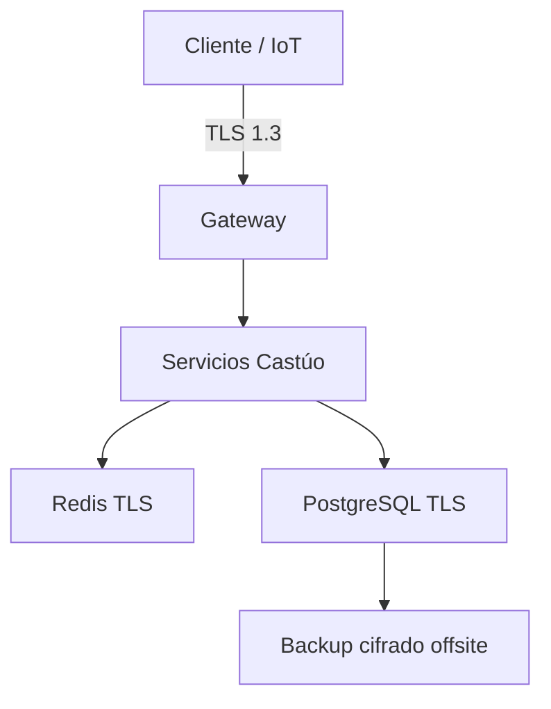

# Prontuario maestro — integración cifrada soberana (2026)

*Implementación práctica con **énfasis en staging** y **soberanía europea** como criterio. OVH (Francia), Aiven (Finlandia) y similares son **ejemplos** de sede/región UE — las certificaciones efectivas figuran en **contrato y DPA**. No sustituye revisión criptográfica ni DPIA.*

**Relación:** [PRONTUARIO-MAESTRO-ENCRIPTACION-ROLES-V2.5.md](../legal/PRONTUARIO-MAESTRO-ENCRIPTACION-ROLES-V2.5.md) · [ENCRYPTION_9_CAPAS_V1.7.1.md](../security/ENCRYPTION_9_CAPAS_V1.7.1.md) · [CASTUO-SECURITY-VSA-PQC-EXECUTIVE.md](../security/CASTUO-SECURITY-VSA-PQC-EXECUTIVE.md) · [PRONTUARIO-REFUERZO-SECRETS-VAULT-2026.md](../legal/PRONTUARIO-REFUERZO-SECRETS-VAULT-2026.md) · [VAULT_KV_PATHS.md](../../backend/security/VAULT_KV_PATHS.md) · [PRONTUARIO-MAESTRO-INFRAESTRUCTURA-SOBERANA-TRL6-TRL7-2026.md](./PRONTUARIO-MAESTRO-INFRAESTRUCTURA-SOBERANA-TRL6-TRL7-2026.md) · [PRONTUARIO-MAESTRO-REFUERZO-INTEGRAL-2026.md](./PRONTUARIO-MAESTRO-REFUERZO-INTEGRAL-2026.md) · [DPIA-Robotics-2026.md](../legal/DPIA-Robotics-2026.md) · [CHECKLIST-CIFRADO-TOTAL.md](./CHECKLIST-CIFRADO-TOTAL.md) · [POLITICA-ROTACION-CLAVES.md](./POLITICA-ROTACION-CLAVES.md) · [PRONTUARIO-INTEGRACION-CIFRADA.md](./PRONTUARIO-INTEGRACION-CIFRADA.md)

---

## 📋 1. Principios de integración cifrada

| Principio | Enfoque práctico |
|-----------|------------------|
| **Soberanía** | Proveedores con sede/tratamiento en **UE/EEA** y DPA acordes *(ej.: **OVH** Francia, **Aiven** Finlandia)* — “certificado” solo si consta en **contrato**. |
| **Código abierto** | Priorizar **EUPL** / **AGPL-3.0** donde encaje; otros FOSS del stack con licencia propia *(p. ej. **PostgreSQL**: licencia PostgreSQL; **Ceph**: principalmente **LGPL-2.1** — ver fichero `LICENSE` de cada versión).* |
| **Gestión de secretos** | **Vault** + rotación **trimestral** *(orientativa)* y **revisión en staging** antes de prod — [POLITICA-ROTACION-CLAVES.md](./POLITICA-ROTACION-CLAVES.md). |
| **Disponibilidad** | **SLO medidos en staging**: p. ej. **99,9 %** servicios críticos — a demostrar con ventana y métricas, no promesa del git. |
| **Validación** | **Pruebas exhaustivas en staging** → evidencia → producción. |

---

## 🔧 2. Arquitectura de cifrado real

### 2.1 Componentes y configuraciones *(staging / prod — validar versión)*

| Componente | Tecnología | Configuración de cifrado | Notas |
|------------|------------|--------------------------|--------|
| Comunicaciones | **OpenVPN 2.6** + TLS *(control channel)* | `TLS_ECDHE_ECDSA_WITH_AES_256_GCM_SHA384` | **Kyber-1024 / PQ híbrido** solo **staging** para evaluación. **UDP 1194** típico OpenVPN — no es el mismo canal que HTTPS al gateway. |
| API Gateway | **Kong 3.4** *(u otro proxy)* | TLS 1.2+ y OAuth2/OIDC | Soberanía por **región + DPA**, no por origen del software. |
| Base de datos | **PostgreSQL 14+** | TLS; **pgcrypto** (AES-256) a nivel aplicación si aplica | **Sin TDE nativo**. Claves desde **Vault** / sesión; reposo en volumen/proveedor. |
| Caché | **Redis 7.0** *(TLS desde 6+)* | TLS 1.2+; `--port 0` | Sellado opcional a nivel aplicación. |
| Almacenamiento | **Ceph** / objeto | Cifrado filesystem / KMS / oferta proveedor | Depende del proveedor *(ej. **OVH** Object Storage / bloque en región UE)*. |

### 2.2 API y PQC en aplicación

| Tema | Nota |
|------|------|
| JWT / OAuth2 | Algoritmos estándar; PQC en **payloads** vía `pq_crypto.py` si el diseño lo exige. |

---

## 📊 3. Flujo de datos cifrados

### 3.1 Diagrama de integración realista *(staging)*



**Notas del diagrama**

- **UDP 1194:** canal **OpenVPN** (túnel); **no** sustituye **TLS 1.3** entre IoT y API *(típ. TCP 443)*.  
- **pgcrypto** solo en **PostgreSQL**; **no** en Ceph. La arista E→F es **persistencia / bloques**, no “pgcrypto en objeto”.  
- **Backup S3 compatible:** p. ej. **OVH Object Storage** u otro con cifrado y DPA acordados.  
- **G → A:** **restauración** o nueva ingesta tras copia; opcional según arquitectura.

### 3.2 Diagrama compacto alternativo



### 3.3 Cifrado por capa

| Capa | Mecanismo | Verificación |
|------|-----------|--------------|
| Transporte | TLS 1.3 / 1.2 endurecido | `openssl s_client`, `curl -v`, testssl.sh *(autorizado)* |
| Autenticación | OAuth2/OIDC | Logs IdP |
| Reposo | Disco / KMS / pgcrypto selectivo | Checklist |
| Backup | restic/rclone / S3 SSE-KMS | `restic check`, prueba de restauración |

---

## 🔒 4. Configuraciones para staging

### 4.1 OpenVPN con TLS 1.3 *(staging)*

```bash
# Configuración base — evitar duplicar flags ya presentes en server.conf
openvpn --config /etc/openvpn/server.conf \
  --tls-cipher TLS_ECDHE_ECDSA_WITH_AES_256_GCM_SHA384
```

**Validación —** `openssl s_client` **solo** si hay **TCP** en el puerto probado (p. ej. 1194 con `proto tcp-server`):

```bash
openssl s_client -connect localhost:1194 -servername staging.castuo-system.eu </dev/null
```

**Nota crítica:** OpenVPN usa **UDP** por defecto **(p. ej. 1194/udp)**. `openssl s_client` **no** valida el datagrama OpenVPN; usar **cliente OpenVPN** real o endpoint TCP/documentación de management.

### 4.2 PostgreSQL con `pgcrypto`

```sql
CREATE EXTENSION IF NOT EXISTS pgcrypto;

-- Implementación segura para staging (clave fuera del SQL versionado)
CREATE OR REPLACE FUNCTION encrypt_data(data TEXT) RETURNS BYTEA AS $$
BEGIN
  RETURN pgp_sym_encrypt(data, current_setting('app.encryption_key', true));
END;
$$ LANGUAGE plpgsql SECURITY DEFINER;
```

**Notas de seguridad**

- Claves gestionadas por **Vault** (o sesión) vía `SET LOCAL`; **nunca** literales en repo.  
- `SECURITY DEFINER`: analizar **OWNER**, `search_path` y `EXECUTE`.  
- **Revisión trimestral** de procedimientos y claves de **staging** antes de alinear prod ([POLITICA-ROTACION-CLAVES.md](./POLITICA-ROTACION-CLAVES.md)).

### 4.3 Redis con TLS

```bash
redis-server --tls-port 6379 \
  --port 0 \
  --tls-cert-file /etc/redis/redis.crt \
  --tls-key-file /etc/redis/redis.key \
  --tls-ca-cert-file /etc/redis/ca.crt
```

**Validación:**

```bash
redis-cli --tls --cert /etc/redis/client.crt --key /etc/redis/client.key --cacert /etc/redis/ca.crt PING
```

*Si el servidor no exige certificado de cliente, puede bastar `--tls --cacert /etc/redis/ca.crt PING` según `tls-auth-clients`.*

---

## 📈 5. Verificación y monitoreo

### 5.1 Comandos de validación *(staging; rutas según SO)*

```bash
openssl s_client -connect localhost:6379 -servername localhost -showcerts </dev/null
```

```bash
psql "host=localhost dbname=castuo sslmode=verify-full sslrootcert=/etc/ssl/certs/ca-certificates.crt"
```

*(En Debian/Ubuntu la ruta CA del sistema es frecuente; en otros SO usar el bundle CA correcto.)*

```bash
curl -v https://api.staging.castuo-system.eu
```

### 5.2 Monitorización continua *(recomendado)*

- Alertas por fallos de handshake TLS y caducidad de certificados.  
- Revisión periódica de logs de autenticación (IdP / proxy).  
- Tras actualizar OpenVPN, PostgreSQL o Redis: **regresión** en staging antes de prod.

### 5.3 Métricas

Medir SLO (p. ej. 99,9 % en staging) con **ventanas y definición de “crítico”** documentadas — sin cifras contractuales fijas en el git.

---

## 📜 6. Documentación y recursos

| Documento | Propósito | Enlace |
|-----------|-----------|--------|
| Checklist cifrado | Implementación por capas | [CHECKLIST-CIFRADO-TOTAL.md](./CHECKLIST-CIFRADO-TOTAL.md) |
| Rotación | Plantilla **trimestral** (revisión en staging) | [POLITICA-ROTACION-CLAVES.md](./POLITICA-ROTACION-CLAVES.md) |
| Índice | Entrada rápida | [PRONTUARIO-INTEGRACION-CIFRADA.md](./PRONTUARIO-INTEGRACION-CIFRADA.md) |
| Roles / PQC código | Cifrado en app | [PRONTUARIO-MAESTRO-ENCRIPTACION-ROLES-V2.5.md](../legal/PRONTUARIO-MAESTRO-ENCRIPTACION-ROLES-V2.5.md) |

---

## 🎯 7. Conclusión y plan de acción

### 7.1 Top 3 acciones prioritarias

1. **Implementar cifrado en tránsito**  
   - OpenVPN **2.6** + TLS en staging *(UDP 1194 según diseño)*.  
   - Validar con **herramientas adecuadas**: cliente OpenVPN; `openssl s_client` **solo** si hay **TCP** TLS en ese puerto.

2. **Configurar cifrado en PostgreSQL**  
   - `pgcrypto` donde haya requisito; **gestión de claves con Vault**.  
   - Probar y documentar en **staging** antes de producción.

3. **Aplicar TLS a Redis**  
   - Configuración básica `--tls-port` / `--port 0` + CA.  
   - Validar conexiones cifradas con `redis-cli --tls` y `PING`.

### 7.2 Recomendaciones prácticas

| Área | Acción |
|------|--------|
| **Staging** | Validar **todas** las configuraciones en entorno no productivo; documentar resultados y ajustar antes de prod. |
| **Secretos** | **Rotación trimestral** de certificados *(orientativa)*; revisión en staging antes de aplicar en prod — [POLITICA-ROTACION-CLAVES.md](./POLITICA-ROTACION-CLAVES.md). |
| **Monitorización** | Alertas por fallos de cifrado/TLS; **revisión semanal** de logs de autenticación *(cadencia ajustable por política)*. |
| **Actualización** | Versiones al día (**OpenVPN**, **PostgreSQL**, **Redis**, **Kong**); revalidar TLS tras cada actualización mayor. |

### 7.3 Fases *(orientativas)*

| Fase | Objetivo |
|------|----------|
| 1–2 | Tránsito completo en staging + inventario DPA |
| 3–4 | Reposo + backup cifrado S3-compatible + prueba restauración |
| 5–6 | Observabilidad SLO, rotación disciplinada, DPIA si cambia tratamiento |

---

## Anexo — problemas comunes

- **OpenVPN UDP:** no uses solo `openssl s_client` al 1194 UDP — prueba con `openvpn --config client.conf` o escenario TCP documentado.  
- **PostgreSQL:** `SELECT * FROM pg_available_extensions WHERE name = 'pgcrypto';`  
- **Redis:** rutas reales a `client.crt` / `ca.crt`.

---

🔐 *Cifrado soberano: staging que miente menos que un press kit — ahí se gana la auditoría.*
