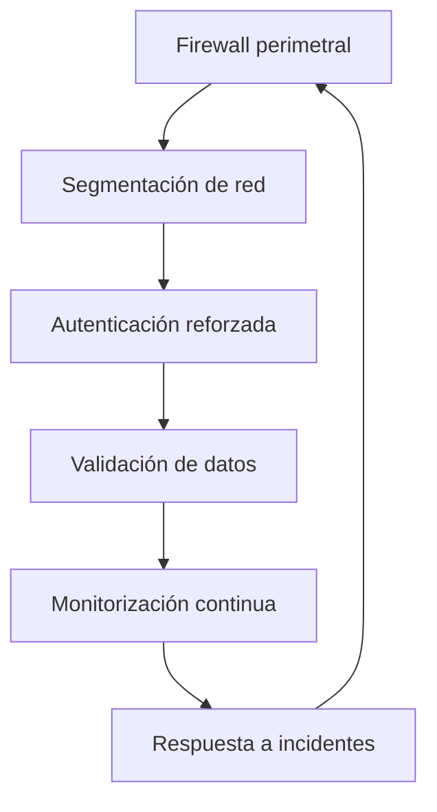

# Prontuario maestro — refuerzo integral CASTÚO-System (2026)

*Estrategia **unificada**: seguridad avanzada, **criterio** de soberanía europea en datos/proveedores y **evolución resiliente** verificable. Este documento **ordena** el corpus; el detalle técnico vive en los prontuarios enlazados.*

**Relación:** [PRONTUARIO-MAESTRO-INTEGRACION-CIFRADA-SOBERANA-2026.md](./PRONTUARIO-MAESTRO-INTEGRACION-CIFRADA-SOBERANA-2026.md) · [PRONTUARIO-MAESTRO-REFUERZO-SEGURIDAD-AVANZADA-2026.md](./PRONTUARIO-MAESTRO-REFUERZO-SEGURIDAD-AVANZADA-2026.md) · [PRONTUARIO-MAESTRO-INFRAESTRUCTURA-SOBERANA-TRL6-TRL7-2026.md](./PRONTUARIO-MAESTRO-INFRAESTRUCTURA-SOBERANA-TRL6-TRL7-2026.md) · [PRONTUARIO-MAESTRO-EVOLUCION-SISTEMA-2026.md](./PRONTUARIO-MAESTRO-EVOLUCION-SISTEMA-2026.md) · [PRONTUARIO-MAESTRO-AUDITORIA-EVOLUCION-RESILIENTE-2026.md](./PRONTUARIO-MAESTRO-AUDITORIA-EVOLUCION-RESILIENTE-2026.md) · [PRONTUARIO-MAESTRO-SEGURIDAD-MULTILINKER-2026.md](./PRONTUARIO-MAESTRO-SEGURIDAD-MULTILINKER-2026.md) · [CHECKLIST-REFUERZO-SEGURIDAD.md](./CHECKLIST-REFUERZO-SEGURIDAD.md) · [DPIA-Robotics-2026.md](../legal/DPIA-Robotics-2026.md)

---

## 📋 1. Principios de refuerzo integral

| Principio | Significado operativo |
|-----------|------------------------|
| **Seguridad por diseño** | Medidas en perímetro, red, identidad, datos y observabilidad; sin “capa única mágica”. |
| **Soberanía europea** *(criterio)* | Priorizar proveedores y regiones **UE/EEE** y FOSS auditables cuando haya **paridad técnica**; inventario DPA y subencargados — no afirmar “100 % UE” sin evidencia contractual. |
| **Resiliencia operativa** | Objetivo de disponibilidad **a medir** (p. ej. 99,9 % → 99,99 %) con SLO internos, no promesa genérica del repositorio. |
| **Código abierto** | Preferir EUPL/AGPL u otras licencias compatibles con política interna; revisar **Elastic/ELK** vs **OpenSearch** según licencia vigente. |
| **Evolución verificable** | Cambios con métricas **baselines** reales, tests, commits y runbooks — el territorio no vota promesas sin medición. |

---

## 🔧 2. Arquitectura de seguridad avanzada (visión unificada)

### 2.1 Capas de seguridad

### 2.2 Soluciones soberanas *(ilustrativas — cotizar y validar con arquitectura)*

| Capa | Ejemplo UE / FOSS | Implementación | Estándar *(referencia)* |
|------|-------------------|------------------|-------------------------|
| Perímetro | Firewall cloud *(p. ej. OVH)* + reglas mínimas | Entrada/salida explícita; sin exposición de paneles | ISO 27001 *(marco)* |
| Red | VPC proveedor + **nftables**/iptables en host | VLANs / SG acordados con bastión si aplica | CIS Controls v8 |
| Autenticación | IdP *(p. ej. Keycloak)* + MFA/YubiKey vía política IAM | Segundo factor en superficies críticas | Política interna + NIST *(guía)* |
| Validación | Pydantic / capas de esquema en API | 422 trazables; coherencia con decisiones agrícolas | OWASP API Security |
| Monitorización | Netdata, Grafana, **OpenSearch**/ELK según licencia | Alertas con propietario y runbook | ITIL / práctica interna |

*La soberanía se demuestra con **ubicación del tratamiento**, **encargados** y **DPIA** actualizada, no solo con nombres de marca.*

---

## 📊 3. Vulnerabilidades críticas y refuerzos *(resumen)*

*Tabla alineada al análisis extendido en el prontuario de seguridad avanzada.*

| Vulnerabilidad | Impacto | Refuerzo | Plazo orientativo | Responsable típico |
|----------------|---------|----------|-------------------|-------------------|
| LLMNR / NBT-NS poisoning | Credenciales / relay en LAN mixta | `systemd-resolved` + GPO Windows; evidencia `tcpdump` | 1 semana | DevOps |
| Validación de sensores incompleta | Decisiones agrícolas erróneas | Pydantic por ruta / middleware común | 2–4 semanas | Backend |
| Falta de segmentación | Movimiento lateral | FW proveedor + nftables *(staging primero)* | 2 semanas | SRE |
| Auth sin MFA | Abuso de secretos robados | IdP + MFA en superficies acordadas | 3 semanas | Security |
| Logs sin correlación | Detección tardía | OpenSearch/ELK u SIEM gestionado | 1 mes | Monitoring |

**Detalle técnico:** [PRONTUARIO-MAESTRO-REFUERZO-SEGURIDAD-AVANZADA-2026.md §5](./PRONTUARIO-MAESTRO-REFUERZO-SEGURIDAD-AVANZADA-2026.md).

---

## 🛡️ 4. Implementaciones técnicas

No duplicar aquí los fragmentos largos: mantienen una sola fuente de verdad.

| Tema | Dónde está el procedimiento canónico |
|------|--------------------------------------|
| LLMNR / mDNS / NBT-NS | [Evolución §2.2](./PRONTUARIO-MAESTRO-EVOLUCION-SISTEMA-2026.md) · [Refuerzo avanzado §5.1](./PRONTUARIO-MAESTRO-REFUERZO-SEGURIDAD-AVANZADA-2026.md) · **Evitar** `tee -a` ciego sobre `resolved.conf` |
| Middleware / Pydantic | [Refuerzo avanzado §5.2](./PRONTUARIO-MAESTRO-REFUERZO-SEGURIDAD-AVANZADA-2026.md) |
| nftables | [Refuerzo avanzado §5.3](./PRONTUARIO-MAESTRO-REFUERZO-SEGURIDAD-AVANZADA-2026.md) *(staging; riesgo de aislamiento)* |
| MFA / YubiKey | [Refuerzo avanzado §5.4](./PRONTUARIO-MAESTRO-REFUERZO-SEGURIDAD-AVANZADA-2026.md) *(sin servicio docker fijo en repo)* |
| Correlación de logs | [Refuerzo avanzado §5.5](./PRONTUARIO-MAESTRO-REFUERZO-SEGURIDAD-AVANZADA-2026.md) |
| Infra UE / migración TRL7 | [Infraestructura soberana](./PRONTUARIO-MAESTRO-INFRAESTRUCTURA-SOBERANA-TRL6-TRL7-2026.md) · [CHECKLIST-MIGRACION-TRL7.md](./CHECKLIST-MIGRACION-TRL7.md) |

---

## 📈 5. Métricas de seguridad y resiliencia

*No se publican valores “actuales” ficticios en el repo. Establecer **línea base** tras la primera medición y archivar informe.*

| KPI | TRL / fase | Meta *(definir internamente)* | Herramienta típica |
|-----|------------|-------------------------------|-------------------|
| `incident_response_time` | Refuerzo 1–6 m | Mejora vs baseline | Runbook + ticketing |
| Fallos de autenticación | Continuo | Umbral y alerta | IdP / proxy |
| Cumplimiento segmentación | Trimestral | Checklist + escaneo autorizado | nmap / FW audit |
| Errores validación sensores | Continuo | Ratio 422 / volumen | Logs API |
| `system_uptime` / SLO | Con infra soberana | Objetivo tras medición | Netdata / proveedor |

---

## 📜 6. Documentación y cumplimiento

| Documento | Propósito | Enlace |
|-----------|-----------|--------|
| **Este prontuario** | Mapa integral refuerzo + soberanía + evolución | *(este archivo)* |
| Refuerzo seguridad avanzada | Vulnerabilidades, herramientas, snippets | [PRONTUARIO-MAESTRO-REFUERZO-SEGURIDAD-AVANZADA-2026.md](./PRONTUARIO-MAESTRO-REFUERZO-SEGURIDAD-AVANZADA-2026.md) |
| Checklist refuerzo | Seguimiento unificado | [CHECKLIST-REFUERZO-SEGURIDAD.md](./CHECKLIST-REFUERZO-SEGURIDAD.md) |
| Runbook incidentes | Respuesta operativa | [RUNBOOK-RESPUESTA-INCIDENTES.md](./RUNBOOK-RESPUESTA-INCIDENTES.md) |
| DPIA vigente | Tratamiento y medidas | [DPIA-Robotics-2026.md](../legal/DPIA-Robotics-2026.md) |

---

## 🎯 7. Conclusión y plan de acción

### 7.1 Top 5 acciones prioritarias

1. **LLMNR / NBT-NS** — Cerrar vector LAN documentado (1 semana).  
2. **MFA** en superficies críticas según IAM (2 semanas).  
3. **Segmentación** — Diseño + prueba en staging (2 semanas).  
4. **Validación de datos** — Cobertura Pydantic acordada (1 mes).  
5. **Correlación de logs** — Stack elegido por licencia y capacidad (1 mes).

### 7.2 Plan de refuerzo ~6 meses *(orientativo)*

| Fase | Objetivo | Resultado esperado *(con evidencia)* |
|------|----------|--------------------------------------|
| Meses 1–2 | Críticos red + identidad | Checklist + capturas + playbook host verificado |
| Meses 3–4 | Detección y respuesta | TTR medido; tabletop; alertas con dueño |
| Meses 5–6 | Soberanía infra + documentación | Inventario DPA; avance TRL7 según [CHECKLIST-MIGRACION-TRL7](./CHECKLIST-MIGRACION-TRL7.md) |

---

🚜 *Pa'lante, campeón.* 🌱

*Refuerzo integral: una brújula para el territorio — capas alineadas, soberanía demostrable y métricas que nacen del agua medida, no del deseo.*
