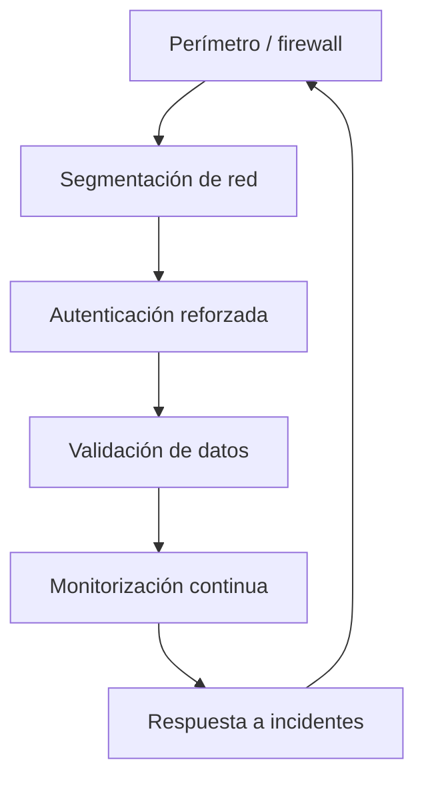

# Prontuario maestro — refuerzo y seguridad avanzada (2026)

*Estrategia integral para fortalecer CASTÚO-System: **seguridad avanzada** y **resiliencia operativa**. No sustituye mandato legal, pentest firmado ni política interna de red.*

**Relación:** [PRONTUARIO-MAESTRO-REFUERZO-INTEGRAL-2026.md](./PRONTUARIO-MAESTRO-REFUERZO-INTEGRAL-2026.md) *(mapa unificado)* · [PRONTUARIO-MAESTRO-SEGURIDAD-MULTILINKER-2026.md](./PRONTUARIO-MAESTRO-SEGURIDAD-MULTILINKER-2026.md) · [PRONTUARIO-MAESTRO-EVOLUCION-SISTEMA-2026.md](./PRONTUARIO-MAESTRO-EVOLUCION-SISTEMA-2026.md) · [PRONTUARIO-MAESTRO-AUDITORIA-EVOLUCION-RESILIENTE-2026.md](./PRONTUARIO-MAESTRO-AUDITORIA-EVOLUCION-RESILIENTE-2026.md) · [CHECKLIST-TRL6-HETZNER-STAGING.md](./CHECKLIST-TRL6-HETZNER-STAGING.md) · [DPIA-Robotics-2026.md](../legal/DPIA-Robotics-2026.md) · [alerts.md](../monitoring/alerts.md)

---

## 📋 1. Principios de fortalecimiento

*Fundamentos para seguridad avanzada y evolución resiliente.*

1. Enfoque en vulnerabilidades **demostrables** y **críticas** en el contexto de despliegue.  
2. Soluciones alineadas a **buenas prácticas** reconocidas en UE *(ENISA, OWASP, CIS — como referencia, no certificación automática)*.  
3. **Priorizar** herramientas **código abierto** auditables cuando haya paridad técnica; licencias de terceros bajo inventario.  
4. Documentación **trazable** de cada medida (quién, cuándo, evidencia).  
5. **Resiliencia operativa:** recuperación y runbooks antes que “seguridad teatro”.  
6. **Soberanía tecnológica** como criterio de diseño *(dónde corren datos y claves)*, sin prometer “100 % UE” sin inventario.

---

## 🔧 2. Herramientas de seguridad avanzada

*Uso solo con **autorización**, **alcance** y **entorno de prueba** acordados. Los perfiles SCAP son **específicos de SO**.*

| Herramienta | Uso concreto | Referencia *(orientativa)* |
|-------------|--------------|----------------------------|
| **Nmap** | `nmap -sV -p- --open <objetivo>` *(solo activos autorizados)* | Buenas prácticas de inventario de servicios |
| **OWASP ZAP** | `zap-baseline.py -t <URL>` o UI | OWASP Top 10 |
| **OpenSCAP** | `oscap xccdf eval --profile …` *(perfil según distro: RHEL/Fedora/Ubuntu differ)* | CIS / perfiles SCAP del proveedor |
| **Metasploit** | Módulos en **laboratorio** con reglas de engagement | Uso ético / legal obligatorio |
| **Lynis** | `lynis audit system` | CIS Controls *(referencia)* |

*Metasploit no es “estándar europeo” por sí solo; el marco es **legal + contractual + ENISA** según caso.*

---

## 📊 3. Análisis de vulnerabilidades críticas

### 3.1 Tabla priorizada *(contexto CASTÚO + red típica)*

| Vulnerabilidad | Impacto | Evidencia | Severidad | Refuerzo |
|----------------|---------|-----------|-----------|----------|
| **LLMNR / NBT-NS poisoning** | Credenciales / relay en LAN mixta | UDP **5355** / **137** en `tcpdump` sin hardening | Crítica *(si LAN hostil)* | [Multilinker / evolución §2.2](./PRONTUARIO-MAESTRO-EVOLUCION-SISTEMA-2026.md); GPO Windows; `systemd-resolved` |
| **Validación de sensores incompleta** | Decisiones agrícolas erróneas | `HydroSensorIn` en ruta lab neuromórfica; otras rutas a auditar | Alta | Extender validación Pydantic / capa común — §5.2 *(diseño)* |
| **Falta de segmentación** | Movimiento lateral | `nmap` muestra servicios alcanzables entre VLANs que no deberían | Crítica *(si aplica arquitectura)* | nftables/iptables + firewall proveedor — §5.3 *(ejemplo)* |
| **Autenticación sin MFA** | Abuso de credenciales robadas | Política de despliegue; Bearer opaco sin segundo factor | Alta | MFA/YubiKey según IAM *(fuera del alcance mínimo del stub lab)* — §5.4 |
| **Logs sin correlación** | Detección tardía | `journalctl` / logs no estructurados | Media | ELK/OSS stack o managed SIEM — §5.5 |

*La columna “evidencia” exige **medición** en vuestro entorno; no se afirma estado solo por el git.*

---

## 🛡️ 4. Estrategia de refuerzo integral

### 4.1 Arquitectura de seguridad *(visión)*



### 4.2 Plan por capas *(orientativo — roles internos)*

| Capa | Medida | Plazo orientativo | Responsable típico |
|------|--------|-------------------|-------------------|
| Red | Segmentación nftables / cloud FW | 2 semanas | DevOps |
| Autenticación | MFA para superficies acordadas | 3 semanas | Security / IAM |
| Validación | Middleware / modelos Pydantic ampliados | 1 mes | Backend |
| Monitorización | Correlación de logs *(ELK u otro)* | 1 mes | Monitoring |
| Respuesta | Runbooks actualizados | 2 semanas | SRE — [RUNBOOK-RESPUESTA-INCIDENTES](./RUNBOOK-RESPUESTA-INCIDENTES.md) |

---

## 🔧 5. Implementaciones técnicas detalladas

### 5.1 Deshabilitar LLMNR / mDNS / NBT-NS

**Linux:** preferir edición bajo `[Resolve]` o una sola pasada `sed` verificada — **no** `tee -a` ciego que duplique bloques. Canónico: [PRONTUARIO-MAESTRO-EVOLUCION-SISTEMA-2026.md §2.2](./PRONTUARIO-MAESTRO-EVOLUCION-SISTEMA-2026.md).

**Windows** *(por interfaz, sin comodín `Tcpip*` en un solo `Set-ItemProperty`)*:

```powershell
Get-ChildItem "HKLM:\SYSTEM\CurrentControlSet\Services\NetBT\Parameters\Interfaces" -ErrorAction SilentlyContinue |
  Get-ChildItem | Where-Object { $_.PSChildName -like "Tcpip*" } |
  ForEach-Object { Set-ItemProperty -Path $_.PSPath -Name "NetbiosOptions" -Value 2 -Type DWord }
```

### 5.2 Middleware de validación universal *(diseño — no implementado como módulo único en repo)*

Patrón recomendado: reutilizar **Pydantic** por ruta o dependencia FastAPI; ejemplo mínimo *(ajustar campos al dominio real)*:

```python
# Patrón orientativo — integrar en routers existentes; no copiar sin imports y política de errores
from pydantic import BaseModel, Field, ValidationError
from fastapi import HTTPException

class UniversalSensorValidator(BaseModel):
    humedad: float = Field(ge=0, le=100)
    temperatura: float = Field(ge=-50, le=60)
    ph: float = Field(ge=0, le=14)

def validate_sensor_payload(data: dict) -> UniversalSensorValidator:
    try:
        return UniversalSensorValidator(**data)
    except ValidationError as e:
        raise HTTPException(status_code=422, detail=e.errors())
```

### 5.3 Segmentación con nftables *(ejemplo didáctico — **peligroso** si se aplica tal cual en producción)*

> **Aviso:** la regla final `drop` puede **aislar** el nodo. Validar en staging; ajustar a interfaces y política de gestión (SSH bastion, etc.).

```bash
sudo nft add table inet filter
sudo nft add chain inet filter input '{ type filter hook input priority 0 ; policy drop ; }'
# Añadir explícitamente loopback, ESTABLISHED, SSH desde bastion, etc.
```

### 5.4 Autenticación multifactor

MFA/YubiKey se integra con **IdP** (Keycloak, etc.) o proxy de autenticación del despliegue. **No** existe en el repo un servicio `yubico/yubikey-otp` estándar para CASTÚO; tratar cualquier `docker-compose` de ejemplo como **hipótesis** hasta aprobación de arquitectura.

### 5.5 ELK / OpenSearch *(stack de correlación)*

```bash
# Ejemplo genérico — preferir imágenes Docker oficiales o servicio gestionado según política
# sudo apt install elasticsearch logstash kibana   # depende de versión y licencia ELK
# Filebeat: habilitar módulos y salida a Elasticsearch/OpenSearch
```

*Evaluar **OpenSearch** (fork ALv2) si la política de licencias del stack ELK no encaja.*

---

## 📈 6. Métricas de seguridad avanzada

*Los valores **actuales** y **metas numéricas** deben **definirse y medirse** en vuestro SIEM/monitorización; el git no fija “4 h” ni “7,2/10”.*

| KPI | Objetivo *(definir)* | Herramienta típica |
|-----|----------------------|--------------------|
| Tiempo de respuesta a incidentes | SLA interno | Runbook + ticketing |
| Fallos de autenticación | Umbral y alerta | IdP / proxy logs |
| Cumplimiento segmentación | Checklist + escaneo | nmap / política FW |
| Errores validación sensores | Ratio 422 / total | API logs |
| Puntuación hardening | Perfil OpenSCAP/Lynis | Informe archivado |

---

## 📜 7. Documentación y cumplimiento

| Documento | Propósito | Enlace |
|-----------|-----------|--------|
| **Este prontuario** | Guía maestra de refuerzo | *(este archivo)* |
| Checklist seguridad avanzada | Seguimiento de medidas | [CHECKLIST-SEGURIDAD-AVANZADA.md](./CHECKLIST-SEGURIDAD-AVANZADA.md) |
| Runbook respuesta a incidentes | Procedimientos operativos | [RUNBOOK-RESPUESTA-INCIDENTES.md](./RUNBOOK-RESPUESTA-INCIDENTES.md) |
| DPIA Robotics | Tratamiento datos / robotics | [DPIA-Robotics-2026.md](../legal/DPIA-Robotics-2026.md) |

*No existe en el repo un `DPIA-SEGURIDAD-AVANZADA-2026.md` separado; las medidas técnicas deben **cohibirse** con el DPIA y DPO vigentes.*

---

## 🎯 8. Conclusión y plan de acción

### 8.1 Top 5 acciones prioritarias

| Acción | Plazo | Impacto | Prioridad |
|--------|-------|---------|-----------|
| Deshabilitar LLMNR/NBT-NS donde aplique | 1 semana | Reduce vector LAN | 🔥🔥🔥 |
| MFA en superficies críticas *(según IAM)* | 2 semanas | Reduce abuso de credenciales | 🔥🔥🔥 |
| Segmentación de red *(diseño + reglas)* | 2 semanas | Limita lateral movement | 🔥🔥🔥 |
| Validación ampliada de sensores | 1 mes | Calidad de decisiones | 🔥🔥 |
| Correlación de logs / SIEM | 1 mes | Detección | 🔥🔥 |

### 8.2 Refuerzo a ~6 meses *(orientativo)*

| Fase | Objetivo | Resultados esperados *(definir evidencia)* |
|------|----------|-------------------------------------------|
| Mes 1–2 | Cerrar críticos de red y auth | Capturas + checklist firmado |
| Mes 3–4 | Detección y runbooks | TTR medido; tabletop completado |
| Mes 5–6 | Optimización y auditoría interna | Informe + métricas archivadas |

---

🚜 *Pa'lante, campeón.* 🌱

*Refuerzo real: vulnerabilidades demostrables, medidas trazables y territorio que no confía en promesas sin evidencia.*
