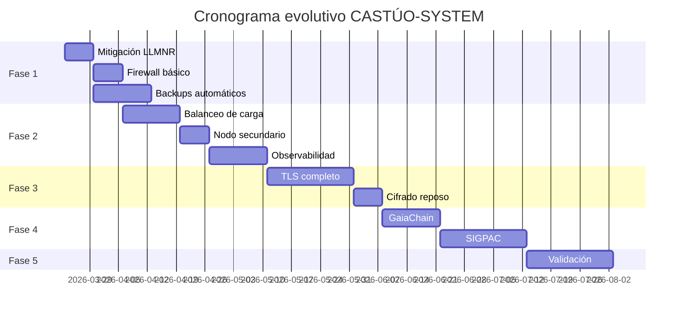

# Prontuario maestro — planificación por fases (20 semanas, 2026)

*Plan evolutivo **coherente** basado en **evidencia del repositorio** y en [PRONTUARIO-MAESTRO-EVALUACION-TECNICA-CASTUO-2026.md](./PRONTUARIO-MAESTRO-EVALUACION-TECNICA-CASTUO-2026.md). Horas y €: **planificación** — cotizar; criterios de aceptación revisables con DPO/agrónomo donde haya datos personales o parcela.*

**Relación:** [PLAN-MEJORA-TECNICA-ESCALADO-CASTUO-2026.md](./PLAN-MEJORA-TECNICA-ESCALADO-CASTUO-2026.md) (HAProxy, ACME, escalado) · [PLAN-MEJORA-INMEDIATA-CASTUO-2026.md](./PLAN-MEJORA-INMEDIATA-CASTUO-2026.md) (acciones tácticas) · [CHECKLIST-INTEGRACIONES-MEJORAS-2026.md](./CHECKLIST-INTEGRACIONES-MEJORAS-2026.md) · [PRONTUARIO-MAESTRO-REFUERZO-INTEGRAL-2026.md](./PRONTUARIO-MAESTRO-REFUERZO-INTEGRAL-2026.md) · [PRONTUARIO-MAESTRO-INTEGRACION-CIFRADA-SOBERANA-2026.md](./PRONTUARIO-MAESTRO-INTEGRACION-CIFRADA-SOBERANA-2026.md) · [PRONTUARIO-MAESTRO-INFRAESTRUCTURA-SOBERANA-TRL6-TRL7-2026.md](./PRONTUARIO-MAESTRO-INFRAESTRUCTURA-SOBERANA-TRL6-TRL7-2026.md) · [POLITICA-ROTACION-CLAVES.md](./POLITICA-ROTACION-CLAVES.md) · [RUNBOOK-RESPUESTA-INCIDENTES.md](./RUNBOOK-RESPUESTA-INCIDENTES.md)

---

## 📋 1. Metodología y principios

1. Solo se planifica sobre lo **existente** en el repositorio actual o gaps ya nombrados en evaluación técnica.  
2. Priorizar mejoras **verificables** en código, tests o CI.  
3. Cada entrega tiene **criterio de aceptación** explícito (no “hecho” sin evidencia).  
4. Métricas tras **medición** (Prometheus, informes Locust/ZAP archivados).  
5. Transparencia sobre **capacidades y límites** (lab SNN, GaiaChain opt-in, SIGPAC stub/manual).

---

## 🔧 2. Fases de estabilización (20 semanas)

### 2.1. Fase 1 — Estabilización crítica *(semanas 1–4)*

**Objetivo:** Reducir vulnerabilidades críticas y base estable.

| Acción | Duración | Criterio de aceptación | Recursos |
|--------|----------|------------------------|----------|
| Mitigar LLMNR poisoning | 7 días | `LLMNR=no` y `MulticastDNS=no` bajo `[Resolve]`; `resolvectl status` coherente; evidencia en ticket | DevOps ~10 h |
| Implantar firewall básico | 7 días | Reglas (nftables/cloud/SG) revisadas y documentadas; gestión SSH/bastión no rota | DevOps ~10 h |
| Configurar backups automáticos | 14 días | Job automatizado + **restauración de prueba** archivada; destino S3-compatible operativo | Storage *(ej. €50/mes — **cotizar**)* |
| Validación de sensores | 14 días | Inventario de rutas con telemetría + esquemas Pydantic/middleware; CI o política que impida rutas sin validación | Backend ~20 h |

*Tests de cobertura: **medir** y archivar informe — no fijar % en el git sin archivo adjunto.*

---

### 2.2. Fase 2 — Infraestructura resiliente *(semanas 5–8)*

**Objetivo:** Redundancia y observabilidad en **staging**.

| Acción | Duración | Criterio de aceptación | Recursos |
|--------|----------|------------------------|----------|
| Configurar balanceo de carga | 14 días | 2 nodos o réplicas operativas en staging con healthcheck | Infra *(ej. €150/mes — **cotizar**)* |
| Añadir nodo secundario | 7 días | **Medición de uptime** (o disponibilidad) definida y export archivable (Prometheus/proveedor) | Infra *(ej. €150/mes)* |
| Implementar HAProxy | 7 días | Tráfico distribuido entre nodos; config versionada; TLS donde aplique | Infra ~20 h |
| Observabilidad básica | 14 días | **5 dashboards** Grafana operativos *(JSON en repo o ruta acordada)*; **alertas básicas** con dueño recomendado | Monitoring ~15 h |

---

### 2.3. Fase 3 — Seguridad avanzada *(semanas 9–12)*

**Objetivo:** TLS, reposo, identidad fuerte.

| Acción | Duración | Criterio de aceptación | Recursos |
|--------|----------|------------------------|----------|
| Aplicar TLS a componentes acordados | 21 días | Inventario de servicios: tráfico cifrado en alcance definido; informe TLS **autorizado** archivado | Security ~30 h |
| Configurar cifrado en reposo | 7 días | Volúmenes/KMS/proveedor; **no** afirmar “TDE PostgreSQL nativo” — ver [PRONTUARIO-MAESTRO-INTEGRACION-CIFRADA-SOBERANA-2026.md](./PRONTUARIO-MAESTRO-INTEGRACION-CIFRADA-SOBERANA-2026.md) | Security ~15 h |
| Implementar YubiKey + OTP | 14 días | MFA operativo en superficies definidas por IdP/política | Security ~20 h |
| Rotar certificados | 7 días | Calendario [POLITICA-ROTACION-CLAVES.md](./POLITICA-ROTACION-CLAVES.md) ejecutado; cadena documentada | Security ~10 h |

---

### 2.4. Fase 4 — Integraciones estratégicas *(semanas 13–16)*

**Objetivo:** Sistemas externos con trazabilidad.

| Acción | Duración | Criterio de aceptación | Recursos |
|--------|----------|------------------------|----------|
| Implementar nodo GaiaChain | 14 días | Staging con RPC/contrato coherente; transacciones de prueba *(hash o explorer)* | Blockchain ~25 h |
| Configurar trazabilidad | 7 días | Eventos registrados y **verificables**; minimización alineada DPIA | Blockchain ~15 h |
| Integración SIGPAC | 21 días | Validación **automática** solo si hay **API/reglas oficiales** integradas; si no, acta de flujo manual + evidencia *(honestidad frente al stub del repo)* | GIS ~30 h |

---

### 2.5. Fase 5 — Optimización y validación *(semanas 17–20)*

**Objetivo:** Preparación para producción.

| Acción | Duración | Criterio de aceptación | Recursos |
|--------|----------|------------------------|----------|
| Pruebas de carga Locust | 14 días | Informe con **baseline medido** y escenario documentado | QA ~20 h |
| Pruebas de seguridad ZAP | 7 días | Informe con **alcance** explícito y remediaciones enlazadas a tickets | Security ~15 h |
| Documentación de arquitectura | 14 días | Diagramas y lista de servicios en `docs/`; revisión interna firmada | Tech Writer ~15 h |
| Crear runbooks operativos | 7 días | **5 runbooks** mínimo *(despliegue, backup, rotación, incidente, cadena/integración)* enlazados a [RUNBOOK-RESPUESTA-INCIDENTES.md](./RUNBOOK-RESPUESTA-INCIDENTES.md) | DevOps ~15 h |

---

## 📊 3. Recursos y costes

### 3.1. Horas estimadas por área

| Área | Horas | Notas |
|------|-------|--------|
| DevOps | 60 | Tareas fase 1–2 y runbooks |
| Backend | 50 | Validación sensores, CI |
| Security | 110 | TLS, reposo, MFA, ZAP, rotación |
| Monitoring | 40 | Grafana + alertas |
| QA | 55 | Locust, validación |
| **Total** | **315 h** | Recalcular al cierre de cada fase |

### 3.2. Costes de infraestructura *(ejemplo)*

| Concepto | Coste estimado | Notas |
|----------|----------------|--------|
| Infraestructura base | €450/mes | Cotizar proveedor y región (UE si soberanía) |
| Almacenamiento adicional | €50/mes | Retención y backup objeto |

---

## 📅 4. Cronograma *(placeholders)*

*Sustituir fechas tras **kick-off**. El Gantt es visual; HAProxy/MFA pueden solaparse con otras barras en la práctica.*

*Nota: las fechas son placeholders para visualización. Reemplazar con fechas reales tras kick-off. La barra “Validación” agrupa Locust, ZAP, documentación y runbooks según calendario interno.*

---

## 🎯 5. Conclusión y próximos pasos

### 5.1. Top 3 acciones inmediatas

1. **Mitigar LLMNR** (7 días) — hardening + verificación `systemd-resolved` / GPO.  
2. **Redundancia básica** (14 días) — balanceo + nodo secundario en staging.  
3. **Observabilidad** (14 días) — 5 dashboards Grafana + alertas con responsable.

### 5.2. Próximos pasos

- Ejecutar ítems en [CHECKLIST-INTEGRACIONES-MEJORAS-2026.md](./CHECKLIST-INTEGRACIONES-MEJORAS-2026.md).  
- Tabla interna de **métricas de éxito por fase** (nombre, fuente, umbral).  
- Reajustar prioridades según **recursos disponibles** y evaluación técnica.

---

*Cada fase cierra con ticket + enlace a evidencia. Sin evidencia, el hito no cuenta para el territorio.*

🚜 *Pa'lante, campeón.* 🌱
