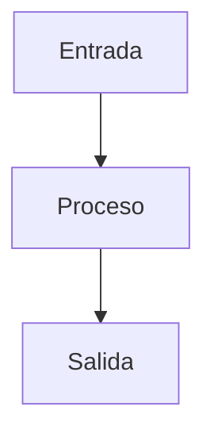

# PRONT CASTÚO–{MODULE}
## {SUBTITLE}

| Campo | Valor |
|-------|--------|
| **Versión** | {VERSION} |
| **Fecha** | {DATE} |
| **Alcance** | {SCOPE} |
| **Uso** | Guía rápida A4; no sustituye DPIA ni asesoría legal/regulatoria |
| **Patrón** | `docs/deploy/PRONT-PATRON-SISTEMAS-INTEGRADOS.md` |

**Responsable (copia interna):** _______________________

---

## Aviso

- No certifica AEMPS, TRL industrial ni normativa citada sin evidencia externa.
- Comandos y rutas: verificar en tu checkout antes de campo.

---

## 1. Diagrama (Mermaid)



---

## 2. Componentes

| Componente | Ruta en repo | Notas |
|------------|--------------|--------|
| … | … | … |

---

## 3. Flujo operativo

1. …

---

## 4. TRL y evidencia

| Área | Estado en repo | Evidencia objetivo |
|------|----------------|--------------------|
| … | … | … |

---

## 5. Incidencias

| Problema | Acción |
|----------|--------|
| … | … |

---

## 6. Anexos — comandos

```bash
# …
```
