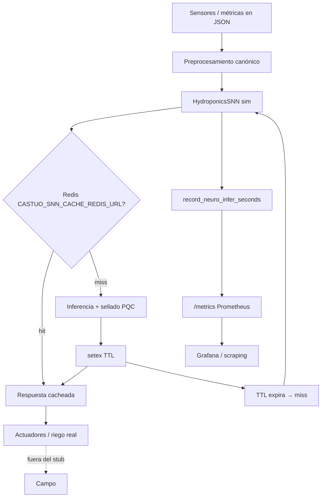

# Neuromórfica, memristores ecológicos y Castúo-System — orientación 2026

**Versión:** 2026-03-23 · **Ámbito:** marco conceptual + trazabilidad con el **código existente** (simulación software). **No** certifica despliegue de memristores físicos, **no** fija TRL de materiales en nombre del repositorio.

**Código de referencia:** `backend/integrations/robotics/neuromorphic_edge.py` (SNN TRL-4 **sim**), caché `castuo:snn:v1:{sha256…}`, tests `tests/integrations/test_neuromorphic_redis_cache.py`, métricas `lab_metrics_optional.py`.

**Marco agronómico-digital (metáforas y límites):** [PRONTUARIO-MAESTRO-ECOLOGIA-DIGITAL-AGRICOLA-2026.md](../deploy/PRONTUARIO-MAESTRO-ECOLOGIA-DIGITAL-AGRICOLA-2026.md) · [PRONTUARIO-MAESTRO-INTEGRACION-BIOLOGICA-DIGITAL-2026.md](../deploy/PRONTUARIO-MAESTRO-INTEGRACION-BIOLOGICA-DIGITAL-2026.md)

---

## 1. Conceptos clave (literatura ↔ este clon)

| Tecnología | Idea general | **Evidencia en este repositorio** | Materiales / I+D (fuera del git) |
|------------|--------------|-----------------------------------|-----------------------------------|
| SNN | Neuronas con pulsos (spikes) | `HydroponicsSNN.process_sensors` con Poisson / RNG sembrado si Redis | Estudios de dispositivos de baja potencia (literatura) |
| Memristor (metáfora) | Estado resistivo persistente | **Redis** como capa de “memoria” de decisión (`hydro_infer_dict`) — **no** es un die TiO₂ | TiO₂, HfO₂, etc.: laboratorio físico |
| Sinapsis / plasticidad | Pesos que cambian con uso | `MemristorSynapse.update_stdp` en simulador NumPy | Grafeno, dopados: investigación |
| Computación en memoria | Menos movimiento CPU↔RAM | Objetivo de **latencia** medible vía `castuo_neuro_hydro_infer_seconds` | Memristores 3D (literatura) |
| Aleaciones / “verde” | Materiales y bajo consumo | Métricas `memristor_power_uW` **simuladas** en JSON de inferencia | Agrovoltaica + sensores reales: expediente aparte |
| Neuromórfica de muy bajo consumo | < mW en silicio especializado | **No** aplica al stub Python en VPS; es **diseño futuro** | Perovskitas, etc.: TRL variable según prototipo |

**Límite honesto:** cualquier TRL citado para **óxidos o perovskitas** en tablas de investigación debe contrastarse con **datasheet y laboratorio**; el git solo afirma **TRL-4 lab-sim** en la respuesta JSON de inferencia.

---

## 1.1 Diagrama de integración (lógico — alineado al stub)



*“Actuadores” y “campo” son el sistema físico objetivo; el lab HTTP solo devuelve JSON y métricas.*

---

## 2. Clave de caché (implementada)

La función **`snn_cache_key(sensors)`** en `neuromorphic_edge.py` usa JSON canónico ordenado de **humedad, ph, ec, luz_umol** (como en el endpoint). No incluye `parcel_id` en la inferencia hidropónica actual; el snapshot PEI sí lleva `parcel_id` en otro flujo.

---

## 3. Métricas Prometheus (**tipos reales en código**)

| Nombre | Tipo en repo | Uso |
|--------|--------------|-----|
| `castuo_neuro_hydro_infer_seconds` | **Histogram** | Latencia por request en `POST .../hydroponics/infer` |
| `castuo_neuro_riego_ml` | **Histogram** | Distribución de valores `riego_ml` observados (no Gauge de último valor) |

Consulta típica (lab en **8011** o **8012** según despliegue):

```bash
curl -sS http://127.0.0.1:8011/metrics | grep castuo_neuro
```

---

## 4. Materiales ecológicos (tabla **orientativa** — no estado Castúo)

| Material | Ventajas citadas en literatura | Relación con Castúo |
|----------|-------------------------------|----------------------|
| TiO₂, HfO₂ | Memristores CMOS-compatibles | Analogía con “memoria de decisión”; **sin** chip en repo |
| VO₂ | Conmutación rápida | Objetivo de latencia en **medición**, no afirmación de ns |
| Perovskitas | Eficiencia fotónica | Autonomía energética en **diseño** de finca, no en el contenedor |
| Nb₂O₅ | Integración densa | Meta de “compute-in-memory” **futura** |
| Cu₂O | Biodegradabilidad discutida en papers | Sensores desechables bajo **normativa residuos** |

---

## 5. Tests automatizados (verificables)

| Test | Qué demuestra |
|------|----------------|
| `test_snn_cache_hit_reproducible` | Misma entrada → mismo `riego_ml` y `chain_seal`; un solo `setex` |
| `test_snn_cache_ttl_expiry` | Tras tiempo simulado > TTL, segundo `setex` (miss) |

No existe en CI `test_memristor_latency` con wafer Nb₂O₅: sería **banco físico**, no pytest.

---

## 6. Próximos pasos (genéricos — sin nombres propios)

| Acción | Nota |
|--------|------|
| GNU Radio / RF | Ver `GNU_RADIO.md`; DPIA si IQ enlaza a persona o parcela identificable |
| Hardware memristor | Prototipo externo al repo; trazabilidad de resultados en informe de laboratorio |
| TTL dinámico | Política por estación / `CASTUO_SNN_CACHE_TTL_SECONDS`; medir hit-rate en Redis |
| DPIA sensores | Ampliar [DPIA-Robotics-2026.md](../legal/DPIA-Robotics-2026.md) si decisiones autónomas afectan datos personales |
| Staging | [CHECKLIST-TRL6-HETZNER-STAGING.md](../deploy/CHECKLIST-TRL6-HETZNER-STAGING.md) + gate `pytest -m trl6` |

---

*El spike en silicio mojado es otra cosa que el spike en NumPy; aquí documentamos ambos sin confundirlos.*
