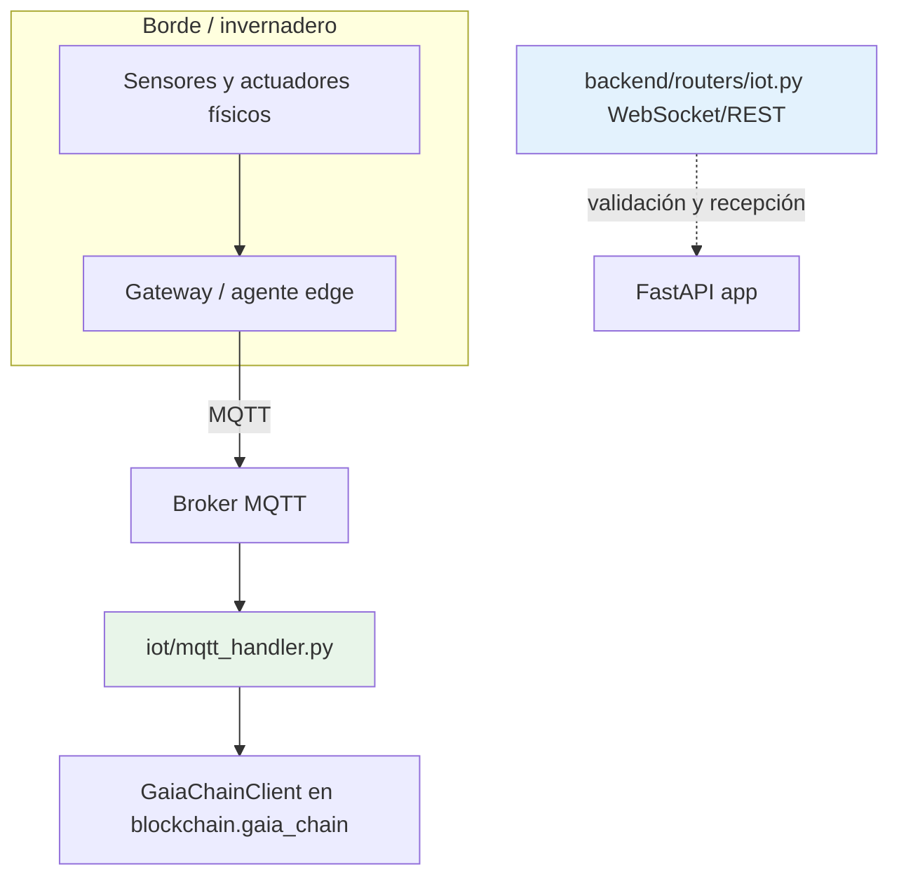

# IoT en CASTUO-System — marco del repositorio (v2.3)

**Soberanía del dato:** lo que no está en el árbol o no publica métricas reales no puede afirmarse como “control universal” ni como alerta Prometheus operativa.

---

## 0. Corrección de rutas del briefing (errores frecuentes)

| El briefing indica | Realidad en el monorepo |
|--------------------|-------------------------|
| `backend/agents/iot_agent.py` | **No existe**; agentes en `iot/docker/edge_agent.py`, `iot/raspberry_pi_agent.py`, etc. |
| `config/tpm_config.yaml` | **No existe**; TPM en `iot/tpm_verification/`. |
| `data/iot/sensor_logs.csv` | **No** es evidencia actual del repo. |
| `python ... audit_repo_evidence_check.py --iot` | El script **no** define `--iot`; la categoría `iot_repo` forma parte del inventario por defecto. |

**Requisitos y normas (referencia):** [REQUISITOS-IOT.md](./REQUISITOS-IOT.md) · [NORMATIVAS-IOT-REFERENCIA.md](./NORMATIVAS-IOT-REFERENCIA.md).

---

## 1. Qué existe hoy (rutas verificables)

| Componente | Ruta | Rol |
|------------|------|-----|
| Manejador MQTT (edge ↔ broker) | `iot/mqtt_handler.py` | Suscripción a temas `castuo/data/#`, `castuo/auth/#`; opcional `paho-mqtt`; integración con `blockchain.gaia_chain.GaiaChainClient` según el propio módulo. |
| API auxiliar IoT en paquete `iot/` | `iot/api_endpoints.py`, `iot/iot_models.py` | Modelos y análisis ligados al flujo MQTT. |
| Compose broker local | `iot/docker-compose.mqtt.yml` | Orquestación de broker para desarrollo/pruebas. |
| Agentes edge | `iot/docker/edge_agent.py`, `iot/docker/edge_hidro.py`, `iot/raspberry_pi_agent.py` | Procesamiento en borde. |
| Router FastAPI | `backend/routers/iot.py` | WebSocket `/ws/iot` e ingest REST `/ingest` con validación Barreras v6.1; comentarios indican persistencia/MQTT en producción como paso posterior. |
| Hidroponía (compose) | `iot/hidroponia-sensors.yml` | Definición de sensores en entorno declarado. |
| TPM (firmware) | `iot/tpm_verification/` | Verificación en dispositivo, no sustituye política de seguridad del despliegue. |

---

## 2. Qué no está en este repo (briefings “v2.2 universales”)

| Elemento del briefing | Estado en monorepo |
|----------------------|-------------------|
| `backend/iot/iot_manager.py` | **No existe** el paquete `backend/iot/`. |
| `backend/iot/actuators/*.py` (ósmosis, pH, nutrientes, ozono) | **No presentes** como módulos Python bajo esa ruta. |
| `config/mqtt_config.yaml` central | **No** hay ese fichero en la raíz de configuración genérica del briefing. |
| `kubernetes/prometheus/alert-rules-iot.yaml` con `iot_ozone_concentration`, `iot_ph_value`, etc. | **No añadido**: las series no están instrumentadas en el código base. |
| `export_to_gaiachain()` llamando a `GaiaChainAuditClient.register_event_in_chain` desde controladores IoT | **Incorrecto** frente al diseño real: registro on-chain vía `backend/api/services/gaiachain_service.py` y `POST /api/audit/register-event`; el cliente en `backend/utils/gaia_chain.py` cubre otras responsabilidades. |

---

## 3. Diagrama de integración (alineado al árbol)

---

## 4. Normativa y agua (marco conceptual)

- **pH / EC / caudal:** el territorio hidropónico exige calibración, trazabilidad del lote de solución y coherencia con RD 506/2013 y usos autorizados de fertilizantes; el código **no** sustituye laboratorio ni registro oficial.
- **Ozono / biocidas:** cualquier ciclo automático debe cumplir normativa aplicable, señalización y ausencia de personas; no se asume certificación por existir un `.py` en un briefing.
- **RD 169/2021 (IoT agrícola):** marco de referencia para documentación de proyecto; la **implementación** concreta depende de despliegue, DPIA y contratos con operadores.

---

## 5. Próximos pasos honestos

1. Si se desea un `IoTManager` central: crear `backend/iot/` con dependencias opcionales (`paho-mqtt`, `pymodbus`) y variables de entorno documentadas, sin simular históricos ni métricas Prometheus inexistentes.
2. Instrumentar **antes** reglas `iot_*` en Prometheus o usar nombres alineados a lo que ya exporta el stack.
3. Mantener este documento y `scripts/audit/audit_repo_evidence_check.py` en sincronía.

---

**Relación:** [PROTOCOLO-AUDITORIA-INTERNA-LEGAL-COHERENCIA.md](../legal/PROTOCOLO-AUDITORIA-INTERNA-LEGAL-COHERENCIA.md) · [SIGPAC-AEMPS-MARCO-REPOSITORIO.md](../legal/SIGPAC-AEMPS-MARCO-REPOSITORIO.md) · [CAAE-PAC-MERCADO-MARCO-REPOSITORIO.md](../legal/CAAE-PAC-MERCADO-MARCO-REPOSITORIO.md)
