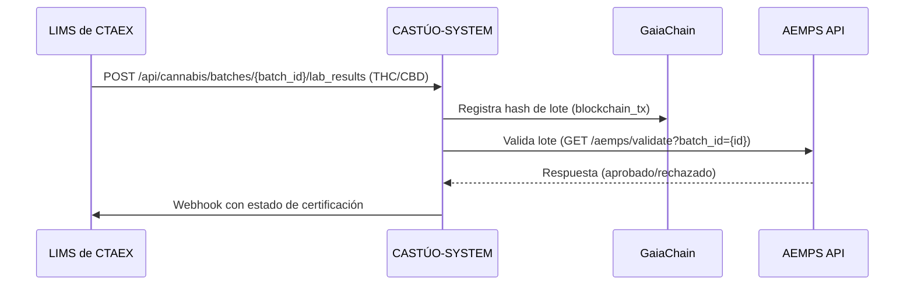
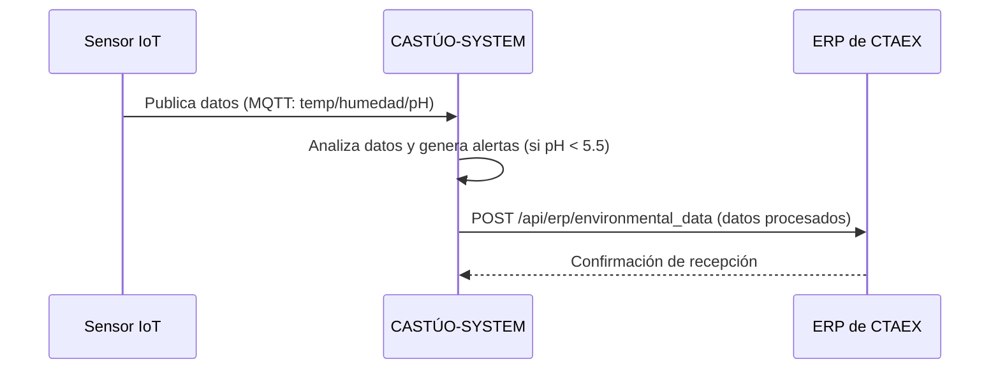

# ANEXO II — PROTOCOLO DE INTEGRACIÓN TÉCNICA
**Acuerdo de Colaboración Estratégica CTAEX S.L. – CASTÚO-SYSTEM**

**Versión:** 1.0  
**Fecha:** [DD/MM/AAAA]  
**Referencia:** Acuerdo marco CTAEX – CASTÚO-SYSTEM.

---

## 1. Sistemas a integrar

| Sistema | Tipo | Responsable | API/Protocolo | Datos a sincronizar |
|---------|------|-------------|----------------|---------------------|
| **LIMS de CTAEX** | Laboratorio | CTAEX (Técnico) | REST API | Resultados de análisis (THC/CBD, pesticidas, metales pesados). |
| **ERP de CTAEX** | Gestión empresarial | CTAEX (IT) | SAP RFC / REST | Pedidos, facturas, inventario. |
| **Sensores IoT** | Monitoreo ambiental | CASTÚO (IoT Engineer) | MQTT | Temperatura, humedad, pH, EC. |
| **GaiaChain** | Blockchain | CASTÚO (Blockchain) | gRPC | Transacciones de trazabilidad (hash de lotes). |
| **AEMPS API** | Regulatorio | CTAEX (Legal) | SOAP/REST | Validación de licencias y lotes de cannabis. |

---

## 2. Flujos de datos

### 2.1. Cannabis medicinal

### 2.2. Microgreens

---

## 3. Requisitos técnicos

### 3.1. API de CASTÚO-SYSTEM

| Endpoint | Método | Parámetros | Respuesta |
|----------|--------|------------|-----------|
| `/api/cannabis/batches` | POST | batch_id, strain_id, thc_percentage, lab_results | batch_id, blockchain_tx, status |
| `/api/microgreens/iot` | POST | batch_id, sensor_data (JSON: temp, humedad, pH, EC) | status, alerts (si hay valores fuera de rango) |
| `/api/erp/sync` | GET | account_id, date_range | Lista de pedidos/facturas sincronizados |

### 3.2. Autenticación

- **JWT:** Todos los endpoints requieren `Authorization: Bearer <token>`.
- **IP Whitelisting:** Solo IPs de CTAEX (89.167.5.0/24).

---

## 4. Pruebas de integración

### 4.1. Plan de pruebas

| Prueba | Criterio de éxito | Responsable |
|--------|-------------------|-------------|
| Sincronización LIMS | 100% de los resultados de laboratorio se registran en CASTÚO-SYSTEM sin errores. | CTAEX (Técnico) |
| Certificación AEMPS | 95% de los lotes de cannabis se certifican en <24h. | CASTÚO (Backend) |
| Alertas IoT | 100% de las alertas (ej.: pH < 5.5) se notifican en <5 min. | CASTÚO (IoT) |
| Backup y restauración | Restauración de datos en <1h en caso de fallo. | DevOps |

---

## 5. Soporte y mantenimiento

- **Horario de soporte:** 24/7 (críticas), 9–18 h (no críticas).
- **Tiempos de respuesta:**
  - **Críticas** (ej.: caída del sistema): <4 h.
  - **Altas** (ej.: error en certificación): <24 h.
  - **Medias/Bajas:** <48 h.

---

## 6. Penalizaciones por incumplimiento

| Incumplimiento | Penalización |
|----------------|--------------|
| Fallo en sincronización LIMS | 5% de descuento en la licencia mensual hasta que se resuelva. |
| Retraso en certificaciones | 10% de descuento en el royalty del trimestre. |
| Fallas en alertas IoT | 3% de descuento en la licencia mensual. |

---

## 7. Aceptación

Las partes aceptan este Anexo como **parte integrante** del Acuerdo Principal.
