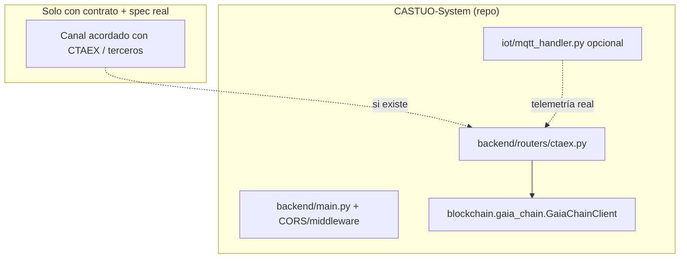

# CTAEX y CASTUO-System — marco del repositorio (honestidad)

**Revisión:** 2026-03-21 · **Alcance:** qué existe en código y documentación frente a **briefings** de integración masiva (API SIGPAC, OAuth2, Prometheus `ctaex_*`, etc.).

**Impacto territorial:** la colaboración con CTAEX se materializa en **convenios, demos y endpoints propios**; no en `https://api.ctaex.es/v2` genérico del briefing salvo que exista **contrato y especificación oficial** publicada para vuestro despliegue.

---

## 1. Qué hay hoy en el monorepo (rutas verificables)

| Artefacto | Ruta / uso |
|-----------|------------|
| Contrato / marco TRL10 | `docs/legal/TRL10/contrato_ctaex_final_20260320.md` |
| NDA plantilla | `docs/legal/nda/nda-ctaex-castuo-2026.md` |
| Router FastAPI “CTAEX” | `backend/routers/ctaex.py` — demo v6.0 (sensores simulados, Stripe opcional, `GaiaChainClient` desde `blockchain.gaia_chain`) |
| CORS / seguridad | `backend/main.py` — `https://ctaex.es` en orígenes; middleware y rutas sensibles CTAEX |
| Demo operativa | `scripts/demo_ctaex.sh` (variables `API_URL`, `EPCIS_URL`, token según entorno) |
| Planes y prontuarios | `docs/ops/PLAN-90-DIAS-ENTERPRISE-EU-2026.md`, `docs/legal/PRONTUARIO-MAESTRO-LEGAL-EJECUCION-90-DIAS.md` |

---

## 2. Qué **no** afirmar (briefing vs realidad)

| Elemento del briefing | Estado |
|------------------------|--------|
| `backend/ctaex/ctaex_client.py`, `irrigation_optimizer.py`, `climate_monitor.py`, `traceability.py`, `weather_station.py`, `alert_manager.py`, … | **No** existen; el paquete `backend/ctaex/` es **mínimo** (`climate_config.py` + YAML territorial), sin cliente OAuth2 ni API CTAEX |
| `https://api.ctaex.es/v2` + OAuth2 client_credentials + scopes `sigpac:read`, … | **No** verificado como API pública del repo; credenciales y URL deben venir de **documento oficial** del proyecto |
| `docs/legal/CONVENIO-CTAEX-2026.pdf`, “firmado 20/03/2026” | **No** incluir PDF ni fechas de firma en el árbol salvo que **subáis** el archivo real fuera de secretos |
| `docs/legal/Ley-3-2023-Extremadura.md`, `RD-169-2021-Eficiencia-Hidrica.md`, `UE-2021-2115-PAC.md`, `docs/gis/ISO-19115-Metadatos.md`, `docs/iot/REQUISITOS-RIEGO.md` | **No** están como esas rutas en el inventario actual; normas en **BOE / EUR-Lex** |
| `GaiaChainAuditClient().register_event_in_chain(...)` en cada llamada HTTP a CTAEX | **Incorrecto** frente al diseño: registro audit/on-chain vía `gaiachain_service.register_event_in_chain` + `POST /api/audit/register-event` (JWT); el cliente en `backend/utils/gaia_chain.py` no es ese canal |
| `kubernetes/prometheus/alert-rules-ctaex.yaml`, métricas `ctaex_soil_moisture`, `ctaex_irrigation_plan`, … | **No** añadidas: **no** hay exportadores que publiquen esas series |
| `castu-monitoring/grafana/dashboards/ctaex-integration.json` | **No** presente como en el briefing |
| `backend/notifications/notification_service.py`, `backend/blockchain/smart_contracts.py`, `TraceabilityContract`, KPI `query_metric` en `GaiaChainAuditClient` | **No** como en el briefing |
| Porcentajes de ahorro de agua (25–30 %), ROI, huella sin medición | **Marketing**, no evidencia de auditoría |

---

## 3. Arquitectura plausible (alineada al árbol)

---

## 4. Normativa (referencia externa)

- **Ley 3/2023** (Extremadura): título y artículos aplicables deben **confirmarse** con expediente; en el repo hay documentación generada que la cita (`compliance_docs/generated/...`).
- **RD 169/2021**, **(UE) 2021/2115**: consultar textos oficiales; el software **no** sustituye asesoramiento agronómico o jurídico.
- **UNE 50510**, **ISO 19115**: aplicables a proyecto de riego / metadatos; no implican que existan módulos `backend/ctaex/water_metrics.py` en el árbol.

---

## 5. Si en el futuro se integra un canal real con CTAEX

1. Especificación técnica y legal **firmada** (endpoints, auth, tratamiento de datos, DPIA actualizada).
2. Cliente delgado (p. ej. `backend/integrations/ctaex_client.py`) sin mezclar `register_event_in_chain` del briefing en `GaiaChainAuditClient`.
3. Eventos auditables vía **`gaiachain_service`** + API audit cuando corresponda.
4. Prometheus/Grafana **después** de instrumentar métricas reales.
5. Actualizar **este** documento y `REQUIRED_EVIDENCE` con rutas que existan.

---

**Relación:** [PROTOCOLO-AUDITORIA-INTERNA-LEGAL-COHERENCIA.md](./PROTOCOLO-AUDITORIA-INTERNA-LEGAL-COHERENCIA.md) · [IOT-MARCO-REPOSITORIO.md](../iot/IOT-MARCO-REPOSITORIO.md) · [CAAE-PAC-MERCADO-MARCO-REPOSITORIO.md](./CAAE-PAC-MERCADO-MARCO-REPOSITORIO.md)
