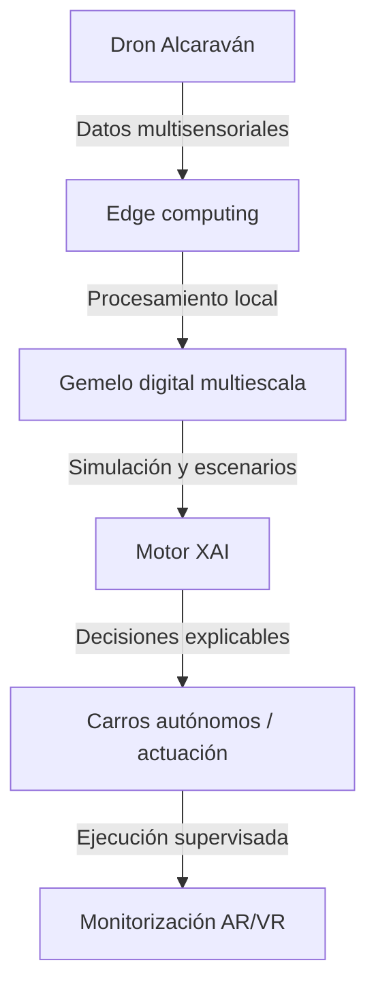
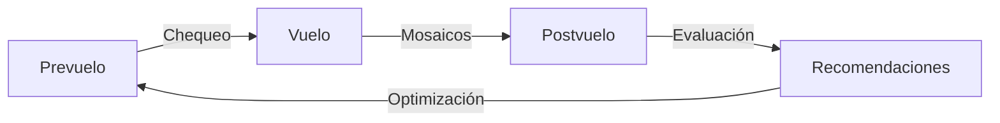

# Diseño integral del ecosistema Castúo 6.0+ — arquitectura avanzada

**Ámbito:** visión de **automatización avanzada**, gemelo digital, sostenibilidad y trazabilidad — **no** roadmap ejecutado ni certificación automática desde el git.

**Honestidad del repositorio:** “**Cuántico**” aquí se entiende como **referencia a resiliencia criptográfica (PQC en `pq_crypto.py`) y a diseño futuro**, no como afirmación de computación cuántica universal desplegada. Métricas numéricas (**+35 %**, **100 %**, etc.) son **objetivos orientativos** de piloto; medir y documentar por cultivo y campaña.

**Relación**

- [PLAN-EXCELENCIA-V2.5-REFUERZO.md](PLAN-EXCELENCIA-V2.5-REFUERZO.md)
- [PRONTUARIO-MAESTRO-AUDITORIA-INTERNA.md](PRONTUARIO-MAESTRO-AUDITORIA-INTERNA.md)

**Ver también**

- [PLAN-INTEGRACION-TECNICAS-AVANZADAS-V2.5.md](PLAN-INTEGRACION-TECNICAS-AVANZADAS-V2.5.md)
- [PLAN-INTEGRACION-REFORZADO-CASTUO-6.md](PLAN-INTEGRACION-REFORZADO-CASTUO-6.md)
- [ROADMAP-INTEGRACIONES-SIGPAC-GAIACHAIN-AEMET.md](ROADMAP-INTEGRACIONES-SIGPAC-GAIACHAIN-AEMET.md)

---

## 1. Arquitectura de gemelo digital (referencia cuántica / PQC)



**Capas del gemelo digital**

| Capa | Contenido |
|------|-----------|
| **Adquisición** | Sensores RGB / térmico / multiespectral; IoT suelo-clima; indicadores de vegetación y microclima (incl. referencias agroecológicas tipo jara, romero, chlorella donde el piloto lo valide). |
| **Modelos** | Simulación hidráulica y de rutas; aceleración de escenarios con IA; **PQC** para integridad de datos sensibles donde el despliegue lo exija. |
| **Decisión** | XAI con trazas auditables; registro blockchain/GaiaChain **según contrato**; órdenes autónomas con **supervisión humana** obligatoria en operaciones de riesgo. |
| **Visualización** | Interfaz 3D, mapas de vigor/humedad, calibración en tiempo real acotada por latencia edge-nube. |

---

## 2. Integración de biomarcadores / bioindicadores (piloto)

*Rol documental: hipótesis de calibración cruzada; validación científica y normativa por cultivo.*

| Biomarcador / referencia | Función (diseño) | Validación |
|--------------------------|------------------|------------|
| Jara | Indicadores de salud ambiental / estrés | Índices espectrales cruzados |
| Romero | Señales de ozonización / calidad de aire local | Validación cruzada con sensores |
| Chlorella | Microclima, ventilación en recintos acotados | Biofiltros adaptativos (piloto) |
| Derivados “cuerna” *(revisar nomenclatura en piloto)* | Calibración de suelo / materia orgánica | Seguimiento multiespectral u holográfico si se adopta |

**Sistema de autocalibración (stub de diseño)**

```python
# backend/biomarkers/calibrator.py — diseño futuro
class BioCalibrator:
    def calibrate(self, sensor_data: dict) -> dict:
        """Ajusta sensores usando correlatos de biomasa/indicadores acordados en piloto."""
        raise NotImplementedError("Requiere protocolo de campo y ADR de integración")
```

---

## 3. Flujos de datos y control



**Fases**

- **Prevuelo:** chequeo y recalibración automática cuando sensores y checklists lo permitan.  
- **Vuelo:** actualización de trayectorias en tiempo real dentro de límites legales (geocercas, AESA, etc.).  
- **Postvuelo:** evaluación de deriva sensorial y control de calidad de mosaicos.

---

## 4. Métricas de esfuerzo (orientativas)

| Área | Métrica | Objetivo piloto |
|------|---------|------------------|
| Precisión espectral | Mejora vs línea base | ≥10 % (meta ejemplo 15 %) |
| Reducción agua | Vs riego previo documentado | 15–30 % (meta ejemplo 25 %) |
| Rendimiento | Productividad / calidad | Objetivo ejemplo +35 % (validar por cultivo) |
| Trazabilidad | Documentación para auditoría | Cobertura de proceso **documentada**; “100 % certificable” solo tras revisión legal/territorial |

---

## 5. Roadmap de implementación (12 semanas — orientativo)

| Semanas | Fase | Objetivo |
|---------|------|----------|
| 1–3 | Instalación IoT y paneles 3D | Sensores + visualización mínima viable |
| 4–6 | Entrenamiento IA y reglas XAI | Decisiones asistidas con explicabilidad |
| 7–9 | Pilotos en cultivos objetivo | Medición de impacto con protocolo |
| 10–12 | Auditoría interna y SOP | Documentación y mejora continua |

---

## 6. Seguridad y sostenibilidad

**Marcos de referencia (no certificación automática por repositorio)**

- **ISO 27001** — seguridad de la información (controles según alcance del despliegue).  
- **GDPR / normativa datos** — tratamiento y bases jurídicas.  
- **ODS** — alineación narrativa con objetivos de sostenibilidad donde el proyecto lo documente.

**Tecnologías clave**

- **Blockchain / GaiaChain:** trazabilidad según diseño actual del repo y contratos reales.  
- **Cifrado post-cuántico (PQC):** módulo existente; despliegue operativo = roadmap.  
- **Energías renovables:** estrategia de infraestructura edge/nube, fuera del alcance del solo código.

---

## Conclusión

**Ecosistema Castúo 6.0+ (visión):**

- Gemelo digital multiescala con edge, XAI y supervisión humana.  
- Bioindicadores / correlatos naturales como **hipótesis de calibración** en piloto.  
- Automatización con drones y actuación autónoma **acotada y normativa**.  
- Sostenibilidad como objetivo medible (agua, insumos, energía).

**Beneficios (orientativos, no garantías del git)**

- Agricultura de precisión con metas de productividad acordadas en piloto.  
- Menor uso de agua e insumos donde las mediciones lo demuestren.  
- Trazabilidad reforzada para **proceso** de certificación, sin “sello” desde el repositorio.

**Documentación**

- [PLAN-EXCELENCIA-V2.5-REFUERZO.md](PLAN-EXCELENCIA-V2.5-REFUERZO.md)  
- [PRONTUARIO-MAESTRO-AUDITORIA-INTERNA.md](PRONTUARIO-MAESTRO-AUDITORIA-INTERNA.md)

**Notas para Cursor**

1. Priorizar integraciones **validadas** y marcos en `docs/legal/`.  
2. **Documentar** cada proceso antes de exponer APIs o prometer métricas.  
3. **Validar** métricas en campo o laboratorio antes de producción.

**Matiz territorial:** diseño orientado a **Extremadura** y cultivos mediterráneos, respetando **normativa europea y española** (datos, drones, fitosanitarios, PAC, etc.) — detalle normativo en documentos legales específicos, no en este resumen.

**Evidencias:** incluido en `REQUIRED_EVIDENCE` (categoría **legal**, `audit_repo_evidence_check.py`); el inventario del script es **84/84** rutas. La visión aquí descrita **no** implica que el código del gemelo/XAI esté completo en el clon.

*Documento de visión arquitectónica; revisión periódica al evolucionar el código y los pilotos.*
