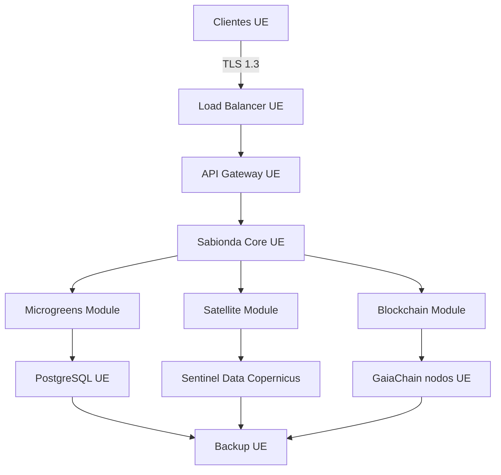
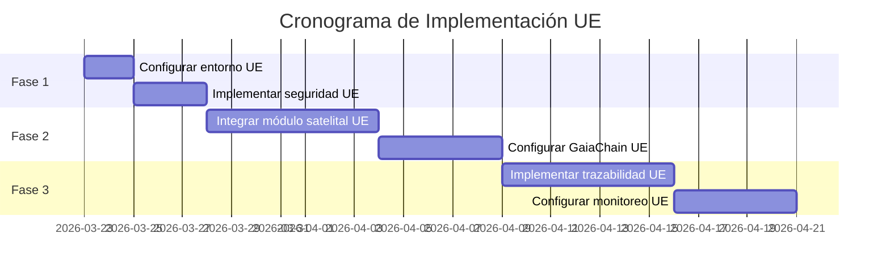

# **🇪🇺 MARCO LEGAL Y SOBERANÍA UE 2026**

*(Documentación legal-técnica para implementación en territorio europeo)*

**Relacionados:** [Stack FOSS + activación](../deploy/EU-FOSS-SOVEREIGNTY-STACK.md) · `docker-compose.eu-sovereignty.yml` · `.env.eu-sovereignty.example` · [Análisis crítico](../deploy/PRONTUARIO-ANALISIS-CRITICO-CONEXIONES-SISTEMA-2026.md) · [Integración satelital](../deploy/PRONTUARIO-MAESTRO-INTEGRACION-SATELITAL-REFORZAMIENTO-2026.md) · `backend/energy_audit/eu_data_sovereignty.py`

---

## **⚠️ ADVERTENCIA LEGAL IMPORTANTE**

**Este documento no constituye asesoramiento legal.** Su propósito es orientar la implementación técnica de acuerdo con el marco normativo europeo. Se recomienda:

1. **Consultar con el Delegado de Protección de Datos (DPO)** de su organización.
2. **Verificar los textos legales consolidados** en [EUR-Lex](https://eur-lex.europa.eu).
3. **Adaptar a su sector específico** (agricultura, educación, salud, sector público, etc.).

**Normativa de referencia:**

- Reglamento **(UE) 2016/679 (RGPD)**, especialmente artículos **44–49**.
- Directiva **(UE) 2016/680** (protección de datos en el ámbito penal y fines conexos).
- Reglamento delegado **(UE) 2023/182** (requisitos de identidad digital / soberanía digital en el ecosistema europeo de ID; contrastar aplicabilidad).

---

## **1. CUMPLIMIENTO NORMATIVO EN DATOS SATELITALES**

### **1.1. Implementación técnica vs requisitos legales**

| **Requisito legal** | **Implementación en repo** | **Evidencia** | **Notas** |
|---------------------|------------------------------|---------------|-----------|
| **Residencia de datos en UE** | Filtro de proveedores satelitales + stack datos | `eu_data_sovereignty_strict()`, `docker-compose.eu-sovereignty.yml` | Por defecto solo **Copernicus/ESA** (modo estricto); PostgreSQL FOSS en compose para residencia bajo su VPS UE. |
| **Transferencias internacionales** | Exclusión Landsat (USGS) | `filter_band_catalog_for_eu()` | **DPIA** si se desactiva el modo estricto (`CASTUO_EU_DATA_SOVEREIGNTY=0`). |
| **Trazabilidad** | Metadatos de procesamiento | `eu_processing_metadata()`, `eu_sovereignty` en NDVI | Origen y política de procesado en metadatos. |
| **Validación de fuentes** | Hosts Copernicus | `assert_eu_copernicus_host()` | Solo dominios **`*.copernicus.eu`**. |

**Código de referencia** (comportamiento canónico; no reducir solo a `== '1'`):

```python
# backend/energy_audit/eu_data_sovereignty.py — eu_data_sovereignty_strict()
import os

def eu_data_sovereignty_strict() -> bool:
    return os.getenv("CASTUO_EU_DATA_SOVEREIGNTY", "1").strip().lower() in ("1", "true", "yes", "on")
```

*Si únicamente usa `0` o `1`, entonces `os.getenv(..., "1") == "1"` es equivalente; el código del repo acepta más valores por ergonomía operativa.*

---

## **2. ARQUITECTURA TÉCNICA CON SOBERANÍA UE**

### **2.1. Diagrama objetivo**



**Componentes críticos (operación):**

- **PostgreSQL:** hosting en proveedor con **región/DPA UE** (p. ej. Hetzner, OVH; otros IaaS UE documentados).
- **GaiaChain:** nodos / **RPC en territorio UE** o cobertura jurídica explícita.
- **Sentinel Data:** solo fuentes **Copernicus/ESA** validadas por código.
- **Backup:** almacenamiento en **UE** y registro en el inventario de tratamientos.

### **2.2. Activación con sistemas FOSS (repo)**

Orquestación conectada en el repositorio:

| Sistema | Fichero / doc |
|---------|----------------|
| PostgreSQL 16 (Alpine) | `docker-compose.eu-sovereignty.yml` |
| Variables soberanía + DB + Gaia | `.env.eu-sovereignty.example` |
| Prometheus, Grafana, Alertmanager | `docker-compose.monitor.yml` |
| Nodo cadena | `docker-compose.gaiachain.yml` |
| Keycloak, Traefik, Vault *(Vault: licencia BSL)* | `docker-compose.eu-oss.yml` |
| Guía de arranque | [EU-FOSS-SOVEREIGNTY-STACK.md](../deploy/EU-FOSS-SOVEREIGNTY-STACK.md) |

*FOSS no implica por sí solo residencia UE: el proveedor y la región del VPS cierran el circuito RGPD.*

---

## **3. IMPLEMENTACIÓN DE SEGURIDAD**

### **3.1. Medidas técnicas para cumplimiento**

```bash
# Firewall (plantilla)
sudo ufw default deny incoming
sudo ufw default allow outgoing
sudo ufw allow 22/tcp
sudo ufw allow 80/tcp
sudo ufw allow 443/tcp
sudo ufw allow 8080/tcp
sudo ufw enable

# TLS de laboratorio; producción: ACME / PKI según política
openssl req -x509 -newkey rsa:4096 -keyout key.pem -out cert.pem -days 365 -nodes
```

**Requisitos adicionales:**

- Certificados TLS emitidos por **autoridad de confianza** acorde a política interna.
- **Cifrado** en tránsito y en reposo.
- **MFA** para accesos privilegiados.

---

## **4. CONFIGURACIÓN Y DESPLIEGUE**

### **4.1. Variables de entorno para soberanía UE**

```env
# Mínimo (alineado con .env.eu-sovereignty.example)
CASTUO_EU_DATA_SOVEREIGNTY=1
COPERNICUS_USER=your_copernicus_user
COPERNICUS_PASSWORD=your_copernicus_password
COPERNICUS_DHUS_BASE=https://scihub.copernicus.eu/dhus
DB_HOST=postgres
GAIA_CHAIN_RPC_URL=your_ue_gaia_chain_rpc_url
```

En compose local, `DB_HOST=postgres` apunta al servicio definido en `docker-compose.eu-sovereignty.yml`.

### **4.2. Validación de cumplimiento**

```bash
PYTHONPATH=. pytest tests/energy_audit/test_eu_data_sovereignty.py -v
PYTHONPATH=. pytest tests/models/test_system_admin_playbook.py -q
```

---

## **5. PLAN DE IMPLEMENTACIÓN**

### **5.1. Cronograma de implementación UE**



---

## **6. CONSIDERACIONES FINALES**

### **6.1. Checklist de cumplimiento**

- [ ] Configurar entorno con **proveedores UE** y contratos/DPA
- [ ] Implementar medidas de seguridad básicas
- [ ] Configurar módulo satelital con **soberanía UE** (`CASTUO_EU_DATA_SOVEREIGNTY`, Copernicus)
- [ ] Validar **GaiaChain / RPC** en territorio UE o marco jurídico aceptable
- [ ] Implementar sistema de **trazabilidad**
- [ ] Configurar **monitoreo y alertas** ([stack FOSS](../deploy/EU-FOSS-SOVEREIGNTY-STACK.md))
- [ ] **Documentar** configuración para auditoría

### **6.2. Documentos relacionados**

- [Prontuario de análisis crítico y conexiones](../deploy/PRONTUARIO-ANALISIS-CRITICO-CONEXIONES-SISTEMA-2026.md)
- [Integración satelital y reforzamiento estructural](../deploy/PRONTUARIO-MAESTRO-INTEGRACION-SATELITAL-REFORZAMIENTO-2026.md)
- [Stack FOSS soberanía UE — guía de activación](../deploy/EU-FOSS-SOVEREIGNTY-STACK.md)
- Implementación técnica: `backend/energy_audit/eu_data_sovereignty.py` · `backend/energy_audit/satellite_preprocess.py`

*Nota:* Este documento está registrado en **`backend/models/system_admin_playbook.py`** (`GOVERNANCE_DOCUMENTATION`) y la capa técnica asociada se valida con los *tests* del §4.2.

---

🚜 Pa'lante, campeón! 🌱💪

Con este marco y el [stack FOSS](../deploy/EU-FOSS-SOVEREIGNTY-STACK.md) puedes:

- Implementar **soberanía de datos** en territorio UE (hosting + código)
- Alinear la operación con la **normativa europea** (DPO + EUR-Lex)
- **Documentar** para auditorías
- **Validar** con *pytest* la parte automatizable

*Que la fuerza (y la normativa europea) te acompañen.* 🇪🇺✨

---

*El RGPD no vive en el markdown: vive en el contrato, en el DPO y en la región del disco donde cae `eu_postgres_data`.*
