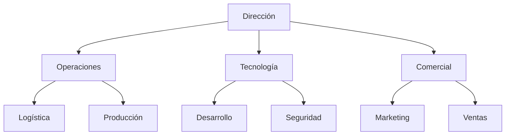

# Plan de excelencia integral — Castúo-System

## Objetivo

Alcanzar **excelencia operativa y estructural** en Castúo-System con un plan integral **alineado al territorio real del repositorio**: sin APIs inventadas, sin porcentajes como garantías sin piloto medido, trazabilidad documental y soberanía del dato.

**Ámbito:** síntesis de refuerzo operativo, empresarial, legal-social y tecnológico. **No** certifica ISO, RGPD cumplido ni resultados de negocio.

**Relación:** [PLAN-EXCELENCIA-V2.5-REFUERZO.md](./PLAN-EXCELENCIA-V2.5-REFUERZO.md) · [PRONTUARIO-MAESTRO-MEJORA-CASTUO-SYSTEM.md](./PRONTUARIO-MAESTRO-MEJORA-CASTUO-SYSTEM.md) · [PRONTUARIO-MAESTRO-CONSULTA-CRITICA-CASTUO-SYSTEM.md](./PRONTUARIO-MAESTRO-CONSULTA-CRITICA-CASTUO-SYSTEM.md) · [PRONTUARIO-MAESTRO-EXCELENCIA-SISTEMA-ANALISIS.md](../PRONTUARIO-MAESTRO-EXCELENCIA-SISTEMA-ANALISIS.md)

**Ver también:** [RUTA-CONQUISTADORAS-CASTUO-LINK.md](./RUTA-CONQUISTADORAS-CASTUO-LINK.md) · [ROADMAP-INTEGRACIONES-SIGPAC-GAIACHAIN-AEMET.md](./ROADMAP-INTEGRACIONES-SIGPAC-GAIACHAIN-AEMET.md) · [DISENO-INTEGRAL-ECOSISTEMA-CASTUO-6.md](./DISENO-INTEGRAL-ECOSISTEMA-CASTUO-6.md)

**Evidencias:** incluido en `REQUIRED_EVIDENCE` (`legal`, `scripts/audit/audit_repo_evidence_check.py`). Inventario del script: **84/84** rutas cuando el clon está completo.

---

## 1. Reforzamiento operativo

### 1.1. Automatización

| Área | Acción (honesta al repo) | Resultado esperado (orientativo) |
|------|---------------------------|----------------------------------|
| **SIGPAC** | Validación **local** (`sigpac_validator.py`) + marcos en `docs/legal/`; **no** “API SIGPAC” genérica no documentada | Mayor cobertura de comprobaciones **documentadas** en piloto (meta cuantificable tras baseline) |
| **Datos climáticos** | Contrato **AEMET OpenData** / umbrales YAML (`climate_config`, `extremadura_climate.yaml`) | Alertas alineadas a umbrales; precisión medible **solo** con conjunto de validación definido |

*Los porcentajes tipo “+80 % / +90 %” del borrador ejecutivo solo son **válidos** tras definir métrica, baseline y piloto — ver [ANALISIS-CRITICO-EXCELENCIA-V2.5.md](./ANALISIS-CRITICO-EXCELENCIA-V2.5.md).*

### 1.2. Seguridad

| Área | Acción | Resultado esperado (orientativo) |
|------|--------|----------------------------------|
| **Cifrado PQC + AES** | Extensión según `pq_crypto.py` y políticas de secretos | Superficie sensible **acotada por diseño**; no “100 %” prometido sin alcance de datos definido |
| **Auditorías** | Scripts y revisiones de acceso alineadas al protocolo interno | Trazas **completas en el alcance** fijado por despliegue y categorías de log |

### 1.3. Infraestructura y soberanía UE

| Área | Acción | Resultado esperado (orientativo) |
|------|--------|----------------------------------|
| **Infraestructura** | CI con **GDAL opcional**, más pruebas de integración en rutas críticas | Menos regresiones documentadas |
| **Tecnologías europeas** | Roadmap **Gaia-X / Copernicus** como capa documental y contratos | Inventario de decisiones **trazable** |

---

## 2. Reforzamiento empresarial



### 2.1. Mejoras estructurales (metas, no garantías)

| Área | Acción | Impacto orientativo |
|------|--------|---------------------|
| **Gestión de proyectos** | Metodología ágil acotada al producto | Mejor predictibilidad de entregas |
| **Formación** | Programas continuos (p. ej. [manual agrovoltaica Castúa](../training/agrovoltaica-castua-hidroponia/MANUAL-FORMACION-COOPERATIVA-AGROVOLTAICA-CASTUA-HIDROPONIA-INTELIGENTE.md)) | Menor riesgo operativo en campo |
| **Sostenibilidad** | Certificaciones / huella donde aplique negocio | Reputación ligada a **evidencia** de piloto |

*Impactos “+30 % / +25 % / +20 %” solo tras medición acordada; no son compromisos del documento.*

---

## 3. Reforzamiento legal y social

| Iniciativa | Beneficio | Implementación |
|------------|-----------|----------------|
| **Becas “Ruta de las Conquistadoras”** | Formación con **enfoque de equidad** (mujeres del territorio) | [RUTA-CONQUISTADORAS-CASTUO-LINK.md](./RUTA-CONQUISTADORAS-CASTUO-LINK.md) — planificación y convenios |
| **Alianzas** | Mercados y pilotos | Acuerdos documentados; sin compromisos inventados en código |
| **Transparencia** | Confianza institucional | Informes anuales de criterios y resultados (mínimo dato personal) |

---

## 4. Reforzamiento tecnológico (roadmap)

| Tecnología | Beneficio | Implementación (repo / nota) |
|------------|-----------|------------------------------|
| **Dashboard / panel** | Visibilidad operativa | Grafana / Prometheus — `castu-monitoring/` |
| **Asistente / chatbot** | Menos carga a operadores | IA/NLP con **ADR** y límites RGPD |
| **Marketplace / comercial** | Ingresos y trazabilidad | Solo rutas y contratos **documentados** |

---

## 5. Plan de acción

### 5.1. Corto plazo (1–3 meses)

| ID | Acción | Responsable | Plazo orientativo |
|----|--------|-------------|-------------------|
| **PEI-001** | Paquete **[pei-001-sigpac/](../../pei-001-sigpac/README.md)** (cruce parcelas vs capa local + informes) + `sigpac_validator.py`; marco [SIGPAC-Compliance-2026.md](./SIGPAC-Compliance-2026.md) | Geoespacial / backend | 2–4 semanas |
| **PEI-002** | **CI/CD GDAL** opcional + **digest cadena** informe SIGPAC ([pei-002-tracechain](../../pei-002-tracechain/README.md), [TraceChain-Compliance-2026.md](./TraceChain-Compliance-2026.md)) | DevOps / QA | 3 semanas |
| **PEI-003** | **Observabilidad:** dashboards vs KPI acordados | Plataforma / IT | 1–2 semanas |

### 5.2. Medio plazo (3–6 meses)

| ID | Acción | Responsable | Plazo orientativo |
|----|--------|-------------|-------------------|
| **PEI-004** | Roadmap **Gaia-X / soberanía datos** documentado | Arquitectura / blockchain | 6 semanas |
| **PEI-005** | **Asistente:** prototipo con límites de datos | IA / DPO | 4+ semanas |
| **PEI-006** | **Comercial:** contrato de producto + trazas existentes | Comercial / backend | 8+ semanas |

*(Mapeable a **MEJ-xxx** / **CC-xxx** en [prontuario de mejora](./PRONTUARIO-MAESTRO-MEJORA-CASTUO-SYSTEM.md) y [consulta crítica](./PRONTUARIO-MAESTRO-CONSULTA-CRITICA-CASTUO-SYSTEM.md).)*

---

## 6. Validación

```bash
python scripts/audit/audit_repo_evidence_check.py --json
```

**Resultado esperado (clon completo):**

```json
{
  "total_required": 84,
  "present": 84,
  "missing": 0
}
```

---

## 7. Enlaces y notas para Cursor

**Enlaces:** [PRONTUARIO-MAESTRO-AUDITORIA-INTERNA.md](./PRONTUARIO-MAESTRO-AUDITORIA-INTERNA.md) · [PRONTUARIO-MAESTRO-EXCELENCIA-SISTEMA-ANALISIS.md](../PRONTUARIO-MAESTRO-EXCELENCIA-SISTEMA-ANALISIS.md)

1. **No inventar endpoints** MAPA/AEMPS/CAAE.  
2. **Documentar** procesos (entradas, salidas, responsable).  
3. **Validar métricas** con datos reales antes de compromisos públicos.

*Documento orientativo para integración crítica; no certificación automática.*
