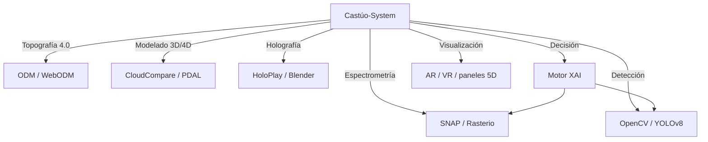

# Plan de integración reforzado — Castúo-System 6.0+

**Objetivo final:** integración **coherente y resolutiva** de técnicas avanzadas, con resultados **medibles** y alineados al **territorio real del repositorio** (sin endpoints ni dependencias inventadas; orquestación y evidencia antes de prometer métricas en producción).

**Relación**

- [PLAN-INTEGRACION-TECNICAS-AVANZADAS-V2.5.md](PLAN-INTEGRACION-TECNICAS-AVANZADAS-V2.5.md) — contratos técnicos, ACT-001…009 y estados 🟡/🔴
- [DISENO-INTEGRAL-ECOSISTEMA-CASTUO-6.md](DISENO-INTEGRAL-ECOSISTEMA-CASTUO-6.md) — gemelo digital, flujos dron y XAI
- [PLAN-EXCELENCIA-V2.5-REFUERZO.md](PLAN-EXCELENCIA-V2.5-REFUERZO.md)
- [PRONTUARIO-MAESTRO-AUDITORIA-INTERNA.md](PRONTUARIO-MAESTRO-AUDITORIA-INTERNA.md)

**Ver también**

- [PRONTUARIO-MAESTRO-EXCELENCIA-SISTEMA-ANALISIS.md](../PRONTUARIO-MAESTRO-EXCELENCIA-SISTEMA-ANALISIS.md)
- [ROADMAP-INTEGRACIONES-SIGPAC-GAIACHAIN-AEMET.md](ROADMAP-INTEGRACIONES-SIGPAC-GAIACHAIN-AEMET.md)

---

## 1. Arquitectura de integración

Capa única de orquestación (`Castúo-System`) hacia pipelines externos y decisión explicable; las cargas pesadas siguen en workers/contenedores según el plan v2.5.



**Matiz territorial:** Extremadura, cultivos mediterráneos y normativa UE; integraciones SIGPAC/clima solo por contratos documentados en el repo (sin URLs API ficticias).

---

## 2. Plan de acción reforzado (INT ↔ ACT)

Cada **INT** amplía el **resultado esperado** del plan v2.5; el **estado** sigue gobernado por evidencia en código y ADR.

| ID | Acción | Mapa v2.5 | Responsable | Plazo orientativo | Resultado esperado |
|----|--------|-----------|-------------|-------------------|--------------------|
| INT-001 | Integración ODM/WebODM | ACT-001 | Equipo geoespacial | 2 semanas | Procesamiento automatizado de imágenes (job + artefactos versionados) |
| INT-002 | Configuración CloudCompare/PDAL | ACT-002 | Equipo topografía | 3 semanas | Comparación de nubes de puntos con umbral acordado |
| INT-003 | Implementación OpenCV/YOLOv8 | ACT-003 + ACT-006 | Equipo IA | 4 semanas | Detección con **mAP50/métricas** en conjunto de validación documentado (objetivo orientativo >90 % solo tras entrenamiento) |
| INT-004 | Integración HoloPlay/Blender | ACT-004 | Equipo visualización | 5 semanas | Pipeline de holograma acordado con `digital_twin` vía ADR |
| INT-005 | Configuración SNAP/Rasterio | ACT-005 | Equipo ciencia de datos | 4 semanas | Flujo raster/espectral reproducible |
| INT-006 | Implementación motor XAI | — (orquestación) | Equipo IA | 6 semanas | Decisiones explicables con trazabilidad (p. ej. GaiaChain donde aplique contrato real) |
| INT-007 | Documentación de procesos | ACT-007 | Equipo documentación | 2 semanas | Guías técnicas por técnica (entradas, salidas, límites) |
| INT-008 | Validación de métricas | ACT-008 | Equipo QA | 3 semanas | Métricas validadas en entorno controlado antes de producción |
| INT-009 | Integración con gemelo digital | ACT-009 | Equipo arquitectura | 8 semanas | Simulación/optimización alineada a [DISENO-INTEGRAL-ECOSISTEMA-CASTUO-6.md](DISENO-INTEGRAL-ECOSISTEMA-CASTUO-6.md) |

---

## 3. Métricas de éxito reforzadas

Objetivos **orientativos**; el estado refleja el clon hasta existan pruebas y artefactos.

| Técnica | Métrica | Objetivo | Estado |
|---------|---------|----------|--------|
| Topografía 4.0 | Precisión modelo 3D | < 5 cm | 🟡 Parcial |
| Modelado 4D | Detección de cambios | < 2 cm | 🔴 Pendiente |
| Holografía | Resolución display/pipeline | > 1000 ppp (según hardware) | 🔴 Pendiente |
| Espectrometría | Precisión espectral | < 5 nm (según sensor) | 🟡 Parcial |
| Detección | Precisión de objetos | > 90 % (post-validación) | 🟡 Parcial |

---

## 4. Integración de código (contrato)

Los siguientes fragmentos son el **contrato** del plan v2.5. En el clon actual **no** existen aún los paquetes `backend/topography/` ni `backend/detection/`; implementar tras ADR y sin confundir con `backend/routers/cameras.py` (placeholder de detección).

**Topografía 4.0**

```python
# backend/topography/fotogrametry.py (planificado)
def process_drone_images(images_dir: str) -> str:
    """Procesa imágenes de dron con ODM (requiere instalación)."""
    raise NotImplementedError("Requiere ODM instalado y configurado")
```

**Detección avanzada**

```python
# backend/detection/vision.py (planificado)
class ObjectDetector:
    def __init__(self, model_path: str):
        self.model = self._load_model(model_path)

    def _load_model(self, path: str):
        """Carga modelo YOLOv8 versionado."""
        raise NotImplementedError("Requiere modelo YOLOv8 entrenado")
```

---

## 5. Conclusión y recomendaciones

1. Priorizar herramientas **validadas** y rutas **documentadas** en el repositorio.
2. **Documentar** procesos antes de exponer nuevos endpoints.
3. **Validar métricas** en banco de pruebas; no publicar umbrales de producción sin conjunto de validación.
4. **Trazabilidad** de resultados (cadena de eventos, versiones de modelo, hash de mosaicos).

**Evidencias:** este plan está en `REQUIRED_EVIDENCE` (categoría **legal**) del script `scripts/audit/audit_repo_evidence_check.py`. El inventario total del script es **84/84** rutas requeridas; la **implementación** de `backend/topography/` y `backend/detection/` sigue sujeta a ADR y código real.

**Notas para Cursor**

1. Leer primero [PRONTUARIO-MAESTRO-AUDITORIA-INTERNA.md](PRONTUARIO-MAESTRO-AUDITORIA-INTERNA.md) y el plan de técnicas v2.5.
2. **No inventar endpoints:** usar solo lo definido en OpenAPI/código real del repo.
3. No usar APIs inexistentes (`cv2.detect_objects`, etc.).

**Enlaces**

- [PLAN-EXCELENCIA-V2.5-REFUERZO.md](PLAN-EXCELENCIA-V2.5-REFUERZO.md)
- [PRONTUARIO-MAESTRO-AUDITORIA-INTERNA.md](PRONTUARIO-MAESTRO-AUDITORIA-INTERNA.md)

*Documento orientativo; no certificación ISO/RGPD automática.*
