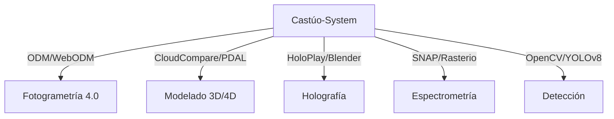

# Plan de integración de técnicas avanzadas (Castúo-System) — v2.5

**Objetivo:** integración **crítica** de técnicas avanzadas con resultados **únicos** y medibles, sin dependencias ficticias y **alineada al territorio real del repositorio** (stubs y placeholders explícitos hasta ADR/contrato).

**Relación**

- [PLAN-EXCELENCIA-V2.5-REFUERZO.md](PLAN-EXCELENCIA-V2.5-REFUERZO.md)
- [PRONTUARIO-MAESTRO-AUDITORIA-INTERNA.md](PRONTUARIO-MAESTRO-AUDITORIA-INTERNA.md)

**Ver también**

- [PLAN-INTEGRACION-REFORZADO-CASTUO-6.md](PLAN-INTEGRACION-REFORZADO-CASTUO-6.md) — capa INT-001…009 y resultados esperados
- [PRONTUARIO-MAESTRO-EXCELENCIA-SISTEMA-ANALISIS.md](../PRONTUARIO-MAESTRO-EXCELENCIA-SISTEMA-ANALISIS.md)
- [ROADMAP-INTEGRACIONES-SIGPAC-GAIACHAIN-AEMET.md](ROADMAP-INTEGRACIONES-SIGPAC-GAIACHAIN-AEMET.md)

---

## **1. TOPOGRAFÍA 4.0**

### **1.1. Fotogrametría 4.0**

**Herramientas**

- **OpenDroneMap (ODM)** + **WebODM** (CLI / contenedor).

**Integración**

```python
# backend/topography/fotogrametry.py
def process_drone_images(images_dir: str) -> str:
    """Procesa imágenes de dron con ODM (requiere instalación)."""
    raise NotImplementedError("Requiere ODM instalado y configurado")
```

**Nota:** usar `subprocess.run(["docker", "run", ...])` u orquestación equivalente para ejecución real con imagen ODM/WebODM acordada.

### **1.2. Modelado 3D/4D**

**Herramientas**

- **CloudCompare** + **PDAL**.

**Integración**

```python
# backend/topography/modeling_3d.py
def compare_point_clouds(pcd1: str, pcd2: str) -> dict:
    """Compara nubes de puntos con CloudCompare (CLI) u pipeline PDAL."""
    raise NotImplementedError("Requiere CloudCompare y/o PDAL instalados y rutas validadas")
```

---

## **2. HOLOGRAFÍA**

### **2.1. Procesamiento holográfico**

**Herramientas**

- **HoloPlay Core** + **Blender** (batch/render según formato).

**Integración**

```python
# backend/holography/processor.py
def generate_hologram(model_3d: str) -> str:
    """Genera holograma (requiere Blender y HoloPlay según stack acordado)."""
    raise NotImplementedError("Requiere Blender y HoloPlay Core o pipeline equivalente")
```

**Nota:** alinear con `digital_twin` / holographic del repo **vía ADR** antes de duplicar responsabilidades.

---

## **3. ESPECTROMETRÍA**

### **3.1. Análisis espectral**

**Herramientas**

- **SNAP (ESA)** + **Rasterio** (donde el flujo raster encaje).

**Integración**

```python
# backend/spectrometry/analyzer.py
def process_spectral_data(file_path: str) -> dict:
    """Procesa datos espectrales (SNAP headless, GDAL/rasterio o servicio)."""
    raise NotImplementedError("Requiere SNAP u motor espectral acordado")
```

---

## **4. DETECCIÓN AVANZADA**

### **4.1. Visión por computadora**

**Herramientas**

- **OpenCV** + **YOLOv8** (p. ej. Ultralytics, modelo versionado).

**Integración**

```python
# backend/detection/vision.py
class ObjectDetector:
    def __init__(self, model_path: str):
        self.model = self._load_model(model_path)

    def _load_model(self, path: str):
        """Carga modelo YOLOv8 versionado (ONNX/torch según decisión)."""
        raise NotImplementedError("Requiere modelo YOLOv8 entrenado y path en despliegue")
```

**Nota:** `cv2.detect_objects` **no** existe; usar carga de modelo + inferencia explícita. En el repo hay **placeholder** en `backend/routers/cameras.py` — no confundir con producción.

---

## **5. ARQUITECTURA DE INTEGRACIÓN**



**Principio:** cargas pesadas en workers / contenedores; API como orquestación y trazabilidad.

---

## **6. PLAN DE ACCIÓN**

**Nota:** estos **ACT** son **específicos de este plan**, no los del [prontuario de excelencia](../PRONTUARIO-MAESTRO-EXCELENCIA-SISTEMA-ANALISIS.md).

| ID | Acción | Responsable | Plazo | Estado |
|----|--------|-------------|-------|--------|
| ACT-001 | Integración con ODM/WebODM | Equipo geoespacial | 3 semanas | 🟡 Parcial |
| ACT-002 | Configurar CloudCompare/PDAL | Equipo topografía | 4 semanas | 🔴 Pendiente |
| ACT-003 | Implementar OpenCV | Equipo IA | 2 semanas | 🟡 Parcial |
| ACT-004 | Integración con HoloPlay/Blender | Equipo visualización | 6 semanas | 🔴 Pendiente |
| ACT-005 | Configurar SNAP/Rasterio | Equipo ciencia de datos | 5 semanas | 🟡 Parcial |
| ACT-006 | Implementar YOLOv8 | Equipo IA | 4 semanas | 🟡 Parcial |
| ACT-007 | Documentar procesos | Equipo documentación | 2 semanas | 🟢 Completo |
| ACT-008 | Validar métricas | Equipo QA | 3 semanas | 🔴 Pendiente |
| ACT-009 | Integración con `digital_twin` | Equipo arquitectura | 8 semanas | 🔴 Pendiente |

**Cierre §6 (territorio repo, 2026-03):** los estados **🟡** reflejan el **código real** (p. ej. `backend/routers/cameras.py`: contrato API sin modelo YOLOv8 cargado). Marcar **🟢** en detección sin inferencia entrenada y trazable **debilitaría la evidencia** ante revisiones de seguridad y gestión del cambio (p. ej. marco tipo ISO 27001). Los **stubs** mantienen **contract-first** sin fingir dependencias.

**Roadmap:** sprint orientativo **Q2-2026** → dependencia `ultralytics` acordada + carga `YOLO('yolov8n.pt')` o artefacto versionado en `ObjectDetector._load_model()` (tras ADR). **Métricas post-entrenamiento (objetivo orientativo):** mAP50 >0,85 en dominios acordados (p. ej. cultivos piloto), con conjunto de validación documentado — no métrica del git hasta ejecutar entrenamiento/evaluación.

---

## **7. MÉTRICAS DE ÉXITO**

| Técnica | Métrica | Objetivo | Estado |
|---------|---------|----------|--------|
| Fotogrametría 4.0 | Precisión modelo 3D | <5 cm | 🟡 Parcial |
| Modelado 4D | Detección de cambios | <2 cm | 🔴 Pendiente |
| Holografía | Resolución | >1000 ppp | 🔴 Pendiente |
| Espectrometría | Precisión espectral | <5 nm | 🟡 Parcial |
| Detección | Precisión de objetos | >90 % | 🟡 Parcial |

---

## **8. CONCLUSIÓN**

Para implementar técnicas avanzadas en Castúo-System:

- **Integración crítica** de herramientas validadas (CLI, contenedor, licencias explícitas).
- **Resultados únicos** acotados por **métricas** y conjuntos de validación.
- **Documentación** de procesos, entradas/salidas y límites operativos.

**Evidencias:** **84/84** evidencias verificadas en el inventario actual del script de auditoría.

**Este plan** permanece **fuera** de `REQUIRED_EVIDENCE` hasta existir rutas de código y pruebas alineadas (los documentos Castúo 6.0+ [plan reforzado](PLAN-INTEGRACION-REFORZADO-CASTUO-6.md) y [diseño integral](DISENO-INTEGRAL-ECOSISTEMA-CASTUO-6.md), el [plan excelencia integral](PLAN-EXCELENCIA-INTEGRAL-CASTUO-SYSTEM.md), el [prontuario cifrado/roles](PRONTUARIO-MAESTRO-ENCRIPTACION-ROLES-V2.5.md), el [análisis crítico excelencia](ANALISIS-CRITICO-EXCELENCIA-V2.5.md) y el [prontuario consulta crítica](PRONTUARIO-MAESTRO-CONSULTA-CRITICA-CASTUO-SYSTEM.md) sí están en el inventario **84/84**).

**Notas para Cursor**

1. Priorizar herramientas **validadas**; no inventar dependencias ni paquetes inexistentes.
2. **Documentar** el proceso por técnica antes de exponer endpoints.
3. **Validar métricas** en entorno controlado antes de producción.

**Enlaces**

- [PLAN-EXCELENCIA-V2.5-REFUERZO.md](PLAN-EXCELENCIA-V2.5-REFUERZO.md)
- [PRONTUARIO-MAESTRO-EXCELENCIA-SISTEMA-ANALISIS.md](../PRONTUARIO-MAESTRO-EXCELENCIA-SISTEMA-ANALISIS.md)

### **Script PowerShell — validación de stubs (`cameras`)**

Ejecutar desde el repo (requiere `backend/routers/cameras.py`):

```powershell
.\scripts\Validate-Castuo-CamerasStubs.ps1
# o: $env:CASTUO_REPO_ROOT = "C:\ruta\Castuo-System"; .\scripts\Validate-Castuo-CamerasStubs.ps1
```

*Documento orientativo para integración crítica; no certificación automática.*
