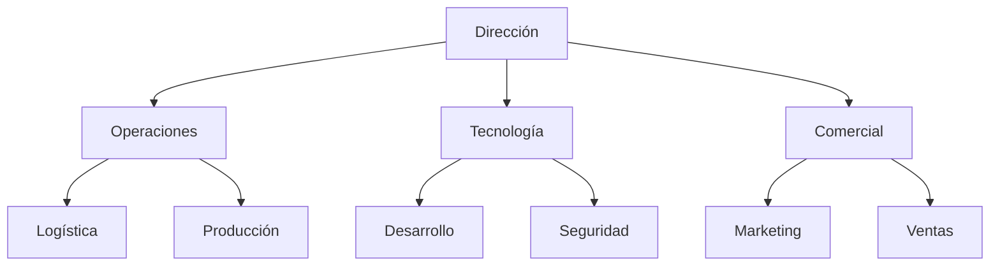

# Prontuario maestro de consulta crítica — CASTÚO-SYSTEM

**Objetivo:** identificar **necesidades críticas** y brechas, y derivar un **plan de acción** hacia la excelencia operativa **sin confundir** inventario documental con certificación externa.

**Ámbito:** coherencia entre briefings, código, pruebas y `docs/legal/`. **No** constituye auditoría legal ni ISO automática.

**Relación:** [PRONTUARIO-MAESTRO-AUDITORIA-INTERNA.md](./PRONTUARIO-MAESTRO-AUDITORIA-INTERNA.md) · [PRONTUARIO-MAESTRO-EXCELENCIA-SISTEMA-ANALISIS.md](../PRONTUARIO-MAESTRO-EXCELENCIA-SISTEMA-ANALISIS.md) · [ANALISIS-CRITICO-EXCELENCIA-V2.5.md](./ANALISIS-CRITICO-EXCELENCIA-V2.5.md) · [PRONTUARIO-MAESTRO-MEJORA-CASTUO-SYSTEM.md](./PRONTUARIO-MAESTRO-MEJORA-CASTUO-SYSTEM.md)

**Ver también:** [PLAN-EXCELENCIA-V2.5-REFUERZO.md](./PLAN-EXCELENCIA-V2.5-REFUERZO.md) · [ROADMAP-INTEGRACIONES-SIGPAC-GAIACHAIN-AEMET.md](./ROADMAP-INTEGRACIONES-SIGPAC-GAIACHAIN-AEMET.md) · [RUTA-CONQUISTADORAS-CASTUO-LINK.md](./RUTA-CONQUISTADORAS-CASTUO-LINK.md) (programa territorial; fuera de `REQUIRED_EVIDENCE`)

---

## 1. Consulta crítica

### 1.1. Áreas de mejora (preguntas guía)

| Área | Pregunta crítica | Respuesta esperada (evidencia) |
|------|------------------|--------------------------------|
| **Automatización** | ¿Qué procesos manuales pueden automatizarse **con contrato** (API, clave, ADR)? | Lista priorizada + riesgo si se omite |
| **Seguridad** | ¿Qué datos exigen cifrado o segregación adicional (PQC, KMS, RGPD)? | Mapa de datos + acciones en `pq_crypto` / políticas |
| **Infraestructura** | ¿Qué pruebas faltan (integración, GDAL opcional, carga)? | Lista en CI + plazos |
| **Integraciones** | ¿Qué integraciones son prioritarias **sin URLs inventadas** (SIGPAC local, AEMET contractual)? | Roadmap alineado a `docs/legal/` |

### 1.2. Utilidades adicionales (roadmap)

| Utilidad | Beneficio | Implementación (repo / nota) |
|----------|-----------|------------------------------|
| **Panel de control** | Visibilidad operativa | Grafana / Prometheus según `castu-monitoring/` |
| **Asistente de soporte** | Reducir carga a operadores | Solo con ADR + RGPD; sin datos sensibles en prompts |
| **Canal comercial** | Ingresos y trazabilidad | Contratos y rutas **documentadas**; sin e-commerce ficticio en código |

---

## 2. Estructura empresarial (referencia)

### 2.1. Refuerzo organizativo

### 2.2. Mejoras estructurales (metas piloto, no garantía)

| Área | Acción | Impacto orientativo |
|------|--------|---------------------|
| **Gestión de proyectos** | Metodología ágil acotada | Mejor predictibilidad de entregas |
| **Formación** | Capacitación continua (p. ej. [manual agrovoltaica Castúa](../training/agrovoltaica-castua-hidroponia/MANUAL-FORMACION-COOPERATIVA-AGROVOLTAICA-CASTUA-HIDROPONIA-INTELIGENTE.md)) | Menor riesgo operativo |
| **Sostenibilidad** | Certificaciones / huella donde aplique negocio | Acceso a mercados con evidencia real |

---

## 3. Plan de acción

### 3.1. Corto plazo (1–3 meses)

| ID | Acción | Responsable | Plazo orientativo |
|----|--------|-------------|-------------------|
| CC-001 | **SIGPAC:** reforzar validación **local** + marcos en `docs/legal/` (sin API MAPA ficticia) | Geoespacial / backend | 2–4 semanas |
| CC-002 | **CI/CD:** GDAL opcional + `tests/integrations/test_sigpac_validator.py` | DevOps / QA | 3 semanas |
| CC-003 | **Observabilidad:** revisar dashboards frente a KPI acordados | Plataforma | 1–2 semanas |

### 3.2. Medio plazo (3–6 meses)

| ID | Acción | Responsable | Plazo orientativo |
|----|--------|-------------|-------------------|
| CC-004 | **Gaia-X / soberanía datos:** roadmap documentado | Arquitectura | 6 semanas |
| CC-005 | **Asistente:** prototipo con límites de datos | IA / DPO | 4+ semanas |
| CC-006 | **Comercial / marketplace:** contrato de producto + trazas existentes | Comercial / backend | 8+ semanas |

---

## 4. Conclusión y próximos pasos

1. Priorizar integraciones **validadas** y herramientas con licencia clara.  
2. **Documentar** cada decisión (entrada, salida, responsable, riesgo).  
3. **Validar métricas** en entorno controlado antes de producción.

**Evidencias:** incluido en `REQUIRED_EVIDENCE` (categoría **legal**); inventario del script **84/84** rutas. La presencia del documento **no** certifica despliegue de red ni concesión de becas.

**Notas para Cursor**

1. **No inventar endpoints:** solo lo documentado en OpenAPI / `docs/legal/` / código real.  
2. **Trazabilidad:** cambios críticos → prueba + nota o ADR.  
3. **Métricas:** datos reales y conjunto de validación definido.

*Documento orientativo para consulta crítica e integración; no certificación automática.*
