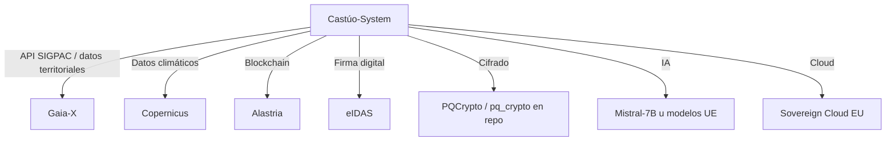

# Prontuario maestro — debilidades, potencial y soberanía europea

**Objetivo:** analizar debilidades técnicas y operativas, identificar potencial de mejora y proponer soluciones alineadas con soberanía europea (RGPD, AI Act, Gaia-X, etc.), **sin confundir roadmap con certificación legal automática**.

**Límite explícito:** las referencias normativas en código y documentación son **marco documental**; no sustituyen dictamen jurídico, DPO ni auditoría externa.

---

## 1. Contexto y relación con otros documentos

**Documentos relacionados**

- [DPIA-CASTUO-SYSTEM.md](./DPIA-CASTUO-SYSTEM.md)
- [PROTOCOLO-AUDITORIA-INTERNA-LEGAL-COHERENCIA.md](./PROTOCOLO-AUDITORIA-INTERNA-LEGAL-COHERENCIA.md)
- [ROADMAP-INTEGRACIONES-SIGPAC-GAIACHAIN-AEMET.md](./ROADMAP-INTEGRACIONES-SIGPAC-GAIACHAIN-AEMET.md)
- [PRONTUARIO-MAESTRO-EXCELENCIA-SISTEMA-ANALISIS.md](../PRONTUARIO-MAESTRO-EXCELENCIA-SISTEMA-ANALISIS.md)

**Evidencias verificadas:** **84/84** presentes (`python scripts/audit/audit_repo_evidence_check.py`, protocolo v2.4).

| Eje | Contenido |
|-----|-----------|
| **Debilidades** | Riesgos técnicos, operativos y de cumplimiento. |
| **Potencial** | Oportunidades con ecosistemas y estándares europeos. |
| **Soberanía** | Datos, proveedores y anclajes jurídicos preferentes en UE/EEE cuando el negocio lo permita. |

---

## 2. Análisis de debilidades

### 2.1. Debilidades técnicas y operativas

| ID | Debilidad | Impacto | Riesgo | Acciones recomendadas |
|----|-----------|---------|--------|------------------------|
| DEB-001 | Validación SIGPAC manual | Proceso no automatizado | Errores humanos en validaciones | Integración con API SIGPAC (requiere **contrato** MAPA/FEGA). Automatización de descargas solo con fuentes oficiales documentadas. |
| DEB-002 | GDAL opcional | Inconsistencia entre entornos | Fallos o ausencia de área UTM en validación | Configurar CI/CD con GDAL (p. ej. OSGeo4W / imagen con `osgeo`). Documentar fallback estructural (`requirements-sigpac-gdal.txt`). |
| DEB-003 | Umbrales climáticos estáticos (YAML) | Datos no enlazados a tiempo real | Alertas imprecisas frente a meteorología observada | Integración AEMET u otras APIs con clave y TOS. Modelos predictivos (p. ej. Mistral u otros en **UE**) si el caso de uso y AI Act lo permiten. |
| DEB-004 | Trazabilidad limitada (diseño actual) | Brecha frente a trazabilidad reforzada | Incumplimiento legal **potencial** según expediente | Evolución de `register_event_in_chain` / contratos (`contracts/`). Smart contracts solo con especificación y contrato; evitar etiquetas comerciales vacías (“GaiaChain 3.0” sin spec). |
| DEB-005 | Informes sin firma digital cualificada | Validez legal limitada para ciertos usos | Rechazo en auditorías o trámites que exijan firma avanzada | Integración eIDAS / firma cualificada según caso de uso. |
| DEB-006 | Pruebas con cobertura parcial | Cobertura limitada | Errores no detectados | Aumentar cobertura; `tests/reports/` para informes; pruebas de integración; GDAL en CI si el territorio lo exige. |

### 2.2. Debilidades legales y de cumplimiento

| ID | Debilidad | Impacto | Riesgo | Acciones recomendadas |
|----|-----------|---------|--------|------------------------|
| DEB-007 | Referencias normativas no certificadas | Cumplimiento no “sellado” por software | Revisión humana/jurídica necesaria | Auditorías externas **asistidas**. Revisión legal periódica. Aclarar `normative_notice` en informes. **No** certificación automática por repositorio. |
| DEB-008 | Cifrado post-cuántico **parcial** en despliegue | Superficie híbrida | Vulnerabilidad futura frente a adversario cuántico (horizonte largo) | **TLS 1.3** (y política de versiones). **HSM** o gestión segura de secretos. **Rotación** de claves. El repo ya incluye `backend/security/pq_crypto.py` (**Kyber-1024** + AES-GCM): extender **uso operativo** a todos los canales que lo requieran. |
| DEB-009 | Documentación técnica predominante | Dificultad para usuarios finales | Baja adopción operativa | Guías para agrónomos/operadores. Tutoriales de export SIGPAC, umbrales e informes. |

**RGPD / AI Act:** bases jurídicas, DPIA y registro de tratamientos actualizados; clasificación de sistemas de IA y obligaciones conforme al reglamento aplicable (asesoramiento externo).

---

## 3. Potencial con soberanía europea

### 3.1. Oportunidades con tecnologías europeas

| ID | Oportunidad | Beneficio | Tecnología europea | Acciones |
|----|-------------|-----------|----------------------|----------|
| POT-001 | API SIGPAC en marco federado | Automatización con gobernanza de datos | Gaia-X (UE) | Contrato MAPA/FEGA. Integración solo con servicios reales documentados; sin URLs inventadas. |
| POT-002 | Datos climáticos Copernicus | Precisión y datos bajo marco UE | Copernicus (UE) | Integración con API/registros Copernicus. Modelos predictivos acoplados a umbrales existentes. |
| POT-003 | Blockchain soberana | Trazabilidad auditable | Alastria (España) u otra red admitida en expediente | Evaluación legal+técnica. Smart contracts tras diseño; **no** migración sin acta. |
| POT-004 | Firma digital | Cumplimiento para prueba electrónica | eIDAS (UE) | Integración con proveedor cualificado / firma cualificada. |
| POT-005 | Cifrado post-cuántico | Seguridad a largo plazo | NIST PQC / perfiles ETSI (marco UE alineado) | El código ya orienta a **Kyber-1024** en `pq_crypto.py`: despliegue operativo, certificados y política PQC. |
| POT-006 | IA soberana | Modelos bajo control residencia/proveedor UE | Mistral u otros modelos alojados en UE | Modelos predictivos climáticos; asistente virtual acotado; **AI Act** según clasificación. |
| POT-007 | Cloud soberana | Almacenamiento y claves con jurisdicción predecible | Gaia-X / Sovereign Cloud UE | Migración contractual; DPA y localización en UE. |

### 3.2. Roadmap para soberanía europea (aspiracional)

Diagrama de **direcciones estratégicas**; no implica que el clon integre hoy cada caja (ver código y `REQUIRED_EVIDENCE`).

---

## 4. Plan de acción para soberanía europea

### 4.1. Corto plazo (1–3 meses)

| ID | Acción | Responsable | Tecnología europea |
|----|--------|-------------|-------------------|
| ACT-001 | Documentar guía de descarga manual de GeoJSON + validación | Documentación | — |
| ACT-002 | Configurar CI/CD para GDAL (p. ej. OSGeo4W o contenedor `osgeo`) | DevOps | Gaia-X (marco de referencia para soberanía de datos en pipelines federados, si aplica al despliegue) |
| ACT-003 | Implementar pruebas para informes (`tests/reports/`) | QA | — |
| ACT-004 | Integración / PoC con API Copernicus para datos climáticos | IoT / datos | Copernicus |
| ACT-005 | Evaluación de migración o anclaje a red DLT soberana (p. ej. Alastria) | Legal + Blockchain | Alastria |

### 4.2. Medio plazo (3–6 meses)

| ID | Acción | Responsable | Tecnología europea |
|----|--------|-------------|-------------------|
| ACT-006 | Negociar acceso a API SIGPAC con MAPA/FEGA | Legal | Gaia-X (marco) |
| ACT-007 | Implementar cliente OAuth2 para API SIGPAC oficial | Backend | Gaia-X (marco) |
| ACT-008 | Integración con eIDAS para firma digital | Legal / integración | eIDAS |
| ACT-009 | Modelos predictivos con Mistral-7B u equivalente UE | IA | Mistral-7B |
| ACT-010 | Cifrado post-cuántico operativo end-to-end (extender `pq_crypto`) | Seguridad | PQCrypto / NIST PQC |

### 4.3. Largo plazo (6–12 meses)

| ID | Acción | Responsable | Tecnología europea |
|----|--------|-------------|-------------------|
| ACT-011 | Evolución de trazabilidad con smart contracts según diseño | Blockchain | Alastria / red acordada |
| ACT-012 | Automatización de auditorías externas (recogida de evidencias; revisión humana/legal) | QA | — |
| ACT-013 | Integración con Sovereign Cloud EU para almacenamiento | DevOps | Sovereign Cloud EU |
| ACT-014 | Cumplimiento asistido con **revisión legal** obligatoria | Legal | — |

---

## 5. Métricas de éxito con soberanía europea

| Área | Métrica actual | Métrica objetivo | Herramienta |
|------|----------------|------------------|-------------|
| Validación SIGPAC | Manual (GeoJSON) | Automatizada (API SIGPAC con contrato) | Tiempo de validación / tasa de error |
| Datos climáticos | Estáticos (YAML) | Dinámicos (Copernicus / AEMET acordado) | Precisión de alertas |
| Blockchain | Registro vía servicio actual (`register_event_in_chain`) | Red soberana (p. ej. Alastria) si expediente lo exige | Inmutabilidad / evidencias de auditoría |
| Firma digital | JSON sin firma cualificada | eIDAS (cualificada) donde proceda | % informes aceptados en trámite objetivo |
| Cifrado | Módulo PQC (**Kyber-1024**) en `pq_crypto.py` | Kyber-1024 + TLS 1.3 + HSM **operativos** en todos los canales críticos | Revisiones de seguridad / pentest |
| IA | Sin modelo predictivo productivo obligatorio | Mistral-7B u modelo UE integrado si caso de uso | Precisión / AI Act |
| Cloud | Según despliegue actual | Sovereign Cloud EU / residencia explícita | % datos y claves en UE |

---

## 6. Conclusión y recomendaciones para Cursor

### 6.1. Resumen de debilidades críticas

- **Validación SIGPAC manual:** riesgo de errores humanos hasta exista API contractual.  
- **Umbrales climáticos estáticos:** alertas imprecisas si el negocio exige tiempo real.  
- **Trazabilidad limitada:** brecha legal **potencial** según expediente y normativa aplicable.  
- **Firma digital pendiente** para ciertos usos: validez limitada frente a terceros que exijan firma avanzada.  
- **Pruebas parciales:** regresiones en informes y rutas poco cubiertas.

### 6.2. Recomendaciones clave para soberanía europea

- Priorizar integraciones europeas cuando haya **contrato y endpoints reales:** SIGPAC/FEGA, Copernicus, redes DLT admitidas (p. ej. Alastria).  
- Implementar tecnologías soberanas donde aplique: **eIDAS**, modelos **UE** (p. ej. Mistral), **PQC** ya presente en repo extendido a despliegue.  
- **Documentar y auditar:** guías técnicas para usuarios; auditorías externas **asistidas**; sin prometer certificación automática.

### 6.3. Nota para Cursor

- **No inventar endpoints:** solo lo documentado en el repositorio y en contratos reales.  
- **Respetar contratos de código:** `register_event_in_chain` con **un diccionario**, no kwargs; `tokenId` entero ≥ 1.  
- **Soberanía europea:** preferir soluciones UE cuando el caso de uso y la legalidad lo permitan, sin afirmar integraciones no reflejadas en el código.
