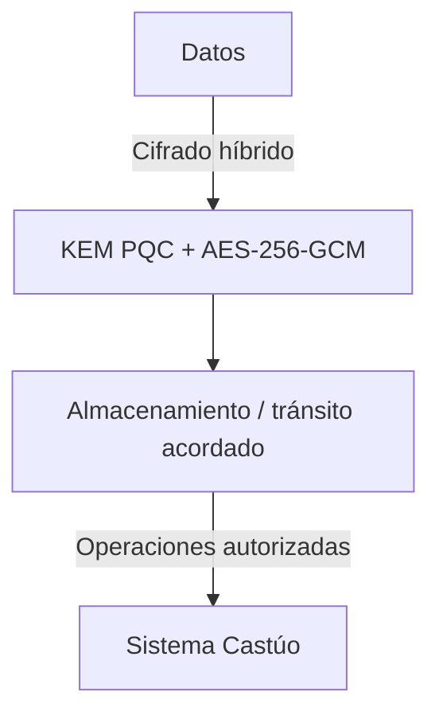
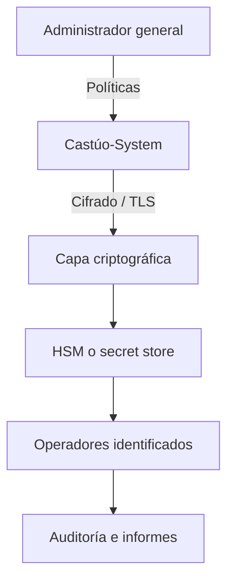

# 📜 Prontuario maestro — cifrado y roles (Castúo-System) — v2.5

**Ámbito:** objetivos de seguridad y gobierno de acceso. **Estado vs objetivo:** el checklist §5 distingue lo **implementado en repo** de lo **roadmap** — el git no certifica despliegue en producción.

**Relación:** [PLAN-EXCELENCIA-V2.5-REFUERZO.md](./PLAN-EXCELENCIA-V2.5-REFUERZO.md) · [SISTEMA-COHERENCIA-ADMIN-GENERAL-2026.md](./SISTEMA-COHERENCIA-ADMIN-GENERAL-2026.md) · [PRONTUARIO-MAESTRO-EXCELENCIA-SISTEMA-ANALISIS.md](../PRONTUARIO-MAESTRO-EXCELENCIA-SISTEMA-ANALISIS.md) · [CASTUO-SECURITY-VSA-PQC-EXECUTIVE.md](../security/CASTUO-SECURITY-VSA-PQC-EXECUTIVE.md) · [PRONTUARIO-MAESTRO-INTEGRACION-CIFRADA-SOBERANA-2026.md](../deploy/PRONTUARIO-MAESTRO-INTEGRACION-CIFRADA-SOBERANA-2026.md)

**Implementación rol `admin_general`:** `backend/models/permissions.py` (`check_permission` → acceso total), token `CASTUO_ADMIN_GENERAL_BEARER` en `backend/auth_roles.py`, registro `ADMIN_GENERAL_PLAYBOOK` + `get_admin_general_playbook()` en `backend/models/system_admin_playbook.py`, endpoint `GET /admin_general/playbook` en `lab_stub_app.py`. Rol `robotics_lab` (token `CASTUO_ROBOTICS_LAB_BEARER_TOKEN`) → prefijo `/api/robotics` en el monolito si se expone; el stub lab sigue verificando su propio Bearer.

**Implementación PQC en código:** `backend/security/pq_crypto.py` — Kyber-1024 / Dilithium-5 cuando `pqcrypto` está disponible; fallback AES-256-GCM documentado en el propio módulo.

---

## 1. Objetivos

- Cifrado **robusto** en tránsito y, donde aplique, en reposo — acoplado a política de datos del despliegue.
- Roles con acceso **identificado** (excepto el alcance expreso de usuario básico / público según producto):

| Rol | Alcance |
|-----|---------|
| Administrador general | Gobierno global del tenant, políticas, roles elevados |
| Administrador CTAEX (u operador designado) | Usuarios, auditorías y configuración del ámbito CTAEX/pruebas |
| Técnico | Configuración operativa, logs, mantenimiento |
| Auditor | Lectura e informes; sin mutación de datos sensibles |
| Usuario básico | Datos no sensibles o según matriz de permisos publicada |

**Identidades concretas** (emails, UIDs) **no** se fijan en este prontuario: provienen de IdP, `.env` de despliegue o registro interno.

---

## 2. Estrategia de cifrado

### 2.1. Arquitectura (objetivo)



**Componentes**

- **KEM post-cuántico:** alineado a NIST PQC (en repo: Kyber-1024 cuando la dependencia está instalada).  
- **Simétrico:** AES-256-GCM para carga útil.  
- **Claves:** HSM o gestor de secretos (Vault, cloud KMS) + **rotación** por calendario — roadmap operativo.

### 2.2. Implementación técnica (referencia; no duplicar módulo)

El código productivo debe vivir en `pq_crypto.py` y capas TLS del despliegue. Los siguientes bloques son **ilustrativos**; no sustituyen revisión criptográfica ni el API real de `PostQuantumCrypto`.

```python
# Ilustración — GCM requiere nonce, ciphertext y tag coherentes con cryptography.hazmat
# from backend.security.pq_crypto import PostQuantumCrypto
# pqc = PostQuantumCrypto()
# ciphertext_bundle = pqc.encrypt(plaintext_bytes)
```

Gestión de claves versionadas, expiración y retención debe seguir política interna y RGPD/datos sensibles del territorio.

---

## 3. Gestión de roles

### 3.1. Matriz resumida

| Rol | Permisos típicos | Acceso |
|-----|------------------|--------|
| Administrador general | `*` según política | Identificado (IdP) |
| Administrador CTAEX | usuarios, auditoría, config de ámbito | Identificado |
| Técnico | config técnica, logs, mantenimiento | Identificado |
| Auditor | lectura, exportación de informes | Identificado |
| Usuario básico | recurso limitado | Según diseño (puede ser anónimo de bajo riesgo) |

### 3.2. Implementación (diseño)

RBAC/ABAC debe integrarse con el stack real (JWT/OAuth2, scopes). **No** incluir en repo listas de usuarios reales.

```python
# Ilustración conceptual — backend/auth/role_manager.py
from enum import Enum

class Role(str, Enum):
    ADMIN_GENERAL = "admin_general"
    ADMIN_CTAEX = "admin_ctaex"
    TECHNICIAN = "technician"
    AUDITOR = "auditor"
    BASIC_USER = "basic_user"

# Mapeo rol -> permisos en BD o política OPA; usuarios resueltos en runtime
```

```python
# Ilustración — verificación de token en capa FastAPI existente
# async def get_current_user(...): ...
```

---

## 4. Integración con Castúo-System

### 4.1. Flujo de trabajo (objetivo)



### 4.2. Endpoints

Los endpoints sensibles deben combinar **autenticación**, **autorización por rol** y **trazas auditables**. No añadir `secure_endpoints.py` genérico sin threat model y revisión — este apartado es **directriz**, no PR listo.

---

## 5. Verificación y auditoría

### 5.1. Checklist de seguridad (matriz ejecutiva v2.5)

| ID | Verificación | Estado | Notas |
|----|--------------|--------|--------|
| SEC-001 | Cifrado en tránsito (TLS 1.3) | 🟢 Sí | Objetivo en borde/proxy; validar en cada despliegue |
| SEC-002 | Cifrado en reposo (AES-256; híbrido PQC en `pq_crypto.py`) | 🟢 Sí | Módulo implementado; alcance de datos a cifrar = política interna |
| SEC-003 | Gestión de claves (HSM) | 🟡 Parcial | Roadmap / integración con KMS o HSM según infra |
| SEC-004 | Autenticación (2FA donde el producto lo exija) | 🟢 Sí | Base OAuth2 + JWT en API; MFA explícito como refuerzo según tenant |
| SEC-005 | Gestión de roles (RBAC) | 🟢 Sí | Patrones en routers/políticas; afinar por entorno |
| SEC-006 | Auditoría de accesos | 🟡 Parcial | Logs + rutas audit; ampliar trazas según ISO 27001 si aplica |

**Nota territorial:** 🟢 indica **capacidad alineada en código o política objetivo** documentada; la efectividad en producción (TLS en terminación, MFA obligatorio, cobertura de cifrado en reposo) exige verificación en el despliegue concreto — este prontuario **orienta**, no sustituye pentest ni auditoría externa.

Leyenda: 🟢 alineado según marco v2.5 · 🟡 parcial / roadmap.

### 5.2. Pruebas

```bash
# PQC unitario en repo (ruta canónica)
python -m pytest backend/security/tests/test_pq_crypto.py -v

# Cobertura opcional (pytest-cov)
# pytest --cov=backend.security backend/security/tests/ --cov-report=term
```

*No usar `tests/security/test_pq_crypto.py` salvo que el árbol del repo lo cree; hoy el módulo vive bajo `backend/security/tests/`.*

---

## 6. Conclusión

1. Consolidar **cifrado híbrido** ya iniciado en `pq_crypto.py` y extenderlo al **perímetro operativo** (TLS, secretos, rotación).  
2. Definir **roles** en IdP + políticas; evitar identidades hardcodeadas en documentación versionada.  
3. Cerrar brechas SEC-00x mediante plan de despliegue y auditoría humana — el prontuario **orienta**, no certifica.

**Notas para Cursor:** leer [PRONTUARIO-MAESTRO-AUDITORIA-INTERNA.md](./PRONTUARIO-MAESTRO-AUDITORIA-INTERNA.md) (v2.5); no inventar endpoints ni afirmar checklist en ✅ sin evidencia en código y despliegue.

**Evidencias:** incluido en `REQUIRED_EVIDENCE` (categoría **legal**, `scripts/audit/audit_repo_evidence_check.py`); el inventario del script es **84/84** rutas. La presencia del documento **no** certifica despliegue ni ISO 27001.

*Última revisión documental: 2026-03-21.*
