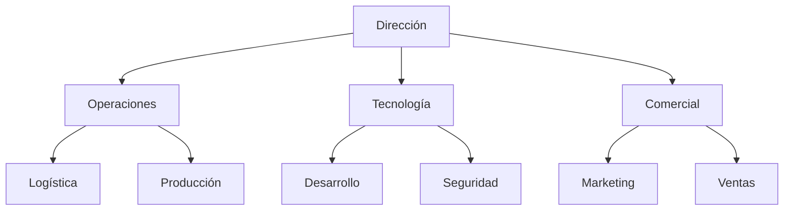

# Prontuario maestro de mejora — Castúo-System

**Ámbito:** refuerzo **operativo** y **estructura empresarial** (objetivos y roadmap). **No** constituye certificación ISO, veredicto legal ni compromiso de métricas en producción sin medición en piloto.

**Relación:** [PLAN-EXCELENCIA-INTEGRAL-CASTUO-SYSTEM.md](./PLAN-EXCELENCIA-INTEGRAL-CASTUO-SYSTEM.md) · [PRONTUARIO-MAESTRO-AUDITORIA-INTERNA.md](./PRONTUARIO-MAESTRO-AUDITORIA-INTERNA.md) · [PRONTUARIO-MAESTRO-EXCELENCIA-SISTEMA-ANALISIS.md](../PRONTUARIO-MAESTRO-EXCELENCIA-SISTEMA-ANALISIS.md) · [ANALISIS-CRITICO-EXCELENCIA-V2.5.md](./ANALISIS-CRITICO-EXCELENCIA-V2.5.md) · [PLAN-EXCELENCIA-V2.5-REFUERZO.md](./PLAN-EXCELENCIA-V2.5-REFUERZO.md)

**Ver también:** [ROADMAP-INTEGRACIONES-SIGPAC-GAIACHAIN-AEMET.md](./ROADMAP-INTEGRACIONES-SIGPAC-GAIACHAIN-AEMET.md) · [SIGPAC-CLIMA-EXTREMADURA-MARCO-REPOSITORIO.md](./SIGPAC-CLIMA-EXTREMADURA-MARCO-REPOSITORIO.md) · [Memoria técnica FUNDECYT Smart Gate v2.0](./fundecyt-smart-gate-v2/MEMORIA-TECNICA-CASTUO-SMART-GATE-V2-FUNDECYT.md) · [PRONTUARIO-MAESTRO-CONSULTA-CRITICA-CASTUO-SYSTEM.md](./PRONTUARIO-MAESTRO-CONSULTA-CRITICA-CASTUO-SYSTEM.md)

---

## 1. Objetivo

Identificar áreas de mejora **prioritarias** para reforzar la operativa técnica y la **gobernanza** empresarial del ecosistema Castúo, sin prometer integraciones ni porcentajes que el clon no pueda sustentar.

---

## 2. Análisis de mejora

### 2.1. Refuerzo operativo

| Área | Mejora necesaria | Resultado esperado (orientativo) |
|------|------------------|----------------------------------|
| **Automatización** | Cerrar flujo **SIGPAC local** + clima contractual (**AEMET OpenData** / umbrales YAML); sin API MAPA inventada en código | Mayor cobertura de validación documentada en piloto |
| **Seguridad** | Extender uso de **PQC + AES** (`pq_crypto.py`), políticas de secretos y auditoría de accesos | Superficie de ataque acotada; trazas revisables por despliegue |
| **Infraestructura** | CI con **GDAL opcional** para `sigpac_validator`, ampliación de pruebas de integración | Menos regresiones en rutas críticas del repo |
| **Soberanía / datos UE** | Roadmap **Gaia-X / Copernicus** como capa documental y contratos; sin fingir registros de activos | Inventario de decisiones y dependencias externas trazable |

### 2.2. Utilidades adicionales (roadmap)

| Utilidad | Beneficio | Implementación (repo / nota) |
|----------|-----------|------------------------------|
| **Panel de control** | Visibilidad operativa | Stack **Grafana + Prometheus** ya referenciado en marcos de monitorización; afinar por entorno |
| **Asistente de soporte** | Reducir carga a operadores | IA/NLP solo con **ADR** y datos permitidos (RGPD); no exponer datos reales en prompts sin DPIA |
| **Canal comercial / marketplace** | Ingresos y trazabilidad | Alinear a rutas y contratos **documentados**; sin endpoints de terceros inventados |

---

## 3. Estructura empresarial (referencia)

### 3.1. Refuerzo organizacional

Modelo orientativo de gobernanza; roles concretos y RACI viven en política interna, no en identidades en este markdown.

### 3.2. Mejoras estructurales

| Área | Acción | Impacto (meta piloto, no garantía) |
|------|--------|-------------------------------------|
| **Gestión de proyectos** | Metodología ágil acotada al producto | Mejor predictibilidad de entregas |
| **Formación** | Capacitación continua (SIGPAC, clima, seguridad, normativa UE) | Menor riesgo operativo en campo |
| **Sostenibilidad** | Certificaciones / PAC / huella donde aplique negocio | Reputación y acceso a mercados alineados a evidencia real |

---

## 4. Plan de acción

### 4.1. Corto plazo (1–3 meses)

| ID | Acción | Responsable | Plazo orientativo |
|----|--------|-------------|-------------------|
| MEJ-001 | **SIGPAC:** reforzar `sigpac_validator` + flujo manual/contrato remoto honesto; revisar [SIGPAC-AEMPS-MARCO-REPOSITORIO.md](./SIGPAC-AEMPS-MARCO-REPOSITORIO.md) | Equipo geoespacial / backend | 2–4 semanas |
| MEJ-002 | **CI/CD:** job GDAL opcional + pruebas `tests/integrations/test_sigpac_validator.py` | DevOps / QA | 3 semanas |
| MEJ-003 | **Observabilidad:** revisar dashboards existentes (`castu-monitoring/`) frente a KPIs acordados | Equipo plataforma | 1–2 semanas |

### 4.2. Medio plazo (3–6 meses)

| ID | Acción | Responsable | Plazo orientativo |
|----|--------|-------------|-------------------|
| MEJ-004 | **Gaia-X / soberanía datos:** roadmap documentado; sin URLs ni “100 % activos” sin inventario real | Arquitectura / compliance | 6 semanas |
| MEJ-005 | **Asistente:** prototipo con límites de datos y registro de acceso | IA / DPO | 4+ semanas |
| MEJ-006 | **Marketplace / comercial:** contrato de producto y trazabilidad (p. ej. GaiaChain donde ya exista contrato en API) | Comercial / backend | 8+ semanas |

---

## 5. Conclusión y próximos pasos

1. Priorizar integraciones **validadas** y marcos en `docs/legal/`.  
2. **Documentar** procesos (entradas, salidas, responsable, riesgos).  
3. **Validar métricas** en piloto antes de fijar objetivos públicos.

**Evidencias:** inventario del script `scripts/audit/audit_repo_evidence_check.py` — **84/84** en el estado actual del repo (este prontuario **no** forma parte de `REQUIRED_EVIDENCE` hasta decisión explícita de ampliar el inventario).

**Notas para Cursor**

1. **No inventar endpoints** MAPA/AEMPS/CAAE: usar placeholders y variables de entorno según documentos legales del repositorio.  
2. **Trazabilidad:** cambios en integración crítica → prueba + nota en plan o ADR.  
3. **Métricas:** solo con datos reales y conjunto de validación definido.

*Prontuario de mejora — orientación territorial (Extremadura / UE) sin sustituir asesoramiento jurídico externo.*
