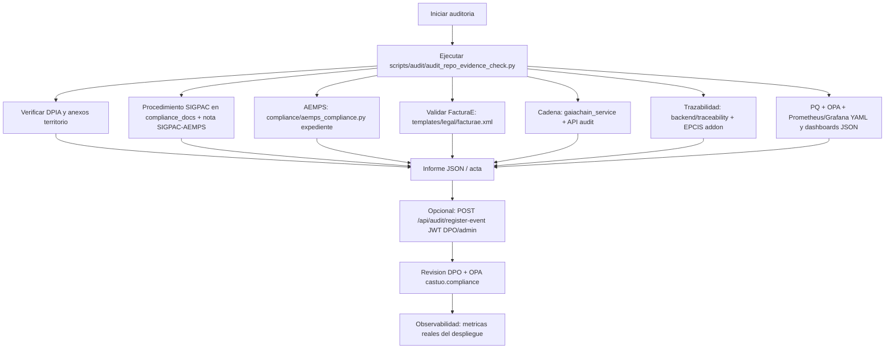

# Protocolo de auditoría interna: legalidad y coherencia (UE + Extremadura / código abierto)

**Versión:** 2.4 · **Última revisión documental:** 2026-03-21 · **Ámbito:** monorepo CASTUO-SYSTEM (OPA, Prometheus, Grafana JSON, API audit, **SIGPAC GeoJSON local + YAML clima + informes Jinja2 + prontuario auditoría interna**, sin APIs MAPA ni métricas `ctaex_*` ficticias).  
**No es:** certificación RGPD, eIDAS, AI Act ni ISO; **sí** es checklist reproducible y enlaces a artefactos del repo.

**Normativa (marco de alineación, no “sellado” por git):** Reglamento (UE) 2016/679 (RGPD), LOPDGDD donde aplique, normativa autonómica aplicable (documentación interna cita **Ley 3/2023** y anexos extremeños — **verificar titulación y vigencia** con asesoramiento), Reglamento (UE) 2024/1689 (AI Act) si hay IA de riesgo documentada, **Real Decreto 903/2025** y demás normativa sanitaria/cannabis según expediente real, PAC/SIGMAP/SIGPAC según procedimientos oficiales MAPA/FEGA, REACH/materiales según uso industrial.

---

## 1. Arquitectura real (Mermaid)



**GaiaChain (sin métodos inventados):**

| Pieza | Función | Ubicación |
|-------|---------|-----------|
| Registro en contrato | `register_event_in_chain(event_data)` con `tokenId`, `action`, `status`, `details`, `compliance` | `backend/api/services/gaiachain_service.py` |
| HTTP | `POST /api/audit/register-event` → cuerpo = ese `event_data` + Keycloak | `backend/api/routes/audit.py` |
| Cliente utilidad consentimientos | `GaiaChainAuditClient(...).get_consent_status(token_id)` | `backend/utils/gaia_chain.py` |

La denominación **“GaiaChain 3.0”** aparece en documentación de despliegue/plantilla (`docs/blockchain/gaiachain-deployment.md`); **no** implica versión normativa europea homologada.

---

## 2. Matriz de responsabilidades (rutas reales)

| Área | Responsable | Ruta en repo | Verificación | Notas UE / OSS |
|------|-------------|--------------|--------------|----------------|
| DPIA | DPO | `docs/legal/DPIA-CASTUO-SYSTEM.md` | Lectura / acta | RGPD Art. 35; AI Act si hay IA de riesgo |
| FacturaE (XML) | Fiscal | `templates/legal/facturae.xml` | XSD AEAT en expediente (p. ej. `xmllint` con esquema oficial) | No sustituye obligaciones LCSP/AEAT |
| Registro tratamiento | Compliance | `compliance_docs/generated/02.01.01_Registro_Actividades_Tratamiento.md` | Regenerar con `compliance_docs/scripts/generate_compliance_docs.py` si procede | Art. 30 RGPD (marco) |
| ISO 27001 (doc generado) | CISO | `compliance_docs/generated/02.04.01_Declaracion_Aplicabilidad_ISO27001.md` | Revisión humana | Certificación solo vía organismo acreditado |
| GaiaChain servicio | Backend | `backend/api/services/gaiachain_service.py` | `python scripts/test_gaia_chain.py` (entorno) | Trazabilidad técnica, no prueba legal sola |
| API audit | Backend | `backend/api/routes/audit.py` | API levantada + token | Requiere rol `dpo` o `admin` |
| Vegetal-Alloys | Técnico | `backend/vegetal_alloys/` | Código + tests cuando existan | REACH según sustancias reales |
| Chemaxon | Técnico | `backend/vegetal_alloys/chemaxon_integration.py` | Revisión / licencias Chemaxon | No hay `tests/vegetal_alloys/` en el árbol |
| AEMPS (módulo) | Compliance | `compliance/aemps_compliance.py` | Import / tests si se añaden | España; no confundir con `backend/compliance/` |
| PQ / NIST | Security | `backend/security/pq_crypto.py` | `pytest backend/security/tests/test_pq_crypto.py` | Híbrido PQC + cifrado simétrico en código |
| OPA | Legal tech / SRE | `monitoring/opa/policies/castuo/compliance.rego` | `opa eval` con input acorde al paquete `castuo.compliance` | Política como código (OSS) |
| Prometheus rules | DevOps | `kubernetes/prometheus/alert-rules.yaml` | `kubectl` / revisión YAML si hay operator | Depende del clúster |
| K8s políticas | DevOps | `kubernetes/security-policies.yaml` | `kubectl apply --dry-run=client` | End sharding del repo |
| Deploy core | DevOps | `k8s/sabionda-core/deployment.yaml` | `kubectl apply --dry-run=client` | Manifiesto del monorepo |
| Observabilidad stack | Ops | `castu-monitoring/README.md`, `castu-monitoring/prometheus/prometheus.yml` | Compose / Helm según entorno | OSS: Prometheus, Grafana |
| Grafana (dashboards JSON) | Ops | `castu-monitoring/grafana/dashboards/*.json` | Importación manual en Grafana | Paneles no implican métricas `ley3_*` salvo que las expongas tú |
| SIGPAC (procedimiento) | Agronomía / compliance | `compliance_docs/generated/02.05.01_Procedimiento_SIGPAC_Extremadura.md` | Lectura / cruce con IDE oficial | No hay `backend/compliance/sigpac.py` con API REST MAPA |
| Marco SIGPAC/AEMPS en repo | Compliance | [SIGPAC-AEMPS-MARCO-REPOSITORIO.md](./SIGPAC-AEMPS-MARCO-REPOSITORIO.md) | Lectura obligatoria antes de integrar | Delimita ficción vs expediente |
| Ley 3 autonómica (anexo) | DPO / legal | `docs/legal/ANEXO-III-CONFIDENCIALIDAD-Y-PROTECCION-DATOS.md` | Revisión con abogado | Numeración y vigencia a contrastar |
| PAC / criterios | Proyecto | `docs/funding/PAC2040-Criterios.md` | Revisión | Narrativa de alineación, no ayuda PAC automática |
| Trazabilidad CIS / corcho | Técnico | `backend/traceability/cis_calculator.py`, `cork_models.py` | Tests / revisión | Territorio productivo |
| EPCIS (addon) | Técnico | `custom-addons/castu_system/models/epcis_event.py` | Revisión modelo | Dependiente del stack Odoo/addon |

---

## 3. Script `audit_repo_evidence_check.py`

```bash
python scripts/audit/audit_repo_evidence_check.py
python scripts/audit/audit_repo_evidence_check.py --json
# Opcional: intentar POST a la API (requiere URL + JWT; ver docstring del script)
python scripts/audit/audit_repo_evidence_check.py --post-register-api
```

- **0** — rutas requeridas presentes.  
- **1** — falta alguna.  
- **2** — error de ejecución.  

Por defecto **no** llama a la API (CI estable, sin backend ni Keycloak). El registro on-chain es **opcional** y debe usar el **payload real** (`tokenId`, `action`, `status`, …), no `event_type` genérico incompatible con `register_event_in_chain`.

---

## 4. Uso en reunión interna (UE)

1. Ejecutar el script; adjuntar JSON al acta.  
2. Revisar DPIA §5 (conclusión) y registro de actividades generado.  
3. OPA: evaluar `allow` con un `input` que cumpla el esquema del `.rego` (acción + metadatos con `normative` y `timestamp`).  
4. Si debe quedar huella en cadena: backend en marcha, usuario DPO/admin, **Bearer token**, y cuerpo JSON válido para `register_event_in_chain`.  
5. Prometheus/Grafana: según despliegue real (`castu-monitoring/` o manifiestos `kubernetes/prometheus/`).

---

## 5. Integración con sistemas (realista)

| Sistema | En repo | Verificación | Límite |
|---------|---------|--------------|--------|
| API GaiaChain audit | `audit.py` + `gaiachain_service.py` | `curl` con JWT | Sin token → 401/403 |
| OPA | `monitoring/opa/policies/castuo/` | `opa eval -d ... -i input.json "data.castuo.compliance.allow"` | No sustituye auditoría legal |
| Prometheus | `kubernetes/prometheus/*.yaml`, `castu-monitoring/` | Revisión / despliegue | `kubectl get prometheusrules` solo si CRDs instaladas |
| FacturaE | `templates/legal/facturae.xml` | XSD oficial AEAT | URL de esquema puede cambiar; validar en expediente |

**Ejemplo de cuerpo válido para la API** (ajustar `tokenId` y token HTTP):

```json
{
  "tokenId": 1,
  "action": "repository_evidence_check",
  "status": "ok",
  "details": {"script": "audit_repo_evidence_check.py", "present": 0, "missing": 0},
  "compliance": {"note": "internal_inventory_only"}
}
```

Respuesta típica del código: `{"status": "success", "transaction_hash": "<hex>", "compliance": {...}}` (si la transacción on-chain tiene éxito).

---

## 6. Qué no se afirma (honestidad)

| Afirmación frecuente | Por qué no |
|----------------------|------------|
| `register_event_in_chain('facturae', 'ruta.xml')` | La función exige **dict** con `tokenId`, `action`, `status`, etc. |
| `GaiaChainAuditClient` “no existe” | **Sí existe** en `backend/utils/gaia_chain.py`; otra capa distinta del servicio HTTP. |
| `GaiaChainAuditClient()` sin RPC/clave/contrato o con `register_event_in_chain` HTTP incrustado | El cliente real usa **Web3** + ABI local; el **POST** audit va por **`gaiachain_service`** / FastAPI. |
| API REST “oficial SIGPAC” tipo `https://sigpac.mapa.gob.es/.../parcel/{id}` con Bearer en este repo | **No implementado**; arriesga credenciales y URLs inexistentes en el código. |
| `validate_license` / AEMPS REST genérico en el briefing | `aemps_compliance.py` **prepara expediente**, no valida licencias vía API pública inventada. |
| Junta de Extremadura `trazabilidad.juntaex.es/api/v1` en módulo Python | **No** hay integración verificada en el monorepo. |
| RD “XXX/2026” agrovoltaico, órdenes citadas sin número oficial | Citar solo normas **identificadas y vigentes** con asesoramiento. |
| Dashboards Grafana con `ley3_compliance_status`, `sigpac_parcel_status` | Esas series **no** están definidas en el repo salvo que las instrumentes tú en Prometheus. |
| `opa eval ... data.castuo.compliance.gdpr` | El paquete existente es **`castuo.compliance`** (`allow`, reglas por `input.action` / `input.metadata`). |
| “GDPR 2026” / “ISO 27001:2026” como norma citada sin fuente | Usar referencias **verificables** (RGPD 2016/679, ISO/IEC 27001:2022, etc.). |
| Registro automático desde CI sin JWT | La ruta `/api/audit/register-event` depende de **Keycloak** (`get_current_user`). |
| `pytest tests/vegetal_alloys/` | Carpeta **no** presente; añadir tests cuando haya criterios. |
| `backend/compliance/aemps_compliance.py` | El fichero está en **`compliance/aemps_compliance.py`**. |
| `docs/deployment/gaiachain-deployment.md` | La ruta real del doc es **`docs/blockchain/gaiachain-deployment.md`**. |
| API CAAE `caae.es/api/v2` + `backend/compliance/caae_integration.py` | **No** verificado en el monorepo; CAAE es controlador de certificación, no un stub REST del briefing. |
| `backend/compliance/pac_2027_agrovoltaica.py` + `pac.juntaex.es` | **No** existe; las ayudas PAC requieren tramitación oficial y convocatorias vigentes. |
| `juntaex_trazabilidad` importado desde PAC | Ese módulo **no** está en el árbol. |
| Dashboards Grafana con `agrovoltaic_production_forecast`, `caae_certifications_status`, `market_price_forecast` | **Métricas no instrumentadas** salvo que las publiques tú en Prometheus. |
| `kubernetes/prometheus/alert-rules-production.yaml` / `alert-rules-market.yaml` del briefing | **No** añadidos: dispararían alertas sobre series inexistentes. |
| `backend/analytics/production_forecast.py` (Prophet + sklearn) | **No** en repo; exige dependencias, datos y gobernanza de IA. |
| `backend/market/price_forecast.py` (XGBoost, Poolred, MAPA precios API) | **No** en repo; URLs y modelos del briefing son placeholders. |
| `backend/irrigation/netafim_integration.py` | **No** en repo; requiere acuerdo comercial y API real Netafim. |
| `backend/compliance/aemps_reports.py` + ReportLab + `validate_license` en `aemps_compliance` | **No** implementado; el módulo AEMPS actual **no** expone esa API; mezclar PDF + `GaiaChainAuditClient.register_event_in_chain` es **incorrecto** frente al código real. |
| Tablas de “beneficios” (% ahorro, ROI, multas) sin medición | Material de **marketing**, no evidencia de auditoría. |
| `backend/iot/iot_manager.py` + actuadores bajo `backend/iot/actuators/` | **No** están en el monorepo; IoT operativo está en **`iot/`** y `backend/routers/iot.py`. Ver [IOT-MARCO-REPOSITORIO.md](../iot/IOT-MARCO-REPOSITORIO.md). |
| `kubernetes/prometheus/alert-rules-iot.yaml` con métricas `iot_ph_value`, `iot_ozone_concentration`, etc. | **No** añadidas: dispararían sobre series **no** publicadas por el código base. |
| `config/mqtt_config.yaml` como evidencia obligatoria del briefing | **No** existe esa ruta genérica en el repo; credenciales y broker deben documentarse en despliegue real. |
| `docs/legal/UE-2018-848-Agricultura-Ecológica.md`, `docs/legal/UE-2021-2115-PAC.md`, `compliance_docs/generated/02.04.01_CAAE-Procedimiento.md`, `compliance_docs/generated/02.05.01_PAC-Criterios.md` | **No** están en el árbol como “texto completo” o procedimientos generados con esos nombres; ver [CAAE-PAC-MERCADO-MARCO-REPOSITORIO.md](./CAAE-PAC-MERCADO-MARCO-REPOSITORIO.md). |
| `python scripts/audit/audit_repo_evidence_check.py --caae` / `--pac` / `--market` / `--iot` | El script **solo** acepta `--json` y `--post-register-api`; el inventario IoT va en `REQUIRED_EVIDENCE["iot_repo"]` por defecto. |
| `backend/iot/sensors/teros12.py`, tests `tests/iot/test_teros12.py` | **No** añadidos; el briefing mezcla drivers con `GaiaChainAuditClient.register_event_in_chain` de forma **incorrecta** frente a `gaiachain_service` + API audit. |
| `docs/iot/SENSORES-DETALLADOS.md`, `docs/iot/ACTUADORES-DETALLADOS.md`, `data/market/precios-historicos.csv`, `scripts/analytics/market_analysis.py` | **No** son evidencias actuales salvo que las incorporéis y actualicéis el inventario. |
| `backend/integrations/sigpac_client.py`, `sigpac_traceability.py`, REST `.../parcel/validation` y `GeoJSONValidator` en `backend/utils/geospatial` | **No** implementados; el briefing **no** refleja contratos MAPA/FEGA reales. Ver [SIGPAC-CLIMA-EXTREMADURA-MARCO-REPOSITORIO.md](./SIGPAC-CLIMA-EXTREMADURA-MARCO-REPOSITORIO.md). |
| `GaiaChainAuditClient.register_event_in_chain` / `query_events` como en el briefing SIGPAC | En `backend/utils/gaia_chain.py` **no** están esos métodos; registro vía **`gaiachain_service.register_event_in_chain(dict)`** + `POST /api/audit/register-event`. **No** pasar `tokenId=` como kwargs sueltos al contrato Python. |
| `kubernetes/prometheus/alert-rules-sigpac.yaml` y métricas `ctaex_sigpac_*` | **No** añadidas; series **no** instrumentadas en el código. |
| Grafana JSON “sigpac-integration”, paneles geomap/logs Loki del briefing | **No** como evidencia salvo que se importe dashboard real alineado a métricas existentes. |
| `backend/ctaex/regional_thresholds.py`, `extremadura_et0.py` del briefing largo | **No** implementados; **sí** hay `config/extremadura_climate.yaml` + `backend/ctaex/climate_config.py` (umbrales revisables, sin Prometheus). |
| `kubernetes/prometheus/alert-rules-extremadura-climate.yaml`, `ctaex_weather_*`, `ctaex_et0_calculated` | **No** en el árbol ni en búsqueda de código; alertas dispararían sobre vacío. |

### 6.1 Criterio para futuras integraciones

1. Documentación o contrato **oficial** del canal (CAAE, PAC, mercado, fabricante de riego).
2. Módulo delgado + pruebas en entorno acordado.
3. Actualizar marcos legales/IoT y `REQUIRED_EVIDENCE` **solo** con rutas que existan.
4. No afirmar integración ni métricas sin fuente de datos real.

### 6.2 SIGPAC local (GeoJSON manual, sin API REST ficticia)

- Marco: [SIGPAC-CLIMA-EXTREMADURA-MARCO-REPOSITORIO.md](./SIGPAC-CLIMA-EXTREMADURA-MARCO-REPOSITORIO.md) (§2 proceso y limitaciones).
- Código: `backend/integrations/sigpac_validator.py`; GDAL opcional: `backend/integrations/requirements-sigpac-gdal.txt`.
- Registro on-chain **opcional** con `CASTUO_SIGPAC_AUDIT_TOKEN_ID` → `register_event_in_chain(event_data: dict)` (un solo dict; **no** kwargs sueltos como en briefings incorrectos). Misma carga útil que vía `POST /api/audit/register-event`.

### 6.3 Umbrales climáticos YAML e informes Jinja2

- Umbrales: `config/extremadura_climate.yaml` · cargador `backend/ctaex/climate_config.py` (sin series `ctaex_*`).
- Informes: `templates/reports/aemps_audit.jinja2` · `backend/reports/audit_generator.py` · [INFORMES-AUDITORIA-PERSONALIZADOS.md](./INFORMES-AUDITORIA-PERSONALIZADOS.md).

**Lectura recomendada:** [CAAE-PAC-MERCADO-MARCO-REPOSITORIO.md](./CAAE-PAC-MERCADO-MARCO-REPOSITORIO.md) · [IOT-MARCO-REPOSITORIO.md](../iot/IOT-MARCO-REPOSITORIO.md) · [CTAEX-INTEGRACION-MARCO-REPOSITORIO.md](./CTAEX-INTEGRACION-MARCO-REPOSITORIO.md) · [SIGPAC-CLIMA-EXTREMADURA-MARCO-REPOSITORIO.md](./SIGPAC-CLIMA-EXTREMADURA-MARCO-REPOSITORIO.md) · [INFORMES-AUDITORIA-PERSONALIZADOS.md](./INFORMES-AUDITORIA-PERSONALIZADOS.md) · [PRONTUARIO-MAESTRO-AUDITORIA-INTERNA.md](./PRONTUARIO-MAESTRO-AUDITORIA-INTERNA.md) · [REQUISITOS-FUTUROS-CAAE.md](./REQUISITOS-FUTUROS-CAAE.md).

---

## 7. Próximos pasos

1. Mantener `REQUIRED_EVIDENCE` alineado al árbol.  
2. Añadir tests FacturaE / vegetal_alloys bajo `tests/` o `backend/.../tests/` cuando se definan criterios.  
3. Documentar en acta el `transaction_hash` si se usó la API, y conservar el JWT fuera del repositorio.

---

## 8. Enlaces rápidos

| Artefacto | Ruta |
|-----------|------|
| Marco SIGPAC/AEMPS (honestidad repo) | [SIGPAC-AEMPS-MARCO-REPOSITORIO.md](./SIGPAC-AEMPS-MARCO-REPOSITORIO.md) |
| Marco SIGPAC avanzado + clima Extremadura (honestidad repo) | [SIGPAC-CLIMA-EXTREMADURA-MARCO-REPOSITORIO.md](./SIGPAC-CLIMA-EXTREMADURA-MARCO-REPOSITORIO.md) |
| Informes auditoría personalizados (Jinja2 / JSON) | [INFORMES-AUDITORIA-PERSONALIZADOS.md](./INFORMES-AUDITORIA-PERSONALIZADOS.md) |
| Umbrales climáticos Extremadura (YAML + cultivo) | [UMBRALES-CLIMATICOS-EXTREMADURA.md](./UMBRALES-CLIMATICOS-EXTREMADURA.md) |
| Prontuario maestro auditoría interna | [PRONTUARIO-MAESTRO-AUDITORIA-INTERNA.md](./PRONTUARIO-MAESTRO-AUDITORIA-INTERNA.md) |
| Marco CAAE / PAC / mercado / ML (honestidad repo) | [CAAE-PAC-MERCADO-MARCO-REPOSITORIO.md](./CAAE-PAC-MERCADO-MARCO-REPOSITORIO.md) |
| Marco CTAEX integración (honestidad repo) | [CTAEX-INTEGRACION-MARCO-REPOSITORIO.md](./CTAEX-INTEGRACION-MARCO-REPOSITORIO.md) |
| Procedimiento SIGPAC (generado) | `compliance_docs/generated/02.05.01_Procedimiento_SIGPAC_Extremadura.md` |
| Anexo confidencialidad (Extremadura) | `docs/legal/ANEXO-III-CONFIDENCIALIDAD-Y-PROTECCION-DATOS.md` |
| Plantilla GaiaChain (doc) | `docs/blockchain/gaiachain-deployment.md` |
| OPA CASTUO | `monitoring/opa/policies/castuo/compliance.rego` |
| Alertas Prometheus (K8s) | `kubernetes/prometheus/alert-rules.yaml` |
| Políticas K8s | `kubernetes/security-policies.yaml` |
| AEMPS (compliance) | `compliance/aemps_compliance.py` |
| Dashboard Grafana (ejemplo) | `castu-monitoring/grafana/dashboards/castuo_production_integral.json` |
| Script auditoría | `scripts/audit/audit_repo_evidence_check.py` |
| Marco IoT (honestidad repo) | [IOT-MARCO-REPOSITORIO.md](../iot/IOT-MARCO-REPOSITORIO.md) |
| Requisitos futuros CAAE | [REQUISITOS-FUTUROS-CAAE.md](./REQUISITOS-FUTUROS-CAAE.md) |
| Requisitos IoT futuro | [REQUISITOS-IOT.md](../iot/REQUISITOS-IOT.md) |
| Normas IoT (referencia) | [NORMATIVAS-IOT-REFERENCIA.md](../iot/NORMATIVAS-IOT-REFERENCIA.md) |
| Netafim / riego (futuro) | [REQUISITOS-NETAFIM-FUTURO.md](../iot/REQUISITOS-NETAFIM-FUTURO.md) |

**Relación:** [PRONTUARIO-MAESTRO-LEGAL-EJECUCION-90-DIAS.md](./PRONTUARIO-MAESTRO-LEGAL-EJECUCION-90-DIAS.md) · [MANIFESTO-CASTUO-SYSTEM-1-0.md](../MANIFESTO-CASTUO-SYSTEM-1-0.md)
