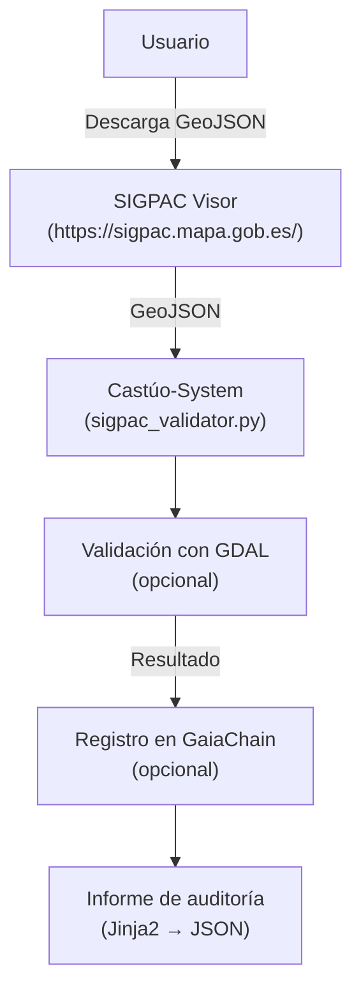
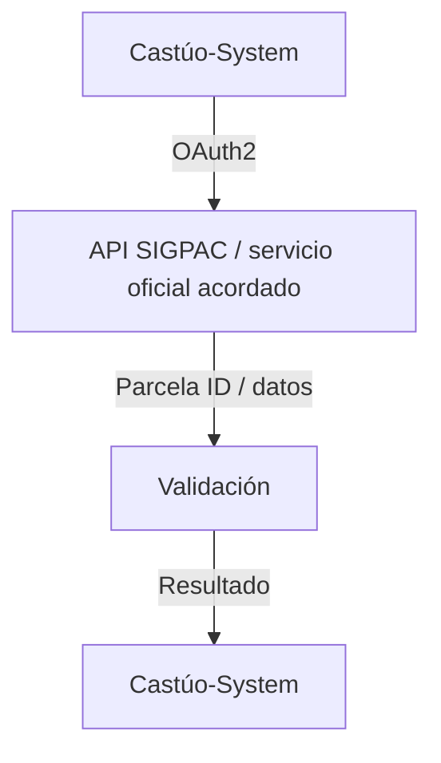

# 📜 Roadmap de integraciones: SIGPAC, GaiaChain, AEMET — v2.5

**Honestidad del repositorio:** estado actual y futuros **condicionados** a contrato, endpoints oficiales y diseño. No sustituye asesoramiento legal ni agrotécnico.

**Relación**

- [SIGPAC-CLIMA-EXTREMADURA-MARCO-REPOSITORIO.md](./SIGPAC-CLIMA-EXTREMADURA-MARCO-REPOSITORIO.md)
- [PRONTUARIO-MAESTRO-AUDITORIA-INTERNA.md](./PRONTUARIO-MAESTRO-AUDITORIA-INTERNA.md) (v2.5)
- [PRONTUARIO-MAESTRO-DEBILIDADES-POTENCIAL-SOBERANIA-EU.md](./PRONTUARIO-MAESTRO-DEBILIDADES-POTENCIAL-SOBERANIA-EU.md)

---

## SIGPAC: flujo actual (sin API en repo)



---

## SIGPAC: integración futura (con contrato; sin URL inventada en repo)

**Requisitos previos:** contrato con MAPA/FEGA; credenciales OAuth2 (`client_id`, `client_secret`).



**Notas:** no hay API pública documentada en este repo como URL invocable. **No** usar URLs ficticias (p. ej. `https://api.sigpac...`). Cliente real: `backend/integrations/sigpac_remote_placeholder.py` sustituido por implementación con `base_url` y credenciales solo en despliegue; `register_event_in_chain` con **un dict** y `tokenId` **int**. El registro opcional en GaiaChain tras validación queda descrito en la sección **GaiaChain** de este mismo roadmap.

---

## GaiaChain: estado actual vs. evolución

| Aspecto | Actual (convención v2.0) | Futuro (convención v3.0) |
|---------|---------------------------|---------------------------|
| Registro | `register_event_in_chain(event_data: dict)` | Smart contracts / capa evolucionada si contrato y diseño |
| Evidencia | Eventos vía servicio y/o cadena según despliegue | Inmutabilidad ampliada + oráculos solo con fuentes oficiales |
| Requisitos | `CASTUO_SIGPAC_AUDIT_TOKEN_ID` u otros tokens enteros documentados | Contrato, ABI y red definidos (nada inventado en código) |

Referencia en repo: `contracts/CASTUO_System.sol`. **No** añadir `web3` con contratos ficticios hasta especificación real.

---

## AEMET: roadmap

| Estado | Descripción |
|--------|-------------|
| **Actual** | Sin integración real; mocks en `tests/integrations/test_aemet_integration.py`. |
| **Futuro** | API AEMET para datos en tiempo real; requiere clave API y endpoints reales. |

Umbrales operativos hoy: `config/extremadura_climate.yaml` + `ExtremaduraClimateConfig.check_violation`.

---

## Tabla de honestidad del repositorio

| Aspecto del briefing | Implementado | No copiar |
|----------------------|--------------|-----------|
| API SIGPAC REST | Descarga manual de GeoJSON desde https://sigpac.mapa.gob.es/ + validación local (GDAL opcional) | API pública inventada |
| `TransformPoint(0,0)` | `Transform` + `IsValid()` post reproyección | Punto arbitrario como test CRS |
| GDAL obligatorio | GDAL opcional; fallback estructural | Obligatoriedad sin CI |
| `register_event_in_chain` con kwargs | `register_event_in_chain(event_data: dict)` | kwargs sueltos; `tokenId` mal tipado |
| Devolver `{}` en error YAML | `ValueError` / `yaml.YAMLError` (fail-fast) | Silenciar errores |
| Umbrales climáticos dinámicos | YAML estático con validación de tipos | Afirmar AEMET sin contrato/clave |
| Firma digital automática | Informes JSON con `normative_notice` | Certificación automática |
| Cifrado post-cuántico | `backend/security/pq_crypto.py` (Kyber + AES) | Negar PQC; obviar cobertura operativa |
| GaiaChain 3.0 | Roadmap | Servicios Web3 ficticios |

---

## Acciones priorizadas

### Corto plazo (1–2 sprints)

| ID | Acción | Responsable | Plazo |
|----|--------|-------------|-------|
| ACT-001 | Documentar guía de descarga manual de GeoJSON + validación | Documentación | 1 semana |
| ACT-002 | Configurar CI/CD para GDAL (p. ej. OSGeo4W / imagen con `osgeo` en Windows o Linux) | DevOps | 2 semanas |
| ACT-003 | Implementar pruebas para informes (`tests/reports/` o equivalente) | QA | 2 semanas |

### Medio plazo (3–6 meses)

| ID | Acción | Responsable | Plazo |
|----|--------|-------------|-------|
| ACT-004 | Negociar acceso a API SIGPAC con MAPA/FEGA | Legal / dirección | 6 semanas |
| ACT-005 | Implementar cliente OAuth2 para API oficial (sustituye placeholder) | Backend | 4 semanas |
| ACT-006 | Integración con API de AEMET para datos climáticos | IoT / backend | 8 semanas |

### Largo plazo (6–12 meses)

| ID | Acción | Responsable | Plazo |
|----|--------|-------------|-------|
| ACT-007 | Migración a GaiaChain evolucionado (smart contracts según diseño) | Blockchain | 12 semanas |
| ACT-008 | Firma digital cualificada para informes (eIDAS / proveedor acordado) | Legal | 6 meses |

---

## Placeholder, pruebas e inventario

| Artefacto | Ruta |
|-----------|------|
| Placeholder SIGPAC remoto | `backend/integrations/sigpac_remote_placeholder.py` |
| Tests AEMET (mocks) | `tests/integrations/test_aemet_integration.py` |
| Test placeholder | `tests/integrations/test_sigpac_validator.py` |

```bash
pytest tests/integrations/test_aemet_integration.py tests/integrations/test_sigpac_validator.py -v
# Esperado: 9 passed, 2 skipped si GDAL no está en el entorno

python scripts/audit/audit_repo_evidence_check.py
# Esperado: 84/84 evidencias
```

---

## Conclusión

- **https://sigpac.mapa.gob.es/** es el **visor humano** de consulta/exportación, **no** una API REST ficticia del repositorio.
- **No inventar endpoints:** solo lo documentado y lo acordado contractualmente.
- **Contratos reales:** `register_event_in_chain` con **un diccionario**; `tokenId` entero ≥ 1.

**Cursor:** [PRONTUARIO-MAESTRO-EXCELENCIA-SISTEMA-ANALISIS.md](../PRONTUARIO-MAESTRO-EXCELENCIA-SISTEMA-ANALISIS.md).
