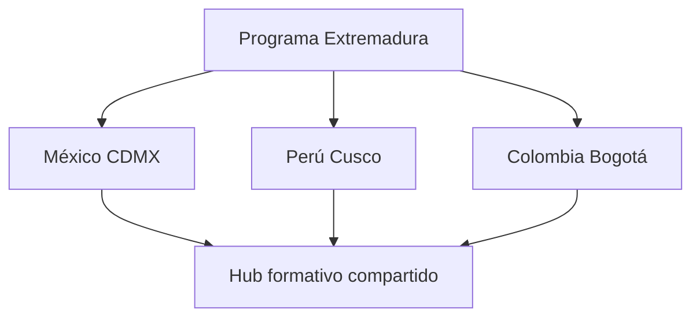

# Ruta de las Conquistadoras — integración con Castúo-Link

**Ámbito:** visión de **programa territorial** (clima + conectividad + formación). **No** certifica antenas desplegadas, convenios firmados ni becas concedidas hasta actas y contratos.

**Relación:** [Manual de formación agrovoltaica Castúa](../training/agrovoltaica-castua-hidroponia/MANUAL-FORMACION-COOPERATIVA-AGROVOLTAICA-CASTUA-HIDROPONIA-INTELIGENTE.md) · [PRONTUARIO-MAESTRO-CONSULTA-CRITICA-CASTUO-SYSTEM.md](./PRONTUARIO-MAESTRO-CONSULTA-CRITICA-CASTUO-SYSTEM.md) · [ROADMAP-INTEGRACIONES-SIGPAC-GAIACHAIN-AEMET.md](./ROADMAP-INTEGRACIONES-SIGPAC-GAIACHAIN-AEMET.md)

**Figura ilustrativa (mapa corredor Extremadura):** [fig-ruta-conquistadores-extremadura-castuo-link.png](../training/agrovoltaica-castua-hidroponia/media/fig-ruta-conquistadores-extremadura-castuo-link.png) (no prueba despliegue real).

---

## 1. Introducción

**Objetivo del programa (planificación):** articular un **corredor de datos** que combine estaciones meteorológicas de referencia, nodos **Castúo-Link** (mesh / LoRa hacia núcleo digital) y **becas formativas** con criterios públicos de equidad, priorizando la participación de **mujeres del territorio** en formación técnica (IoT, clima, soberanía de datos).

**Matiz narrativo:** el nombre evoca el patrimonio histórico extremeño como **ancla cultural** del programa; la ejecución depende de **políticas locales, convocatorias y cumplimiento normativo** (RGPD, subvenciones, obra civil, espectro radioeléctrico).

---

## 2. Extremadura — nodos ejemplo y metas

*Los hitos siguientes son **objetivos**; el número total de sedes (p. ej. meta de **hasta ~25** nodos) requiere **cronograma y presupuesto** por fase.*

| Ubicación (ejemplo corredor) | Estación meteorológica (objetivo) | Castúo-Link (objetivo) | Becas / año (meta indicativa) |
|------------------------------|-----------------------------------|-------------------------|-------------------------------|
| Trujillo | Planificar / piloto | Planificar / piloto | Meta: hasta 3 plazas |
| Cáceres | Planificar / piloto | Planificar / piloto | Meta: hasta 3 plazas |
| Mérida (p. ej. Dehesa La Serena — referencia material gráfico) | Planificar / piloto | Gateway conceptual | Meta: hasta 3 plazas |
| Badajoz | Planificar / piloto | Planificar / piloto | Meta: hasta 3 plazas |
| Guadalupe (entorno patrimonial — diseño con cautela ambiental) | Planificar | Planificar | Meta: hasta 3 plazas |
| *…resto del corredor (~20 sedes adicionales meta)* | *Por convenio municipal / comarcal* | *Por convenio* | *Meta: hasta 3 plazas / sede sujeto a presupuesto* |

**Criterios de selección de sede (borrador):** cobertura de vacío de datos climáticos, riesgo de heladas/sequía, presencia cooperativa o ayuntamiento colaborador, viabilidad energética del nodo.

---

## 3. América — extensión internacional (roadmap)

*Solo como **hoja de ruta**; exige marco legal internacional (protección de datos, importación de equipos, acuerdos con entidades locales) y **no** forma parte del alcance probado del repositorio.*

| País (ejemplo) | Ciudad (referencia histórica) | Estación / enlace (objetivo) | Becas / año (meta indicativa) |
|----------------|-------------------------------|------------------------------|-------------------------------|
| México | Ciudad de México | Roadmap | Meta: hasta 5 plazas |
| Perú | Cusco | Roadmap | Meta: hasta 5 plazas |
| Colombia | Bogotá | Roadmap | Meta: hasta 5 plazas |
| *…otros países (meta ejemplo: hasta ~10)* | *Por acuerdo bilateral / ONG / universidad* | Roadmap | Meta proporcional |

**Coherencia histórica (pedagógica):** Extremadura como espacio de **origen migratorio** del periodo colonial; América como espacio de **encuentro y memoria** — el programa debe evitar glorificación simplista y alinearse a **educación científica y derechos humanos** en convocatorias.

---

## 4. Refuerzo legal y gobernanza

1. **Convenios:** ayuntamientos, diputaciones, cabildos o entidades con competencia sobre suelo y instalación (torretas, energía, acceso).
2. **Becas:** reglamento de convocatoria (criterios, comisión de valoración, publicidad de resoluciones, plazos de reclamación), compatible con normativa de subvenciones aplicable.
3. **Datos personales:** RGPD — bases legales, minimización, información a personas interesadas; si hay datos de terceros países, **cláusulas contractuales tipo** o decisiones de adecuación.
4. **Radiofrecuencia:** uso de bandas ISM / autorizaciones según normativa nacional en cada jurisdicción.
5. **Transparencia:** publicación anual de criterios, número de solicitudes y resoluciones (sin datos sensibles).

---

## 5. Mapas conceptuales

### 5.1. Corredor en Extremadura (orden didáctico, no cronología de obra)

### 5.2. Puente programa Extremadura ↔ nodos América (roadmap)

> **Nota:** nodos, kilómetros de corredor o niveles TRL en material gráfico externo son **planificación** hasta respaldarse con informes de piloto.

---

## 6. Notas legales

- **Imágenes / mapas:** ilustrativos; no certifican despliegue ni cobertura real medida.  
- **Certificación / homologación** de equipos: requiere informes técnicos y laboratorios acordes al producto final.  
- **Este markdown** no sustituye pliegos administrativos ni resoluciones de convocatoria.

---

## 7. Enlaces

| Recurso | Ruta |
|---------|------|
| Manual de formación cooperativa agrovoltaica Castúa | [MANUAL-FORMACION-…](../training/agrovoltaica-castua-hidroponia/MANUAL-FORMACION-COOPERATIVA-AGROVOLTAICA-CASTUA-HIDROPONIA-INTELIGENTE.md) |
| Prontuario consulta crítica | [PRONTUARIO-MAESTRO-CONSULTA-CRITICA-CASTUO-SYSTEM.md](./PRONTUARIO-MAESTRO-CONSULTA-CRITICA-CASTUO-SYSTEM.md) |

*Documento orientativo para integración crítica; no certificación automática.*
