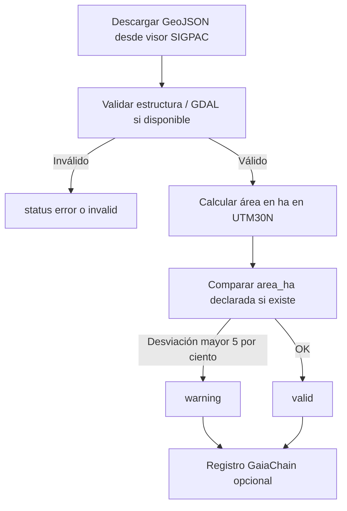
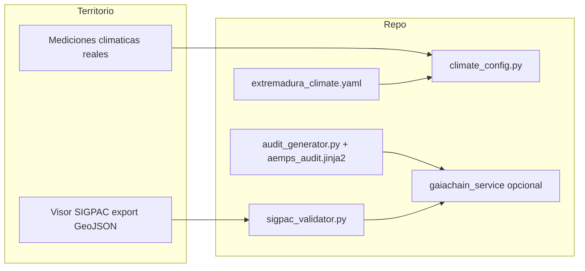

# SIGPAC local, clima Extremadura e informes (marco real del repositorio)

**Impacto territorial:** validar GeoJSON en local reduce errores cartográficos; **no** sustituye la titularidad registral ni el expediente SIGPAC/PAC en MAPA/FEGA. Umbrales YAML orientan decisiones solo si los datos meteorológicos son **medidos**; el informe Jinja2 no es acto administrativo.

**Relación:** [SIGPAC-AEMPS-MARCO-REPOSITORIO.md](./SIGPAC-AEMPS-MARCO-REPOSITORIO.md) · [CTAEX-INTEGRACION-MARCO-REPOSITORIO.md](./CTAEX-INTEGRACION-MARCO-REPOSITORIO.md) · [INFORMES-AUDITORIA-PERSONALIZADOS.md](./INFORMES-AUDITORIA-PERSONALIZADOS.md) · [PROTOCOLO-AUDITORIA-INTERNA-LEGAL-COHERENCIA.md](./PROTOCOLO-AUDITORIA-INTERNA-LEGAL-COHERENCIA.md) · [Roadmap SIGPAC / GaiaChain / AEMET](./ROADMAP-INTEGRACIONES-SIGPAC-GAIACHAIN-AEMET.md)

---

## 1. Marco legal y técnico (referencia, no “sello” automático)

Normas citadas en documentación interna (Reglamento (UE) 2019/1009, RD 903/2025, UNE-EN ISO 19115, Ley 3/2020, UNE 50510, RD 169/2021, etc.) son **marco de alineación**; el código aporta trazabilidad técnica y checklists, no sustituye asesoramiento jurídico ni agrotécnico.

---

## 2. Proceso SIGPAC: descarga manual + validación local

1. Operador descarga geometría desde el **visor SIGPAC** (u otra fuente oficial acordada) como GeoJSON `Feature` (Polygon o MultiPolygon).
2. `backend/integrations/sigpac_validator.py` (`SIGPACValidator`):
   - Comprueba estructura y cierre de anillos **sin GDAL**.
   - Con **GDAL** (`osgeo.ogr/osr`): validez topológica; si el `Feature` declara CRS proyectado **EPSG:25830** (o **32630**), el área se calcula en ese SRS; si no, se asume **WGS84** y se transforma **EPSG:4326 → EPSG:25830** para ha.
   - Sin GDAL: `status=valid` puede ir sin `area_ha` o con `validation_note` (no hay superficie UTM).
3. Comparación opcional: `properties.area_ha` declarada vs calculada; >5 % → `warning` (umbral operativo interno, contrastar con expediente).
4. **Registro on-chain opcional:** si `CASTUO_SIGPAC_AUDIT_TOKEN_ID` está definido, se llama a `register_event_in_chain(event_data)` con **un único dict** importado desde `gaiachain_service` (claves `tokenId`, `action`, `status`, `details`, `compliance`). Errores RPC no invalidan la validación local.

**Dependencia opcional GDAL:** `backend/integrations/requirements-sigpac-gdal.txt`.

**Riesgo reproyección:** geometrías fuera del uso habitual de UTM30N o datos corruptos pueden hacer fallar `Transform` o dejar la geometría inválida tras reproyectar; el código registra error en log y devuelve `status=invalid` con mensaje descriptivo (no silencia el fallo).

**Anti-patrón (no usar):** comprobar la transformación con `TransformPoint(0, 0)` u otro punto arbitrario no valida el pipeline CRS de la parcela; el código usa retorno de `geometry.Transform` (código OGR cuando aplica) + `IsValid()` tras reproyectar.

---

## 3. Umbrales climáticos (YAML, sin métricas `ctaex_*`)

- Fichero: `config/extremadura_climate.yaml` (parámetros de referencia Extremadura).
- Cargador: `backend/ctaex/climate_config.py` (`ExtremaduraClimateConfig`).
- Uso: lógica de negocio o servicios futuros leen umbrales **después** de obtener datos reales (estación, sensor, API meteorológica acordada). **No** se añaden reglas Prometheus sobre series no publicadas.

---

## 4. Informes para auditorías (Jinja2 + JSON)

- Plantilla: `templates/reports/aemps_audit.jinja2`.
- Generador: `backend/reports/audit_generator.py` → JSON validado con `json.dumps` tras render.
- Documentación operativa: [INFORMES-AUDITORIA-PERSONALIZADOS.md](./INFORMES-AUDITORIA-PERSONALIZADOS.md).
- Registro GaiaChain opcional: variable `CASTUO_AUDIT_REPORT_TOKEN_ID` o argumento `token_id=` en `generate_aemps_report`.

---

## 5. Limitaciones y alternativas

| Límite | Alternativa |
|--------|-------------|
| Validación local ≠ coincidencia con capa oficial en tiempo real | Cruce manual / procedimiento PAC con IDE/visor |
| Sin Catastro/SIOSE en este flujo | Enlazar referencias catastrales en `properties` si el expediente las exige |
| GaiaChain opcional | Acta interna + `POST /api/audit/register-event` con JWT cuando proceda |

---

## 6. Qué sigue **sin** afirmarse (briefings anteriores)

- API REST `https://sigpac.mapa.gob.es/.../parcel/validation` con Bearer inventado.
- `GaiaChainAuditClient.register_event_in_chain` (no existe en `backend/utils/gaia_chain.py`).
- Prometheus `ctaex_sigpac_*`, `ctaex_weather_*`, dashboards Grafana asociados sin instrumentación.
- `query_events` genérico en cliente Web3 del briefing.

---

## 7. Diagrama (artefactos actuales)

---

## 8. Roadmap de integraciones

Para más detalles sobre integraciones futuras (SIGPAC, GaiaChain, AEMET), ver:

- [docs/legal/ROADMAP-INTEGRACIONES-SIGPAC-GAIACHAIN-AEMET.md](./ROADMAP-INTEGRACIONES-SIGPAC-GAIACHAIN-AEMET.md)

---

**Cierre:** el inventario de evidencias incluye estos paths; cualquier nueva integración debe actualizar `REQUIRED_EVIDENCE` solo con rutas existentes y contratos reales.
