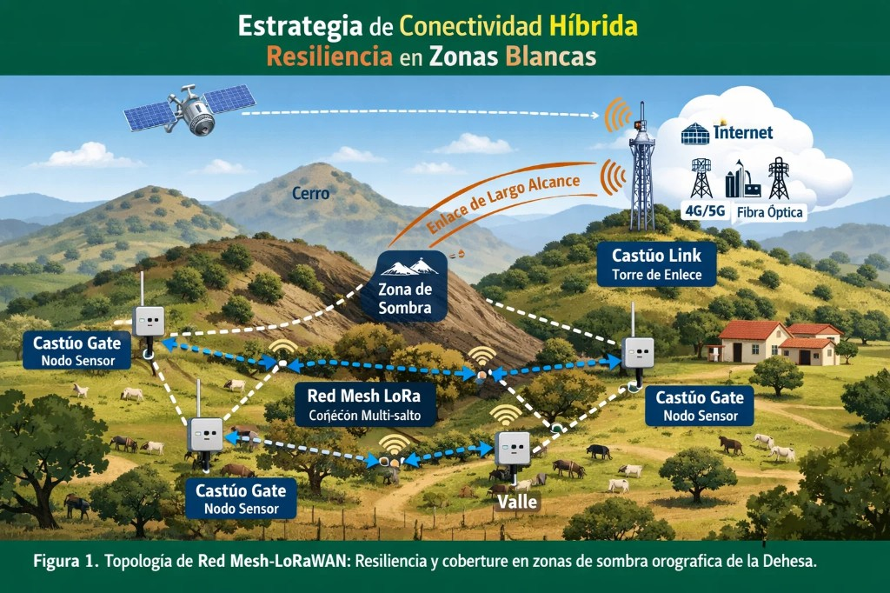
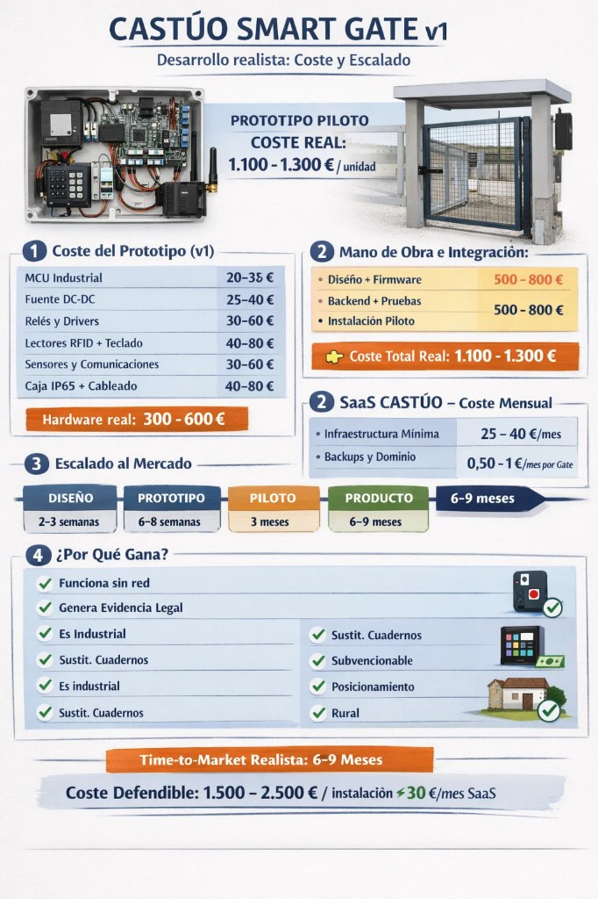
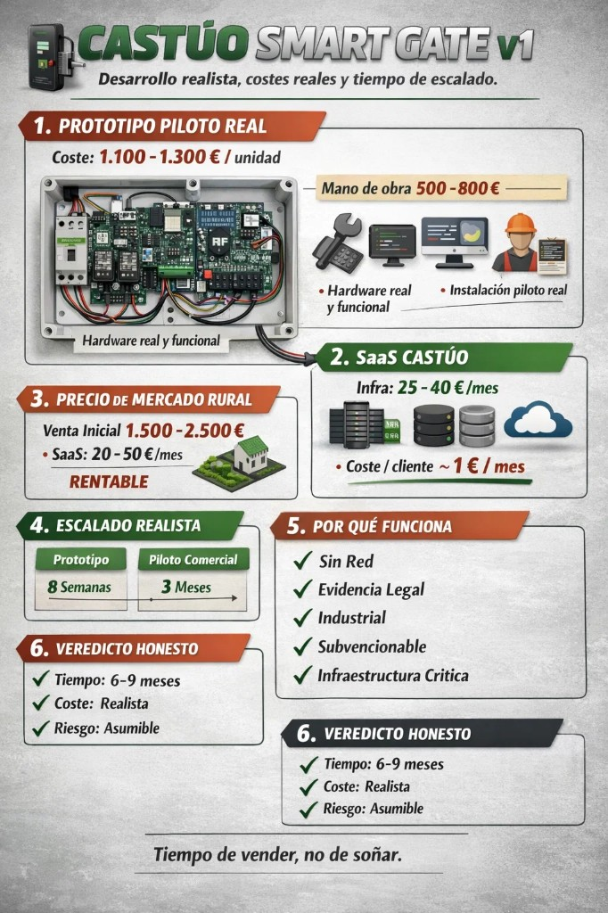
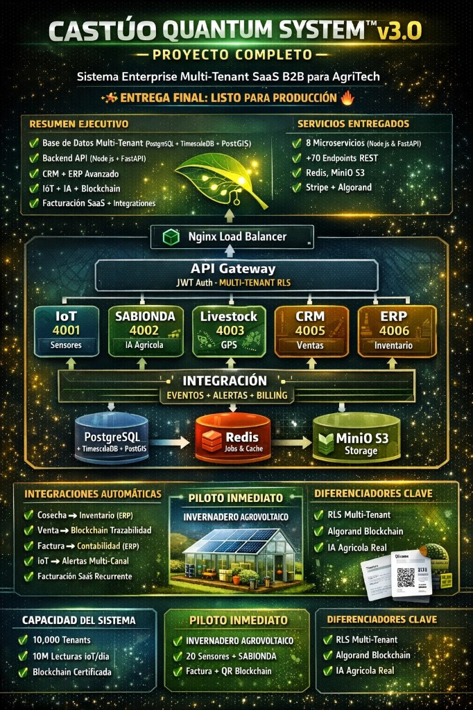

# Memoria técnica — CASTÚO SMART GATE v2.0

**Convocatoria / marco:** FUNDECYT-PCTEX (documento base para solicitud o fase de valoración; **no** constituye resolución administrativa ni certificación de producto).

**Elaboración:** 2025 (referencia temporal de maqueta, prototipos documentados y plan de trabajo).

**Ámbito territorial:** Extremadura y entornos rurales / agroindustriales comparables (dehesa, explotaciones ganaderas, cooperativas, perímetro industrial periférico).

---

## Declaración sobre figuras e imágenes

> **Las imágenes incluidas en anexos visuales o en la versión PDF derivada tienen carácter ilustrativo y representan el concepto funcional del prototipo y de la arquitectura de conectividad objetivo, no un modelo comercial definitivo ni un diseño industrial homologado sin ensayo.**

Cualquier render, fotografía de maqueta o diagrama debe interpretarse en coherencia con la **honestidad técnica** de este documento: los requisitos de estanqueidad (IP), EMC o evaluaciones RGPD se someten a **verificación en laboratorio y piloto**, no a afirmaciones genéricas.

---

## 1. Denominación del proyecto

**CASTÚO SMART GATE v2.0** — Sistema inteligente de control de accesos rurales con **encapsulado modular fabricado aditivamente (impresión 3D)**, operación **offline-first**, captura visual **puntual y protegida ópticamente**, e integración documentada con la plataforma **CASTÚO-SYSTEM**.

---

## 2. Resumen ejecutivo

El proyecto aborda el control de accesos en entornos con conectividad intermitente, alto riesgo de manipulación y necesidad de **evidencia auditable** (registros técnicos y soporte a requisitos legales/contractuales). La versión v2.0 introduce una **coraza modular** que reduce coste de carcasa, permite **adaptación geométrica** a distintos vanos (puertas metálicas, cancelas, pasos rurales e instalaciones industriales perimetrales) y aloja un **módulo de visión** con ventana óptica (cristal mineral templado u óptica equivalente de policarbonato duro según especificación de piloto) que equilibra **discreción**, **protección** y **calidad de imagen suficiente para evidencia** (no videovigilancia continua por defecto).

La conectividad se plantea como **estratégica híbrida**: malla multi-salto en sub-GHz / LoRa hacia un nodo de concentración (diseño tipo **Castúo Link**), y **backhaul** satélite / 4G-5G / fibra cuando exista infraestructura, coherente con topologías de **zonas blancas** y relieve (orografía de dehesa).

---

## 3. Objetivos

### 3.1. Objetivo general

Desarrollar y validar un sistema de control de accesos para entornos rurales y agroindustriales que combine:

- Resistencia **mecánica** y **ambiental** (objetivo de diseño: grado de protección IP65/IP66 según UNE-EN 60529, sujeto a ensayo).
- **Autonomía operativa** sin dependencia permanente de red (offline-first; sincronización diferida).
- **Evidencia técnica y legal** (registros, sellos de tiempo, trazas de evento; tratamiento de datos personales bajo minimización RGPD).
- **Fabricación distribuida** mediante impresión 3D portátil o semindustrial (PETG/ASA/nylon según caso).
- **Interoperabilidad** con CASTÚO-SYSTEM según **contratos reales del repositorio** (API, auditoría, IoT, cadena de eventos donde aplique).

### 3.2. Objetivos específicos

1. Cerrar diseño de **coraza modular v2.0** con compartimentos: electrónica, potencia, óptica, disipación pasiva, precinto.
2. Definir **política de captura visual**: evento-disparado, retención acotada, cifrado en dispositivo y en tránsito.
3. Ensayar **adaptadores** de anclaje para al menos tres familias de portón / valla (rural liviana, rural reforzada, industrial ligera).
4. Ejecutar **piloto de campo** con métricas: disponibilidad local, latencia de sincronización, tasa de falsos positivos de acceso, integridad de logs.
5. Entregar **manual de fabricación** (BOM, parámetros de impresión orientativos, control de calidad dimensional).

---

## 4. Estado del arte y justificación

Los sistemas comerciales rurales suelen depender de conectividad estable o de carcasas industriales genéricas poco adaptables. En la dehesa y en explotaciones extremas, la **orografía** y la **sombra de enlace** degradan cobertura; las soluciones “maker” carecen de **trazabilidad** y de **resistencia**. v2.0 articula **industrialidad** (proceso, precinto, firmware firmado) con **fabricación local** (menor stock, reparación rápida).

---

## 5. Madurez tecnológica (TRL)

| Fase | TRL | Descripción (veraz) |
|------|-----|---------------------|
| Prototipo funcional v1 | **5** | Validación de componentes en entorno relevante controlado. |
| Versión reforzada v2.0 | **6** | Demostrador en entorno relevante (campo / instalación piloto). |
| Piloto precomercial | **7** | Prototipo operacional en entorno operacional; requiere plan de soporte y datos de uso. |

*Los TRL se declaran como **objetivos de plan**; la acreditación ante organismo requiere evidencias de ensayo y fechas de informe.*

---

## 6. Arquitectura del sistema v2.0

### 6.1. Bloques funcionales

1. **Unidad de control** (MCU industrial o equivalente certificable en roadmap).
2. **Subsistema de energía** (protección transitorios, alimentación DC acotada, batería/respaldo opcional).
3. **Sensórica de acceso** (RFID, teclado, lectores acordados al piloto).
4. **Módulo de visión puntual** (sensor + **ventana óptica oscurecida** con cristal templado o policarbonato duro antirrayado; sellado con junta; orientación fija para reducir aberración y proteger privacidad).
5. **Almacenamiento local cifrado** (eventos, hashes, metadatos mínimos).
6. **Conectividad opcional** (Ethernet, 4G/5G, módulo LoRa / mesh hacia concentrador).
7. **Coraza modular 3D** (sustitución de carcasa industrial estándar de mayor coste logístico).

### 6.2. Conectividad híbrida (objetivo de red)

La topología objetivo combina:

- **Nodos de campo** (Smart Gate / gateway de campo) en malla multi-salto para sortear **zonas de sombra orográfica**.
- **Torre o punto elevado** de concentración (**Castúo Link** conceptual) con enlace de largo alcance.
- **Backhaul** redundante: satélite, celular, fibra — según disponibilidad en el despliegue.

*Figura ilustrativa (colocar PNG en `media/` según README-FIGURAS):*

---

## 7. Coraza técnica impresa en 3D (diferencial v2.0)

### 7.1. Función

Protección estructural, encaje de juntas, separación EMC entre potencia y señal baja, alojamiento de **zona de precinto**, y **adaptación** a geometrías de puerta y poste mediante **módulos intercambiables** (bridas, extensiones, cubiertas).

### 7.2. Materiales orientativos

| Material | Uso recomendado |
|----------|-----------------|
| PETG técnico | Humedad, coste, impresión portátil |
| ASA | UV y exterior |
| Nylon + fibra (opcional) | Esfuerzo mecánico alto |

### 7.3. Módulos

- Cuerpo principal estanco (objetivo IP65/IP66 tras ensayo).
- Compartimento electrónico separado de potencia.
- **Ventana óptica** con tratamiento antirreflejo opcional; opacidad periférica para integración estética y reducción de grabación no necesaria.
- Rejillas de disipación pasiva.
- Anclajes normalizados (perfil metálico, tubo, placa).
- Zona de **precinto físico** antiapertura.

**Adaptabilidad:** el diseño paramétrico permite variantes para **cancelas rurales**, **pasillos industriales** y **vallas perimetrales** sin molde de inyección; cada variante requiere **validación dimensional** en prototipo.

---

## 8. Cámara oculta, óptica y privacidad (RGPD)

- **Principio de minimización:** captura asociada a **evento** (acceso denegado, alarma de sabotaje, comando auditado), no streaming continuo salvo módulo explícito y base legal / DPIA.
- **Óptica:** cristal mineral templado (mejor scratch y limpieza) o policarbonato duro (impacto); montaje que evite humedad intersticial (junta + compartimento desecante opcional).
- **Seguridad física:** apertura de compartimento óptico detectable (tamper); registro de evento en log firmado o encadenado según política de despliegue.
- **Evidencia:** resolución y FPS acotados al **reconocimiento operativo** (no promesa de identificación biométrica remota sin estudio de impacto).

---

## 9. Cumplimiento normativo y técnico (marco)

Referencias **de diseño** (cumplimiento efectivo = ensayo + informe):

- **UNE-EN 60529** — Grados IP (objetivo declarado tras prueba de laboratorio).
- **Compatibilidad electromagnética (EMC)** — Plan de ensayo según producto final y mercado.
- **Baja tensión** — Separación de circuitos, fusibles, seccionadores según esquema aprobado.
- **RGPD** — Minimización, información al interesado en entorno laboral/agrario, evaluación de tratamiento si hay imágenes.

---

## 10. Trazabilidad física y digital

### 10.1. Identificación física

- ID único grabado / marcado láser en coraza.
- QR / DataMatrix con URL o identificador interno.
- Lote de fabricación aditiva (bobina, fecha, máquina).
- Versión de firmware y **hash** publicado en release.

### 10.2. Integración CASTÚO-SYSTEM (alcance honesto del repositorio)

El repositorio **Castuo-System** incluye, entre otros elementos auditables, rutas y servicios documentados para **auditoría**, **IoT** y **registro de eventos** (p. ej. patrones GaiaChain / API de auditoría según `docs/legal/` y código en `backend/`). La memoria **no** afirma que todo el ecosistema empresarial multi-tenant descrito en materiales de marketing externo esté desplegado como un único binario en producción: la integración del Smart Gate debe apoyarse en **contratos de API y documentos legales** vigentes en el clon.

*Figuras de referencia histórica v1 (coste / escalado) — ilustrativas:*

---

## 11. Seguridad frente a sabotaje

- Coraza reforzada y geometría anti-palanca donde el diseño lo permita.
- Tornillería de acceso restringido.
- Sensor de apertura / tamper.
- Registro de intentos de manipulación y, si procede, captura puntual.
- Política de **borrado seguro** o inutilización de claves ante robo (roadmap documentado).

---

## 12. Impacto económico (orden de magnitud)

| Concepto | Rango orientativo (EUR) |
|----------|-------------------------|
| Material coraza 3D | 10–25 |
| Tiempo máquina + post-proceso | 10–20 |
| **Total coraza** (solo encapsulado) | **20–45** |
| Sustitución vs. carcasa industrial genérica | orden 80–150 (referencia de mercado, variable) |

*Los costes de **ingeniería**, **certificación** y **puesta en marcha** se presupuestan aparte.*

---

## 13. Innovación y encaje RIS3 Extremadura

- Fabricación aditiva aplicada a **hardware agro-rural**.
- Offline-first y resiliencia en **zonas blancas**.
- Trazabilidad físico-digital alineada a **agroalimentación** y **digitalización**.
- Menor barrera de entrada para **pymes y autónomos** (reparación local).

---

## 14. Resultados esperados

1. Prototipo v2.0 validado en entorno real (informe piloto).
2. Manual técnico y de fabricación aditiva.
3. Dataset de eventos de campo (anonimizado para análisis).
4. Base para escalado comercial y **transferencia regional**.

---

## 15. Plan de trabajo (referencia 2025)

| Fase | Mes (orientativo) | Entregable |
|------|-------------------|------------|
| D01 | M1–M2 | CAD paramétrico coraza + BOM |
| D02 | M2–M3 | Impresión prototipos + ensayo IP preliminar |
| D03 | M3–M4 | Firmware evento-cámara + política RGPD |
| D04 | M4–M5 | Integración API CASTÚO-SYSTEM (contrato documentado) |
| D05 | M5–M6 | Piloto campo + informe TRL |

---

## 16. Riesgos y mitigaciones

| Riesgo | Mitigación |
|--------|------------|
| Fallo estanqueidad | Juntas + protocolo de prueba + revisión CAD |
| Deriva EMC | Plano de masas, apantallado opcional, filtrado |
| Exposición RGPD | Minimización, DPIA si aplica, retención corta |
| Degradación óptica | Material certificado, recambio modular de ventana |

---

## 17. Conclusión

El **CASTÚO SMART GATE v2.0** es **técnicamente abordable** y **económicamente defendible** como línea de I+D aplicada, con innovación clara en **coraza modular aditiva**, **visión protegida** y **conectividad híbrida** para entornos extremos. La comercialización y las ayudas públicas requieren **evidencias** (ensayos, piloto, documentación legal de tratamiento de datos).

---

## Anexo A — Sobre narrativas “plataforma cuántica / enterprise v3”

En documentación comercial o infografías puede aparecer una arquitectura **enterprise** con numerosos microservicios, bases de datos amplias o capacidades declaradas como “100 % producción”. **Este anexo delimita el alcance:** la memoria del Smart Gate v2.0 debe ceñirse a **integración verificable** con el repositorio y contratos existentes. Cualquier capacidad adicional (CRM/ERP completo, blockchain genérico, etc.) se trata como **roadmap** sujeto a repositorio, presupuesto y gobernanza de datos — **no** como hecho probado solo por diagramas.

*Si se incluye diagrama conceptual de plataforma (ilustrativo):*

---

## Anexo B — Generación PDF

Ver `README-FIGURAS.md` en este directorio. Para entrega institucional se recomienda portada con logo, numeración de páginas y tabla de figuras.

---

*Documento orientativo para FUNDECYT-PCTEX. Revisión legal y agrotécnica externa recomendada antes de presentación.*
