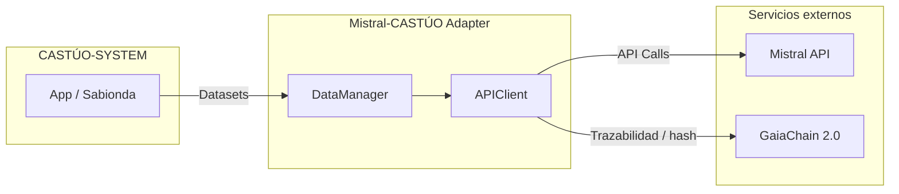
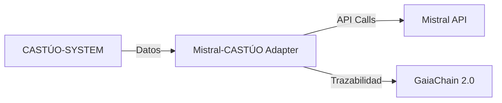

# Integración entre Mistral AI y CASTÚO-SYSTEM™

Adapter oficial para gestionar datos y llamar a Mistral API desde CASTÚO-SYSTEM, con cumplimiento global y trazabilidad en GaiaChain 2.0.

**URLs de documentación:**

- [docs.castuo-system.com/mistral-adapter/](https://docs.castuo-system.com/mistral-adapter/) ← Cliente-facing
- [castuo-system.github.io/mistral-adapter/](https://castuo-system.github.io/mistral-adapter/) ← Backup / GitHub

---

## Descripción

El **Mistral-CASTÚO Adapter** permite:

- Cargar y validar datasets agrícolas (CSV, JSON, Parquet) con comprobaciones de cumplimiento normativo.
- Realizar llamadas autenticadas a Mistral API (v1) con rate limiting y registro de transacciones.
- Cumplir de forma configurable con GDPR, AI Act 2024 y PAC 2040 según la región.
- Registrar las acciones en GaiaChain 2.0 para auditoría y trazabilidad.

---

## Arquitectura

Flujo de datos y trazabilidad:

Vista simplificada:

---

## Casos de uso

| Caso de uso | Descripción |
|-------------|-------------|
| **Gestión de datasets agrícolas** | Carga y validación de CSV, JSON y Parquet (sensores, cultivos, parcelas). |
| **Llamadas seguras a Mistral API** | Autenticación (API Key / OAuth2), rate limiting y logging detallado. |
| **Cumplimiento automático** | Adaptación por región: GDPR, AI Act 2024, PAC 2040 y normativas locales. |

---

## Navegación

| Sección | Descripción |
|---------|-------------|
| [Características](features.md) | Tabla de capacidades del adapter. |
| [Instalación](installation.md) | Clonado, dependencias y variables de entorno. |
| [Uso](usage.md) | Carga de datos y consultas a la API. |
| [API Reference](api-reference.md) | Clases, métodos y configuración. |
| [Cumplimiento](compliance.md) | Normativas por región y validación. |
| [Ejemplos](examples.md) | Casos Sabionda Educa. |
| [FAQ](faq.md) | Preguntas frecuentes (tokens, errores, rate limit). |
| [Roadmap](roadmap.md) | Próximos pasos y GaiaChain 2.0. |
| [Changelog](changelog.md) | Cambios por versión. |
