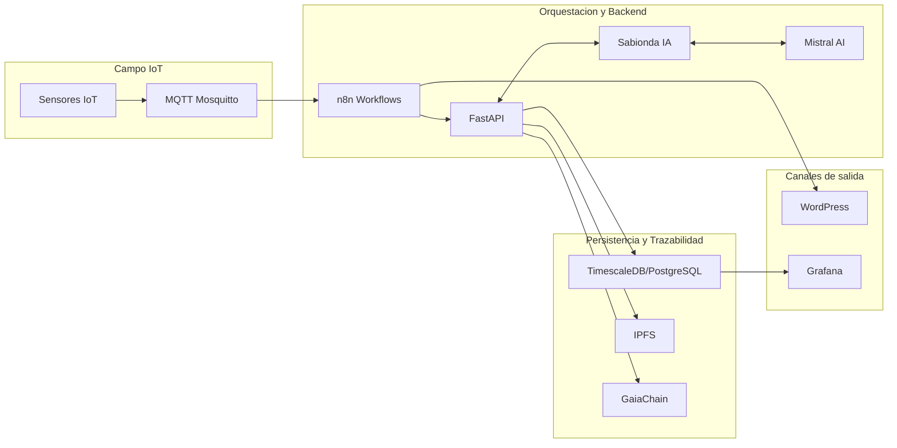

# Arquitectura Visual CASTUO-SYSTEM

## Capas
- Campo IoT: captura y transporte de telemetria.
- Orquestacion: automatizacion (n8n) y servicios API/IA.
- Datos: almacenamiento operativo y trazabilidad inmutable.
- Frontales: publicacion (WordPress) y observabilidad (Grafana).

## Archivos Relacionados
- Terraform Hetzner: `hetzner_infra/main.tf`
- Variables Terraform: `hetzner_infra/variables.tf`
- Workflow n8n Mistral->WordPress: `n8n/workflows/mistral-wordpress-report.json`
- Runbook conectividad: `docs/ops/HUB-CONNECTIVIDAD.md`
