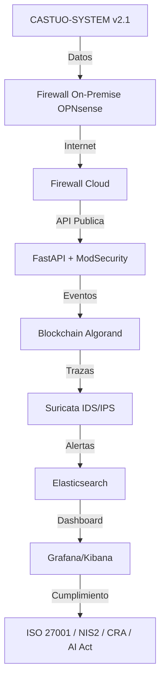

# RUNBOOK SEGURIDAD HIBRIDA CASTUO-SYSTEM v2.1

## Objetivo
Implementar y verificar un firewall de malla hibrida (on-premise + cloud) para CASTUO-SYSTEM v2.1 con trazabilidad de auditoria y enfoque de cumplimiento.

## Marco de cumplimiento
- NIST SP 800-41: arquitectura de firewalls de red y segmentacion.
- ISO 27001:2022: controles A.13 (seguridad de red) y A.14 (desarrollo seguro).
- NIS2: deteccion y respuesta a incidentes con evidencias.
- CRA: resiliencia y verificabilidad del ciclo de vida.
- AI Act: supervision humana y trazabilidad de decisiones de IA.

## Arquitectura objetivo


## Componentes implementados en repo
- OPNsense: guia operativa y controles de puertos en este runbook.
- ModSecurity: reglas custom en infrastructure/security/modsecurity/custom_rules.conf.
- Calico/K8s Network Policies: manifests en k8s/network-policies/.
- IoT firewall posture: endurecimiento MQTT/TLS documentado en scripts de validacion.
- Suricata + Elastic Stack: compose y reglas en infrastructure/security/.
- Blockchain Algorand: registro de eventos criticos por capa blockchain existente en API.

## Despliegue
1. Aplicar politicas de red Kubernetes:
```bash
kubectl apply -f k8s/network-policies/deny-all-except-api.yaml
kubectl apply -f k8s/network-policies/allow-mqtt.yaml
```
2. Levantar stack de seguridad (WAF/IDS/SIEM):
```bash
docker compose -f infrastructure/security/docker-compose.security.yml up -d
```
3. Ejecutar verificacion integral y generar evidencias:
```bash
make security-hybrid-check
```

## Verificaciones clave
- WAF ModSecurity operativo y cargando reglas OWASP/custom.
- Suricata activo con reglas de port scan y SSH brute force.
- Elasticsearch y Kibana levantados para consulta de alertas.
- Network Policies aplicadas en namespace castuo-system.
- Salud de API local y/o cloud con trazabilidad de evidencia.

## Evidencias de auditoria
El script scripts/security-hybrid-check.sh genera un bundle en artifacts/security-hybrid/<timestamp>:
- 00_summary.txt
- opnsense_rules.txt
- network_policies.yaml
- modsecurity_logs.txt
- suricata_alerts.txt
- elastic_health.json
- kibana_health.json

## Riesgos y mitigaciones
- Reglas WAF agresivas: iniciar en modo detect y pasar a on tras baseline.
- Falsos positivos Suricata: afinar umbrales con historico.
- Saturacion Elastic: retencion de 30 dias y rotacion.
- Drift de politicas K8s: verificacion automatizada por CI y runbook.

## Criterio operativo
- GO: sin FAIL en checks criticos y evidencias completas.
- NO-GO: fallo en red, WAF/IDS inactivo o ausencia de trazabilidad.
