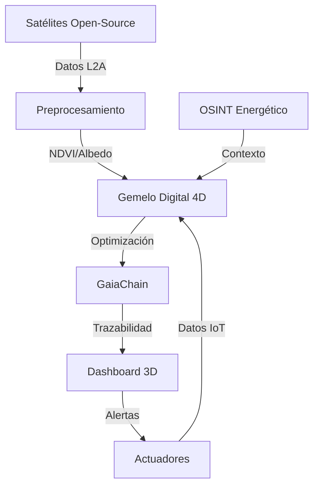

# Sistema de Auditoría Energética con Satélites de Código Abierto

*(Integración con Castúo-System | Estado: Por validar | Autor: Gregorio Julian Jimenez Bodes)*

## 1. Arquitectura general



## 2. Componentes técnicos

| Componente | Tecnología | Función | Estado |
|---|---|---|---|
| Satélites | Sentinel-2/3 (ESA), Landsat 8/9 (NASA) | Descarga de imágenes multiespectrales (NDVI, albedo, temperatura). | Por validar |
| Preprocesamiento | GDAL + Python (Rasterio) | Cálculo de índices y corrección atmosférica. | Implementado |
| Gemelo Digital 4D | Three.js + OpenFOAM | Simulación de cultivos, paneles agrovoltaicos y flujo energético. | Por validar |
| Blockchain | GaiaChain | Trazabilidad de auditorías y certificaciones. | Implementado |
| Dashboard | Three.js (r128) | Visualización 3D/4D de métricas energéticas. | Por validar |
| OSINT Energético | APIs públicas (ENTSO-E, REE) | Datos de precios, demanda y políticas regulatorias. | Mock implementado |
| Backend | FastAPI + Python 3.10 | API para gemelo digital y datos satelitales. | Por desplegar |

## 3. Flujo técnico

**Descarga de datos satelitales:**

```bash
python -m backend.energy_audit.satellite_preprocess --zip ruta/al/archivo.zip --product_id S2A_MSIL2A_20230320T100031_N0509_R122_T30SXD_20230320T120432
```

Opcional: `--red ruta/al/archivo_B04.jp2 --nir ruta/al/archivo_B08.jp2 --out data/satellite/processed/NDVI.tif` para bandas individuales (CLI).

**Procesamiento (NDVI) vía `SatelliteProcessor`:**

```python
from backend.energy_audit.satellite_preprocess import SatelliteProcessor

processor = SatelliteProcessor()
ndvi_stats = processor.compute_ndvi_from_pair("ruta/al/B04.jp2", "ruta/al/B08.jp2")
# Escribe por defecto en data/satellite/processed/NDVI_from_pair.tif (o pase out_path como tercer argumento).
```

**Actualización del gemelo digital:**

```python
from backend.energy_audit.digital_twin_energy import EnergyAuditTwin

twin = EnergyAuditTwin()
result = twin.update(
    satellite_data={"radiation": 850, "albedo": 0.18, "ndvi": 0.75},
    iot_data={
        "air_temp": 28,
        "humidity": 60,
        "energy_consumed": 3500,
        "crop_type": "microgreens",
    },
)
```

**Notarización en GaiaChain** (ejecutar desde `docs/ops/energy-audit/`):

```bash
bash ../../../../scripts/energy_audit/Register-EnergyAudit.sh examples/energy_audit_report.example.json
```

Desde la **raíz del repositorio**:

```bash
bash scripts/energy_audit/Register-EnergyAudit.sh docs/ops/energy-audit/examples/energy_audit_report.example.json
```

## 4. Roadmap

| Fase | Acciones | Plazo | Responsable |
|---|---|---|---|
| Fase 1: Datos | Integración con Copernicus Open Access Hub y procesamiento de bandas. | 30 días | Equipo I+D |
| Fase 2: Gemelo 4D | Implementación del modelo con Three.js/OpenFOAM y validación con datos reales. | 45 días | Equipo Desarrollo |
| Fase 3: Blockchain | Notarización de auditorías en GaiaChain y generación de informes certificables. | 30 días | Equipo Blockchain |
| Fase 4: Validación | Pruebas con datos reales (Extremadura) y ajustes según resultados. | Q2 2026 | Equipo Calidad |

## 5. Enlaces relacionados

| Recurso | Descripción | Ruta |
|---|---|---|
| Ejemplo de informe | Plantilla de informe de auditoría energética con datos de ejemplo. | [`examples/energy_audit_report.example.json`](examples/energy_audit_report.example.json) |
| Script de preprocesamiento | Sentinel-2/3 (`--zip`, `--product_id`, `--red`, `--nir`, `--out`). | [`../../../backend/energy_audit/satellite_preprocess.py`](../../../backend/energy_audit/satellite_preprocess.py) |
| Gemelo digital 4D | Modelo de simulación energética (Three.js/OpenFOAM en roadmap). | [`../../../backend/energy_audit/digital_twin_energy.py`](../../../backend/energy_audit/digital_twin_energy.py) |
| Script de notarización | GaiaChain minimal: `hash`, `coop_id`, `ipfs_cid`. | [`../../../scripts/energy_audit/Register-EnergyAudit.sh`](../../../scripts/energy_audit/Register-EnergyAudit.sh) |
| Visualizador 3D | Three.js r128. | [`../../../frontend/energy_audit/digital_twin_viewer.html`](../../../frontend/energy_audit/digital_twin_viewer.html) |
| Procedimiento Omega-9 | Notarización y cumplimiento normativo. | [`../../ops/research/omega9-notarization-procedure-2026.md`](../../ops/research/omega9-notarization-procedure-2026.md) |

## 6. Cumplimiento normativo

**DORA (UE 2022/2554):** Art. 5 (gestión de riesgos), Art. 6 (pruebas de resiliencia), Art. 16 (registro de incidentes).

*Estado: Por validar con entidad acreditadora.*

**NIS2 (UE 2022/2555):** Anexo I (medidas de seguridad), Anexo II (notificación de incidentes).

*Estado: Mock implementado para pruebas.*

**RGPD:** El witness minimal registra un **hash criptográfico** del JSON de auditoría; diseñar payloads **sin datos personales**. Tratamientos adicionales (ficheros, IoT) requieren base legal y DPIA según caso.

*Estado: Patrón de evidencia alineado con scripts de notarización; cumplimiento integral por validar.*

**Nota:** Valores de precisión (p. ej. «95 %») y certificaciones externas deben figurar como **por validar** o **estimados**. El archivo `energy_audit_report.example.json` incluye `status: "pending_validation"` y notas aclaratorias donde aplica.
