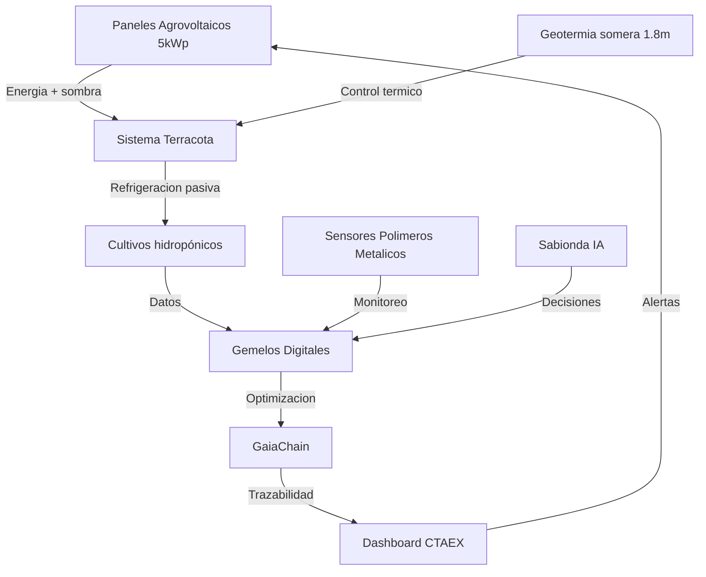

# PROTOTIPO PILOTO EXTREMADURA 2026
# Agrovoltaica + Terracota + Polimeros Metalicos Biocompatibles (CTAE X / Castuo-System)

**Formación cooperativa / Castúa:** [Manual hidroponía inteligente + geotermia + terracota](../../training/agrovoltaica-castua-hidroponia/MANUAL-FORMACION-COOPERATIVA-AGROVOLTAICA-CASTUA-HIDROPONIA-INTELIGENTE.md)

## Enfoque
Primera implementacion real en Extremadura (Valdefermos, Caceres) con enfoque tecnico y regulatorio.
No se asumen subvenciones no confirmadas. Donde haya cifras no confirmadas, se marca como "por validar".

## 1) Contexto y Objetivos del Prototipo

### 1.1 Objetivos Tecnicos

| Objetivo | Metricas de exito | Plazo | Responsable |
|---|---:|---|---|
| Validar refrigeracion pasiva con terracota | Temp interna <= 24C con 40C exterior | 6 meses | CTAEX + Castuo |
| Integrar polimeros metalicos biocompatibles | Sensores funcionales sin toxicidad | 3 meses | CICYTEX |
| Monitoreo con gemelos digitales | Datos en tiempo real en dashboard | 2 meses | Castuo |
| Trazabilidad en GaiaChain | Registros inmutables de metricas | 1 mes | Castuo |
| Evaluacion de geotermia somera | Estabilidad termica +/- 2C | 4 meses | CTAEX |

### 1.2 Localizacion y Especificaciones

- Ubicacion: finca experimental Valdefermos (Caceres)
- Superficie: 0.5 ha (escalable a 2 ha en fase 2)
- Cultivos piloto:
  - Microgreens (rucula, albahaca)
  - Fresas hidroponicas
- Infraestructura base:
  - Paneles agrovoltaicos: 5 kWp
  - Sistema de terracota: modulos 80x40x10 cm
  - Sensores con polimeros metalicos: 50 unidades
  - Gemelos digitales: simulacion termica/hidropónica (integrad o en Castuo-System)

## 2) Arquitectura Tecnica del Prototipo

### 2.1 Diagrama de Integracion (logico)



### 2.2 Componentes Clave (costes estimados; por validar)

| Componente | Especificacion tecnica | Proveedor / colaborador | Coste estimado (€) |
|---|---|---|---:|
| Paneles agrovoltaicos | 5 kWp, bifaciales, estructura elevada (3m) | SolarProfit | 6000 |
| Sistema terracota | modulos de arcilla 80x40x10 cm, 500 unidades/ha | Ceramicas Extremadura | 3500 |
| Geotermia somera | bomba calor 3 kW, profundidad 1.8m, circuito cerrado | ClimaExt | 8000 |
| Polimeros metalicos | sensores humedad/temperatura (PLA + nanoparticulas de cobre), 50 unidades | CICYTEX (I+D) | 2000 |
| Hidroponicos | sustrato coco, nutrientes automatizados, 200 m2 | HydroExt | 4000 |
| Gemelos digitales | simulacion termica/hidroponica en tiempo real | Castuo-System | incluido |
| GaiaChain | nodo local para notarizacion de metricas | Castuo-System | incluido |
| Sabionda IA | modelo local para optimizacion (Mistral 7B) | Castuo-System | incluido |
| Sensores adicionales | radiacion solar, viento, CO2 (10 unidades) | Agritech SL | 1500 |

> Nota: costes y proveedores son "por validar" para su confirmacion contractual/operativa.

## 3) Monitoreo y Metricas

### 3.1 Sensores y datos a recopilar

| Parametro | Sensor / dispositivo | Frecuencia | Unidad | Rango esperado |
|---|---|---|---|---:|
| Temp exterior | DHT22 | cada 15 min | C | 10-45 |
| Temp interior (terracota) | sensor terracota (polimero metalico) | cada 15 min | C | 15-28 |
| Humedad relativa | DHT22 | cada 15 min | % | 40-90 |
| Radiacion solar | piranometro | cada 10 min | W/m2 | 0-1200 |
| Flujo de calor geotermico | sensor flujo termico | cada 30 min | W/m2 | 10-50 |
| Humedad del sustrato | sensor capacitivo (polimero metalico) | cada 15 min | % | 60-90 |
| pH del agua | sonda pH | cada 1 hora | pH | 5.5-6.5 |
| CE del agua | sonda CE | cada 1 hora | mS/cm | 1.5-2.5 |
| Consumo energetico | medidor inteligente | cada 1 hora | kWh | 0-20 |
| Produccion de cultivos | balanza + vision computacional | diario | kg/m2 | 0.5-2.0 |

### 3.2 Dashboard de Monitoreo (Grafana) - plantilla (por validar)

```yaml
# docs/ops/pilotos/dashboards/extremadura-agrovoltaica-terracota-template.json
#
# Plantilla: requiere exporter/metrics real en Prometheus con esos nombres.
{
  "title": "Prototipo Extremadura: Agrovoltaica + Terracota",
  "uid": "extremadura-piloto-2026",
  "panels": [
    {
      "title": "Temperaturas",
      "type": "timeseries",
      "targets": [
        { "expr": "agrovoltaica_temp_exterior", "legend": "Exterior" },
        { "expr": "agrovoltaica_temp_interior", "legend": "Interior (Terracota)" },
        { "expr": "geotermia_temp", "legend": "Geotermia" }
      ]
    }
  ]
}
```

> Este dashboard es una plantilla; se debe alinear con los nombres reales de metricas que exponga el sistema.

## 4) Notarizacion en GaiaChain (evidencia inmutable)

### 4.1 Principio del contrato minimal (repo)
Para notarizar en GaiaChain usando el mecanismo del repo, el payload de witness debe respetar:
`{ "hash", "coop_id", "ipfs_cid" }`

### 4.2 Script de notarizacion de metricas (plantilla)
Se implementa como scaffolding ejecutable:
- `scripts/ops/piloto/Register-PilotoMetrics.sh`

**Aclaracion:** el ejemplo original usaba rutas de sysfs especificas. El script del repo incluye placeholders para integrar tus lecturas reales (sin hardcodear rutas especificas).

## 5) Protocolos de Seguridad y Cumplimiento (operativos)

### 5.1 Seguridad laboral
- EPIs para instalacion (guantes, gafas): CTAEX
- Protocolo de trabajo en altura (paneles): por validar segun plan operativo

### 5.2 Bioseguridad (polimeros metalicos)
- Analisis de toxicidad (CICYTEX)
- Limpieza de modulos de terracota antes de uso

### 5.3 Proteccion de datos
- Cifrado de datos con VeraCrypt (logs de sensores): Castuo
- Notarizacion en GaiaChain de eventos criticos: Castuo

### 5.4 Cumplimiento legal
- Registro en AEMPS para cultivos hidropónicos (si aplica a tu caso): Castuo
- Licencias de uso de suelo: Junta de Extremadura

## 6) Cronograma (alto nivel)

| Fase | Acciones | Plazo | Hitos |
|---|---|---:|---|
| Fase 0 (preparacion) | Firma acuerdo con CTAEX | 15 dias | acuerdo firmado |
| Fase 1 (instalacion) | Montaje PV + terracota + sensores + geotermia | 30 dias | sistema operativo |
| Fase 2 (puesta en marcha) | Cultivos + gemelos + integracion GaiaChain | 15 dias | primeras notarizaciones |
| Fase 3 (monitoreo) | Recopilacion de datos (6 meses) | 180 dias | dashboard operativo |
| Fase 4 (evaluacion) | Informe tecnico + presentacion institucional | 30 dias | validado |

## 7) Evidencia legal y acuerdos (CTAEX)

### 7.1 Acuerdo de colaboracion (texto de referencia; sin cifras economicas no confirmadas)
El texto solicitado se integra para evidencia en:
- `docs/ops/pilotos/ctaex-acuerdo-prototipo-agrovoltaica-terracota.md`

### 7.2 Notarizacion del acuerdo (GaiaChain)
- Script scaffolding: `scripts/ops/piloto/Register-Agreement.sh`

## 7.3 Propiedad intelectual y certificaciones (OEPM / ISO / UNE / AEMPS)
Documentacion base incluida en el repo:
- OEPM (solicitud de patente conjunta): `docs/legal/patentes/solicitud-oepm-agrovoltaica-terracota-2026.md`
- NDA con CTAEX: `docs/legal/nda/nda-ctaex-castuo-2026.md`
- ISO 10993-5 (plan de ensayos): `docs/compliance/ISO10993-5/plan-ensayos-biocompatibilidad.md`
- UNE 66181:2022 (memoria tecnica): `docs/compliance/UNE66181/memoria-tecnica-innovacion.md`
- AEMPS RD 903/2025 (trazabilidad): `docs/compliance/aemps-traceability.md`

---

## 8) Arquitectura avanzada (3D/4D + holografia + trazabilidad)
Para la integracion avanzada, ver:
- `docs/ops/pilotos/extremadura-gemelo-4d-holografico-2026.md`

> Esta seccion integra capas 3D/4D, visualizacion inmersiva y un protocolo de versionado notarizable por GaiaChain.

> Este registro se recomienda tras la firma y antes de iniciar mediciones (para fijar la evidencia legal).

