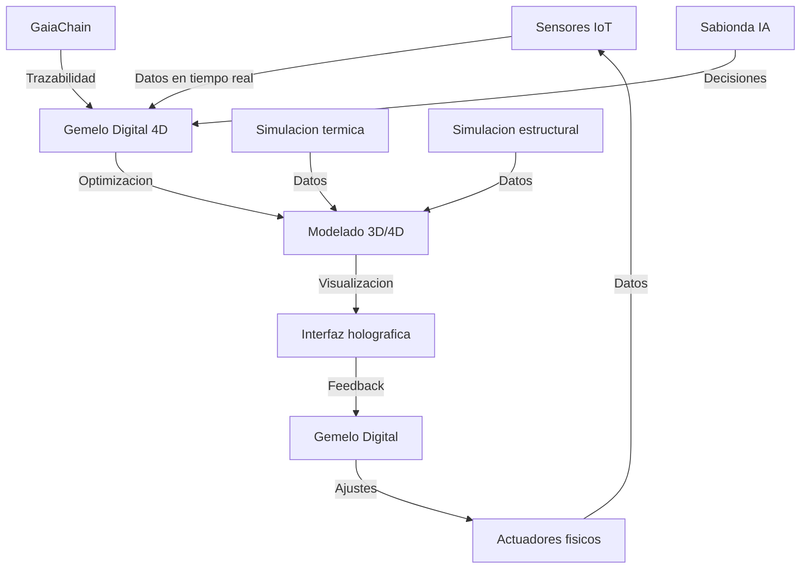

# ARQUITECTURA AVANZADA DEL SISTEMA - EXTREMADURA 4D/HOLOGRAFICO (2026)

## 0) Objetivo
Definir una arquitectura avanzada (3D/4D + visualizacion holografica + trazabilidad) para el prototipo de Extremadura, manteniendo:
- Integracion con el backend Castuo (estructura verificada en el repo).
- Trazabilidad inmutable con GaiaChain usando el contrato minimal del repo: `{"hash", "coop_id", "ipfs_cid"}`.
- No asumir dependencias externas como "operativas" si no existen en el repo: se marcan como `por validar`.

## 1) Diagrama de integracion con capas 3D/4D

## 2) Capa a capa (tecnologias y mapeo con Castuo)

| Capa | Tecnologia | Funcion | Integracion con Castuo |
|---|---|---|---|
| Sensores IoT | LoRaWAN + sensores (incluye "polimeros metalicos") | temperatura, humedad, radiacion, flujo | Flujos de datos ya existentes en el repo (IoT) |
| Gemelo Digital 4D | Backend Python (scaffold) | simulacion termica/estructural temporal | backend Castuo (plantilla en `backend/digital_twin/`) |
| Modelado 3D/4D | Export a geometria | geometria parametricamente coloreada | salida JSON para frontend (scaffold) |
| Interfaz holografica | Unity/MRTK + HoloLens 2 | visualizacion inmersiva | por validar (frontend/scaffold) |
| GaiaChain | blockchain soberana | trazabilidad de modelos/decisiones | se usa `scripts/ops/piloto/Register-3DModel.sh` |
| Sabionda IA | Mistral local | decisiones de optimizacion | backend ya expone `POST /mistral/ask` (ver router) |
| Simulacion termica | OpenFOAM + Python (por validar) | CFD (analitica avanzada) | por validar en repo actual; scaffold python |
| Simulacion estructural | CalculiX + Blender (por validar) | resistencia mecanica | por validar en repo actual; scaffold python |

## 3) Implementacion tecnica (scaffold "inmutable")

### 3.1 Gemelo Digital 4D (scaffold)
Se propone implementar el motor en:
- `backend/digital_twin/digital_twin_4d_extremadura.py`

Requisitos del motor:
- Entrada: dict con lecturas (temp_exterior, humedad, radiacion, etc.).
- Salida: dict con `thermal_data`, `structural_data`, `alerts` y `timestamp`.
- Export 3D/4D: dict con `geometry` + `materials` para visualizacion.

> Nota: el repo actualmente contiene `backend/digital_twin/gemelos_digitales.py` y `holographic_encryption.py`, pero no un endpoint de export 3D/4D listo. Este bloque es un "scaffold" por validar e integrar mas adelante.

### 3.2 Visualizacion 3D/4D (frontend scaffold)
El repositorio ya contiene paginas 3D (ej: `frontend/public/3d-virtual.html`).
Para el piloto, se incluye un visualizador scaffold en:
- `frontend/public/digital-twin-4d-visualizer-extremadura.html`

Ese fichero intenta cargar `GET http://localhost:8000/gemelos/export_3d` (endpoints por validar en el backend actual) y, si falla, renderiza datos de ejemplo.

### 3.3 Simulacion termica/estructural
Como el repo no incluye OpenFOAM/CalculiX, se define:
- Simulacion CFD: scaffold simplificado (sin CFD real) hasta que existan dependencias.
- Simulacion estructural: scaffold de estres relativo a partir de inputs.

## 4) Integracion GaiaChain para trazabilidad 3D/4D

### 4.1 Notarizacion (payload minimal)
Se usa el contrato minimal del repo:
`{ "hash", "coop_id", "ipfs_cid" }`

Donde:
- `hash` = SHA-256 de metadatos canonicos del modelo 3D/4D o del documento de version.
- `coop_id` = `GAIA_COOP_ID`
- `ipfs_cid` = `null` si no se utiliza IPFS

### 4.2 Script recomendado
- `scripts/ops/piloto/Register-3DModel.sh` (scaffold a crear)

> El scaffold ya esta creado en el repo y utiliza el witness minimal `{hash, coop_id, ipfs_cid}`.

## 5) Protocolos de ejecucion (alto nivel)
1. Inicializar motores (gemelo 4D, modelos 3D/4D).
2. Generar un "modelo versionado" (JSON/archivo) para el periodo `T`.
3. Calcular hashes SHA-256.
4. Notarizar con GaiaChain.
5. Visualizar en 3D/4D y registrar alertas (por validar con endpoints reales).

## 6) Enlaces en el repo
- Piloto Extremadura: `docs/ops/pilotos/extremadura-agrovoltaica-terracota-2026.md`
- Acuerdo CTAEX: `docs/ops/pilotos/ctaex-acuerdo-prototipo-agrovoltaica-terracota.md`
- Notarizacion metricas: `scripts/ops/piloto/Register-PilotoMetrics.sh`

