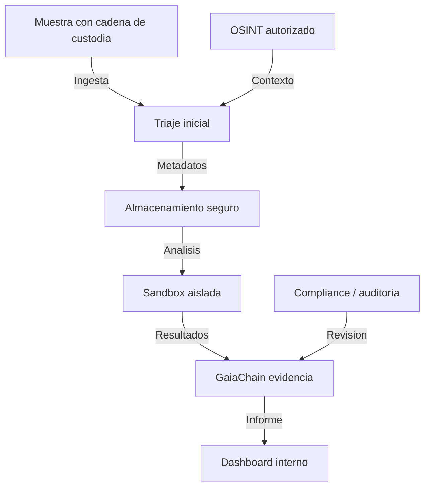

# Omega-9 (codigo interno) - Laboratorio defensivo de analisis de malware (2026)

*(Uso **solo autorizado** con cadena de custodia; marco orientativo DORA / NIS2 / eIDAS. No sustituye asesoramiento legal.)*

**Notarizacion y certificacion (procedimiento)**: [`omega9-notarization-procedure-2026.md`](omega9-notarization-procedure-2026.md)

## 0) Alcance y limites legales (obligatorio)

Este documento describe una **arquitectura de laboratorio defensivo** para:

- Analisis de **muestras autorizadas** (malware en cuarentena, binarios propios, artefactos de incidentes con cadena de custodia).
- **Triage** e **informes** con evidencia notarizable en GaiaChain (contrato minimal del repo: `hash`, `coop_id`, `ipfs_cid`).

**No autoriza:** explotacion ofensiva, interceptacion ilegal, ni analisis fuera de politica y mandato escrito.

## 1) Diagrama de arquitectura (flujo defensivo)

## 2) Componentes defensivos (referencia; por validar en tu entorno)

| Componente | Tecnologia de referencia | Funcion defensiva | Normativa UE (referencia) |
|---|---|---|---|
| Ingesta | Scripts + registro + hash | SHA-256 inmutable; metadatos minimos sin PII | eIDAS (firma de informes, si aplica) |
| Validacion opcional | ClamAV | Barrera para muestras **no** maliciosas esperadas (ajustar en laboratorio de malware) | NIS2 (medidas tecnicas) |
| Almacenamiento | VeraCrypt + backups | Cifrado en reposo; copias controladas | GDPR Art. 32 |
| Sandbox | Firejail / QEMU / contenedor efimero | Ejecucion aislada; red en deny-by-default | NIS2 Anexo II (medidas operativas) |
| Analisis estatico | Ghidra + YARA | Patrones, reglas, IOC | ISO 27001 (si certificais) |
| Base / colaboracion | MISP + TheHive (si desplegadas) | IOC y casos; **sin** URLs inventadas | Directiva NIS2 |
| Trazabilidad | GaiaChain witness | Hash de payload canonico de evento/informe | Evidencia auditable |
| Compliance tooling | OpenAudIT u equivalente | Inventario y controles (scaffold) | DORA (continuidad ICT) |
| Dashboard | Grafana + metricas reales | KPI internos (colas, SLA) | Por validar |

## 3) Cadena de custodia

### 3.1 Proceso estandar (plantilla)

1. **Recepcion**: origen documentado; sello de tiempo si aplica (RFC 3161 / politica interna).
2. **Registro**: SHA-256 de la muestra + JSON canonico de metadatos; witness minimal en GaiaChain.
3. **Almacenamiento**: volumen cifrado (p.ej. VeraCrypt); copia en IPFS **solo** si politica lo permite; `ipfs_cid` en witness posterior.
4. **Analisis**: solo en sandbox sin rutas de escape; registro de acciones (logs + hashes).
5. **Informe**: documento interno; notarizar hash del informe canonico (`Register-LabEvidence.sh`).

### 3.2 Script de ingesta (scaffold)

- `scripts/ops/research/ingest-sample.sh`

Comportamiento:

- Calcula `sample_sha256`.
- Construye registro canonico `{ action, sample_sha256, metadata, timestamp_utc }`.
- Envio witness: `hash = SHA256(JSON_canonico)`, `coop_id`, `ipfs_cid` opcional.
- ClamAV: **opcional** (`RUN_CLAMAV=1`). En laboratorio de malware real, usar `ALLOW_INFECTED_SAMPLE=1` o no activar ClamAV en la ingesta.

## 4) Trazabilidad GaiaChain (minimal)

Igual que el resto del repo: no enviar campos extra al witness si el endpoint solo acepta `hash`, `coop_id`, `ipfs_cid`.

Scripts:

- `scripts/ops/research/ingest-sample.sh` (evento `ingest`)
- `scripts/ops/research/Register-LabEvidence.sh` (JSON por stdin / `--file`; fichero no JSON -> sobre `evidence_kind`, `document_path`, `document_sha256`, `timestamp_utc`)

## 5) Cumplimiento normativo (orientativo)

### 5.1 DORA (resiliencia ICT)

| Requisito (resumen) | Implementacion Omega-9 (objetivo) | Evidencia (scaffold) |
|---|---|---|
| Gestion de riesgos ICT | Revision trimestral de riesgos de laboratorio | `docs/compliance/dora/risk-assessments/README.md` |
| Pruebas de resiliencia | Simulacros semestrales (tabla maestra en DORA) | `docs/compliance/dora/resilience-tests/README.md` |
| Registro de incidentes | Incidentes ICT con hash en GaiaChain | Witness `CASTUO-LAB-01` (por validar) |
| Intercambio de informacion | MISP / acuerdos sectoriales | Feeds y URLs **por validar** (no inventar dominios) |

Detalle: [`docs/compliance/dora.md`](../../compliance/dora.md)

### 5.2 NIS2 (Directiva (UE) 2022/2555)

| Requisito (resumen) | Implementacion (objetivo) | Evidencia |
|---|---|---|
| Medidas de seguridad | Cifrado, MFA, segmentacion | Politicas IAM + auditoria |
| Notificacion de incidentes | Flujo hacia CSIRT / INCIBE segun criterio legal | `docs/compliance/nis2/README.md` |
| Gestion de riesgos | OSINT autorizado + revision periodica | Informes internos |

## 6) Hoja de ruta (alto nivel)

| Fase | Acciones | Plazo | Responsable |
|---|---|---:|---|
| 0 | Infra aislada + GaiaChain + politica legal | 30 d | Infra + Legal |
| 1 | Ingesta + sandbox + registro de hashes | 45 d | SecOps |
| 2 | Compliance DORA/NIS2 (documentacion ejecutable) | 60 d | Legal + Cumplimiento |
| 3 | Operacion piloto con cadena de custodia + MISP (opcional) | 30 d | SecOps |
| 4 | Auditoria externa (si aplica) | 60 d | Cumplimiento |

## 7) Enlaces en el repo

| Documento | Ruta |
|---|---|
| Seguridad reforzada (Qubes / Parrot) | [`docs/ARQUITECTURA-SEGURIDAD-REFORZADA-QUBES-WHONIX-PARROT.md`](../../ARQUITECTURA-SEGURIDAD-REFORZADA-QUBES-WHONIX-PARROT.md) |
| DORA (stub ampliado) | [`docs/compliance/dora.md`](../../compliance/dora.md) |
| NIS2 (stub) | [`docs/compliance/nis2/README.md`](../../compliance/nis2/README.md) |
| Notarizar evidencia | `scripts/ops/research/Register-LabEvidence.sh` |
| Ingesta con custodia | `scripts/ops/research/ingest-sample.sh` |
