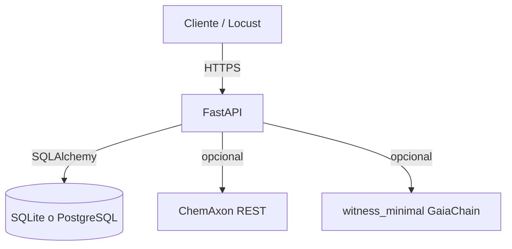

# Modulo de aleaciones vegetales (Castuo-System)

Estado en repo: **API FastAPI** bajo prefijo `/vegetal-alloys`, SQLite por defecto, **ChemAxon en mock** hasta URL + API key reales.

## Arquitectura (referencia)

## Variables de entorno

| Variable | Uso |
|----------|-----|
| `DATABASE_URL` | Por defecto `sqlite:///./data/vegetal_alloys.db` |
| `CHEMAXON_BASE_URL` | Base URL del servicio licenciado |
| `CHEMAXON_API_KEY` | Bearer; si falta, propiedades **mock** |
| `CHEMAXON_TIMEOUT_SEC` | Timeout HTTP (default 15) |
| `GAIA_CHAIN_API_KEY` / `GAIA_CHAIN_API_URL` | Witness opcional (ver `witness_minimal`) |

## Endpoints

| Metodo | Ruta | Descripcion |
|--------|------|-------------|
| POST | `/vegetal-alloys/alloys/` | Crear aleacion |
| GET | `/vegetal-alloys/alloys/{id}` | Leer por id |
| POST | `/vegetal-alloys/alloys/{id}/chemaxon` | Body JSON `{"smiles":"..."}` |

## Codigo

- `backend/vegetal_alloys/database.py` — modelo y sesion
- `backend/vegetal_alloys/router.py` — rutas
- `backend/vegetal_alloys/chemaxon_integration.py` — cliente + mock
- `tests/load/locustfile.py` — prueba de carga
- Formulas ASCII: `BIOPLA-STEVIA-2026.txt`, `BIOPLA-STEVIA-2026-v2.txt`

## Cumplimiento

Las formulas en `.txt` son documentacion de dominio publico (CC0 en texto). Uso comercial exige validacion analitica y normativa aplicable (REACH, contacto alimentario, etc.), no sustituida por mock de API.
