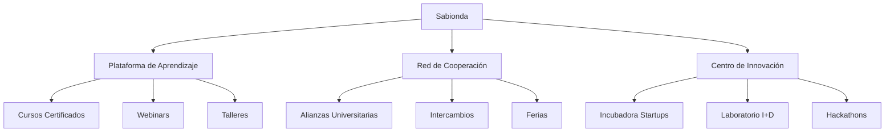

# Sistema Educativo Sabionda

**Objetivo**: Gestión del desarrollo y cooperación internacional (formación, certificados, alianzas).

**Escalado técnico + expansión UE (visión 2026):** [PRONTUARIO-MAESTRO-ESCALADO-CLIENTES-SABIONDA-UE-2026.md](../deploy/PRONTUARIO-MAESTRO-ESCALADO-CLIENTES-SABIONDA-UE-2026.md)

---

## 0. Estado de implementación en el repo (para evitar claims no verificables)
- `SABIONDA EDU v5.0` está implementado como servicio FastAPI en `backend/sabion_edu/app_edu.py` con endpoints `POST /edu/enroll`, `POST /edu/progress`, `GET /edu/certificates`, `POST /edu/levelup` y `GET /edu/dashboard`.
- La integración Moodle (vía REST) existe como cliente en `academy/lms_integration.py`, pero requiere URL y token reales del servidor Moodle externo.
- La “emisión blockchain” de `SABIONDA EDU` en este repo usa `MerkleProof + IPFS CID` como mecanismo de verificación simulado/estructural (ver `backend/sabion_edu/edu_certificates.py`); GaiaChain entra cuando la cadena está configurada en módulos donde aplique.

## 1. Objetivos

| Objetivo | Métrica | Herramienta |
|----------|---------|-------------|
| Formar 500 profesionales/año | Nº certificados emitidos | Moodle + Certificados Blockchain |
| Alinear con estándares UE | % cursos que cumplen EQF | Marco EQF |
| Cooperación internacional | Nº alianzas con universidades (UEx, Wageningen) | Acuerdos de colaboración |
| Innovación continua | Nº proyectos I+D+i por alumnos | GitHub + Notion |
| Trazabilidad educativa | % certificados verificables en blockchain | GaiaChain |

---

## 1.1 Métricas clave (objetivos 2026 vs 2031)
> Nota: objetivos a medir. Herramientas externas se consideran “integraciones a habilitar” si no están instrumentadas ya en el repo.

| Objetivo | 2026 | 2031 | Herramienta de seguimiento |
|----------|------|------|-----------------------------|
| Profesionales certificados/año | 500 | 2.000 | Moodle + verificación blockchain |
| Cursos alineados con EQF | 80% | 100% | Marco EQF |
| Alianzas internacionales | 5 | 20 | HubSpot |
| Proyectos I+D+i por alumno/año | 3 | 5 | GitHub + Notion |
| Certificados blockchain | 100% | 100% | GaiaChain (cuando aplique) |

---

## 2. Estructura

---

## 3. Programas educativos

| Programa | Duración | Destinatarios | Certificación | Métricas |
|----------|----------|---------------|---------------|----------|
| Experto en Trazabilidad Blockchain | 6 meses | Técnicos agrícolas, auditores | Certificado + NFT GaiaChain | 100 alumnos/año |
| Especialista en Cannabis Medicinal | 3 meses | Agrónomos, farmacéuticos | Certificado AEMPS | 50 alumnos/año |
| IoT para Agricultura 4.0 | 2 meses | Ingenieros, técnicos | Certificado Libelium | 80 alumnos/año |
| Gestión de Proyectos Agritech | 4 meses | Emprendedores, gestores | Certificado PMI | 60 alumnos/año |
| Sostenibilidad y PAC 2026 | 1 mes | Agricultores, cooperativas | Certificado Junta de Extremadura | 200 alumnos/año |
| Agricultura Regenerativa | 3 meses | Agricultores, técnicos | Certificado UE | 120 alumnos/año |
| Hidroponía Avanzada | 2 meses | Técnicos, emprendedores | Certificado Sabionda | 70 alumnos/año |

---

## 4. Cooperación internacional

| Iniciativa | Objetivo | Socios potenciales | Métricas |
|------------|----------|--------------------|----------|
| Alianzas universidades | Programas conjuntos (Máster Agritech) | UEx, Wageningen, Hohenheim | 3 alianzas 2026 |
| Intercambio | Estudiantes y profesionales | Erasmus+, DAAD | 20 participantes/año |
| Ferias | Casos de éxito (Cannabis Europa, GreenTech) | CTAEX, Junta Extremadura | 5 ferias/año |
| Incubadora startups | Emprendimientos agritech | ENISA, CDTI | 5 startups/año |
| Laboratorio I+D | Proyectos con centros investigación | CICYTEX, CSIC | 3 proyectos/año |
| Red de Cooperativas | Colaboración con cooperativas agrícolas | Cooperativas Extremeñas | 10 acuerdos |

---

## 5. Métricas de éxito

| Métrica | Fuente | Herramienta | Objetivo 2026 | Objetivo 2031 |
|---------|--------|-------------|----------------|----------------|
| Alumnos certificados | Moodle + GaiaChain | Grafana | 500 | 2.000 |
| Alianzas internacionales | HubSpot | Tableau | 5 | 20 |
| Patentes | OEPM | Notion | 1 | 10 |
| Startups incubadas | Airtable | Notion | 2 | 10 |
| Reducción CO2 | Sensores IoT | Power BI | 20 % | 50 % |
| Ingresos por formación | Stripe | Excel | €50.000 | €500.000 |
| Cursos con certificación blockchain | Moodle | GaiaChain | 100 % | 100 % |

---

## 6. Plan de implementación 2026–2027

| Acción | Responsable | Plazo | Presupuesto (€) |
|--------|-------------|--------|------------------|
| Desarrollar plataforma Moodle | IT Team | 3 meses | 15.000 |
| Crear cursos certificados | Equipo Educativo | 6 meses | 30.000 |
| Firmar alianzas universidades | Comercial | 4 meses | 10.000 |
| Lanzar incubadora startups | Innovación | 6 meses | 50.000 |
| Organizar hackathons | I+D | Trimestral | 5.000/hackathon |
| Asistir ferias internacionales | Comercial | Anual | 20.000/feria |
| Certificar cursos en blockchain | Blockchain Team | 2 meses | 10.000 |
| Implementar sistema de métricas | Equipo IT | 2 meses | 5.000 |

**Presupuesto total 2026**: €140.000 (referencial).

---

## 6.2 Plan marco 2028–2031 (escalado iterativo)
| Año | Objetivo principal | Entregables |
|-----|----------------------|-------------|
| 2028 | Consolidar verificación de certificados y evidencias | Ajuste de flujos de verificación Export de evidencias Baselines medibles |
| 2029 | Escalar el catálogo y cobertura EQF | Nuevos cursos Auditoría de alineación EQF Mejora de tasas de finalización |
| 2030 | Internacionalización | 5 alianzas adicionales 2 programas bilingües 3 ferias internacionales |
| 2031 | Excelencia operativa | Automatización de procesos 90% de satisfacción 10 startups incubadas |

## 7. Módulos técnicos Sabionda

| Módulo | Funcionalidad | Tecnología | Estado |
|--------|----------------|------------|--------|
| Plataforma de Aprendizaje | Gestión de cursos y certificados | Moodle (vía REST en `academy/lms_integration.py`) + EDU v5 (repo) | Parcialmente implementado |
| Cursos certificados | Cursos, microcredenciales y trazabilidad | SABIONDA EDU v5 (`backend/sabion_edu/app_edu.py`) + verificación (según cadena/config) | Implementación base (objetivo a escalar) |
| Webinars y Talleres | Sesiones en vivo y grabadas | Integración por habilitar (Zoom/YouTube) | Por implementar |
| Foros cooperación | Cooperación internacional y comunidad | Discourse (integración por habilitar) | Por implementar |
| Incubadora | Gestión de startups agritech | Notion + Airtable (integración por habilitar) | Diseño/arranque inicial |
| Laboratorio I+D | Proyectos con universidades | GitHub + Jira | Diseño/arranque inicial |
| Certificados blockchain | Evidencia verificable y trazabilidad | GaiaChain donde aplique + mecanismo EDU (Merkle/IPFS CID sim) | Diseño inicial (GaiaChain por configurar donde aplique) |
| Sistema de Métricas | Seguimiento de KPIs | Prometheus/Grafana (repo) + Power BI/Tablas (integración por habilitar) | Por implementar |
| Gestión de Alianzas | CRM de acuerdos | HubSpot + Salesforce (integración por habilitar) | Por integrar |
