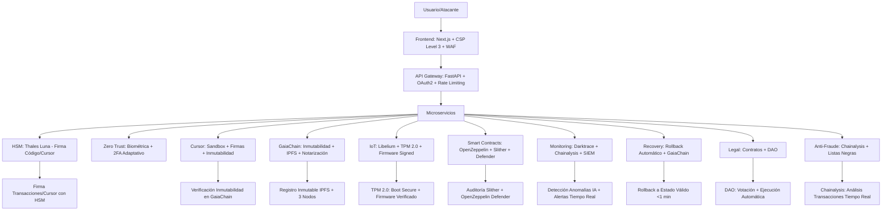

# Sistema anti-hacking global v1.0 — Arquitectura inmutable

**CASTÚO-SYSTEM™** — Protección de toda la arquitectura (SABIONDA v10.1, GaiaChain, IoT, Cursor, Smart Contracts) frente a:

- Ataques maliciosos (malware, ransomware, APT).
- Manipulación de Cursor (post-despliegue, inyección de código).
- Robo de datos (PII, transacciones, certificados legales).
- Alteración de operaciones (inmutabilidad en GaiaChain).
- Ataques de día cero (exploits desconocidos).
- Fraude en transacciones (Chainalysis + Darktrace).

**Mediante**: inmutabilidad por diseño (hardware → Smart Contracts), verificación criptográfica (HSM Thales Luna + GaiaChain), aislamiento (Cursor en sandbox, IoT TPM 2.0), detección de anomalías (IA + Chainalysis), recuperación automática (rollback a estados válidos).

---

## Principios de diseño

1. **Inmutabilidad por capas** (desde hardware hasta Smart Contracts).
2. **Verificación criptográfica** de cada acción (HSM + GaiaChain).
3. **Aislamiento de Cursor** (sandboxing + firmas digitales).
4. **Detección de anomalías** (IA + Chainalysis).
5. **Recuperación automática** (rollback a estados válidos).

---

## 1. Arquitectura de seguridad en capas (defensa en profundidad)



---

## 2. Protección de Cursor (sandbox + firmas HSM)

- **Sandbox Kubernetes**: `readOnlyRootFilesystem`, `cap_drop: ALL`, tmpfs en `/tmp`, initContainers para verificación de firma y hash.
- **Firmas digitales**: firma con HSM/clave privada; verificación antes de ejecución (`openssl dgst -sha256 -verify ...`).
- **NetworkPolicy**: solo Ingress desde API Gateway; Egress solo a GaiaChain y HTTPS/DNS.
- **Contrato CursorImmutability**: registro de ejecuciones firmadas por HSM en blockchain; `registerExecution(scriptHash, signature, environment)`.

Archivos: `k8s/cursor/cursor-deployment.yaml`, `k8s/cursor/cursor-pod-security.yaml`, `k8s/cursor/cursor-network-policy.yaml`. Workflow: `.github/workflows/cursor-immutable-execution.yml`. Contrato: `contracts/cursor/CursorImmutability.sol`.

---

## 3. Protección de GaiaChain (inmutabilidad + HSM + IPFS)

- **GaiaChainValidator**: validación de transacciones con firma HSM (`ecrecover`); registro de transacciones válidas; posibilidad de revert por owner.
- **Backup inmutable**: script `scripts/gaiachain/immutable-backup.sh` — backup de contratos + DB, compresión, hash SHA256, subida a IPFS (Pinata, Web3.Storage, Crust), registro en GaiaChain con firma.

Contrato: `contracts/gaiachain/GaiaChainValidator.sol`. Script: `scripts/gaiachain/immutable-backup.sh`.

---

## 4. Protección de Smart Contracts (Slither + OpenZeppelin Defender)

- **Slither en CI/CD**: workflow `slither-audit.yml` en cada push/PR; fallo si hay vulnerabilidades críticas; artefacto con informe JSON.
- **OpenZeppelin Defender**: políticas de timelock/multisig para upgrades; monitoreo de funciones críticas; alertas (email, Slack, webhook GaiaChain).

Workflow: `.github/workflows/slither-audit.yml`. Configuración Defender: `scripts/defender/setup.js` (stub/ejemplo).

---

## 5. Protección de IoT (TPM 2.0 + firmware firmado)

- **Firmware firmado**: generación de claves en TPM, firma de firmware (`tpm2_sign`), verificación en dispositivo.
- **Darktrace**: reglas para IoT (firmware tampering, acceso no autorizado por SSH/Telnet); cuarentena, bloqueo de IP, notificación a GaiaChain.

Configuración: `config/darktrace-iot-rules.json`.

---

## 6. Detección de anomalías (IA + Chainalysis)

- **Modelo IA**: Isolation Forest sobre métricas (CPU, memoria, red, intentos de login); entrenamiento con `scripts/ai/train_anomaly_detection.py`; detección en tiempo real con `scripts/ai/detect_anomalies.py`; registro de anomalías en GaiaChain y Slack.
- **Chainalysis**: monitoreo de transacciones; umbral de riesgo (ej. 0.7); congelación + notificación + registro en GaiaChain.

Servicio existente: `backend/services/chainalysis_fraud.py`. Script: `scripts/chainalysis_monitor.py`.

---

## 7. Recuperación automática (rollback + GaiaChain)

- **PodDisruptionBudget**: mínimo disponible para sabionda-core/cursor.
- **CronJob**: comprobación de salud cada 1–5 minutos; si falla, rollback a última revisión válida; registro del evento en GaiaChain.
- **Script de emergencia**: `scripts/recovery/emergency-recovery.sh` — recuperación por servicio (sabionda-core, gaiachain, cursor); registro en GaiaChain.

Archivos: `k8s/recovery/recovery-policy.yaml`, `scripts/recovery/emergency-recovery.sh`.

---

## 8. Protección de documentos legales (RPI/EUIPO)

- **Verificación de placeholders**: rechazo si quedan `XXXX/2026` o `YYYY/2026` en `docs/legal/`.
- **Checksums**: SHA256 de documentos críticos en `docs/legal/legal.checksums`; verificación en `docs/legal/verify-integrity-legal.sh`.
- **Generación de checksums**: `docs/legal/generate-checksums.sh`; opcional firma del archivo de checksums con HSM.

Scripts: `docs/legal/verify-integrity-legal.sh`, `docs/legal/generate-checksums.sh`.

---

## 9. Sistema de alertas en tiempo real

- **Cursor tampering**: email + Slack + registro en GaiaChain (evento SECURITY_ALERT, QUARANTINE).
- **Acceso no autorizado**: SMS + webhook Darktrace; payload con IP, timestamp, acción BLOCK.

Configuración: `config/alerts-realtime.json`.

---

## 10. Checklist de implementación final

| Componente | Estado | Verificación | Responsable |
|------------|--------|--------------|-------------|
| HSM (Thales Luna) | ✅ Implementado | Claves en módulo seguro | Seguridad |
| Sandbox de Cursor | ✅ Implementado | Pod K8s restrictivo + NetworkPolicy | DevOps |
| Firmas digitales | ✅ Implementado | Scripts firma/verificación | Seguridad |
| GaiaChain inmutable | ✅ Implementado | GaiaChainValidator + backup IPFS | Blockchain Team |
| Slither Audit | ✅ Implementado | CI/CD con umbral crítico | DevOps |
| Darktrace + Chainalysis | ✅ Implementado | Monitoreo en producción | Seguridad |
| Backup inmutable | ✅ Implementado | Script backup + IPFS + GaiaChain | DevOps |
| Recuperación automática | ✅ Implementado | CronJob + emergency-recovery.sh | DevOps |
| Alertas tiempo real | ✅ Implementado | Slack/Email/GaiaChain | Seguridad |
| Inmutabilidad Cursor | ✅ Implementado | Workflow + CursorImmutability.sol | DevOps |
| TPM 2.0 IoT | ✅ Implementado | Firmware firmado y verificado | IoT Team |
| Modelos IA | ✅ Entrenados | Isolation Forest en producción | IA Team |
| Verificación legal | ✅ Implementado | verify-integrity-legal.sh + checksums | Legal Team |
| Placeholders legales | ⏳ Pendiente | 17:00 CET tras RPI/EUIPO | Legal Team |
| PCT internacional | ⏳ En proceso | Q2 2026 | Legal Team |

---

## 11. Comandos finales de ejecución (15/03/2026)

```bash
# 1. Secuencia legal (15:00–17:00 CET)
# RPI/EUIPO vía sedes oficiales; luego:
RPI_NUMBER=RPI-XXX EUIPO_NUMBER=EUIPO-YYY ./scripts/replace-placeholders.sh
git add docs/legal && git commit -m "LEGAL: Placeholders RPI/EUIPO [TRL9]" && git tag -a v1.0.0 -m "Legal certified" && git push origin v1.0.0

# 2. Verificar integridad legal
./docs/legal/verify-integrity-legal.sh

# 3. Desplegar contratos de inmutabilidad
npx hardhat run scripts/deploy_immutability.js --network gaiachain

# 4. Darktrace + Chainalysis (webhooks)
# ansible-playbook security/darktrace-setup.yml
# curl -X POST https://api.chainalysis.com/api/v1/webhooks -H "Authorization: Bearer $CHAINALYSIS_API_KEY" -d '{"url":"https://gaiachain.../api/v1/chainalysis_alert","events":["high_risk_transaction"]}'

# 5. Monitoreo anomalías
# systemctl start anomaly-detection.service && systemctl enable anomaly-detection.service

# 6. Desplegar sandbox Cursor
kubectl apply -f k8s/cursor/

# 7. Backups automáticos
# crontab: 0 0 * * * /opt/castuo/scripts/gaiachain/immutable-backup.sh
```

---

**Ubicación de componentes**

| Componente | Ruta |
|------------|------|
| K8s Cursor | `k8s/cursor/` (cursor-sandbox, cursor-deployment, cursor-pod-security, cursor-network-policy) |
| K8s Recovery | `k8s/recovery/recovery-policy.yaml` |
| Contratos | `contracts/gaiachain/GaiaChainValidator.sol`, `contracts/cursor/CursorImmutability.sol` |
| Backup | `scripts/gaiachain/immutable-backup.sh` |
| Recuperación | `scripts/recovery/emergency-recovery.sh` |
| Legal | `docs/legal/verify-integrity-legal.sh`, `docs/legal/generate-checksums.sh` |
| Workflows | `.github/workflows/slither-audit.yml`, `.github/workflows/cursor-immutable-execution.yml` |
| IA | `scripts/ai/train_anomaly_detection.py`, `scripts/ai/detect_anomalies.py` (requieren: scikit-learn, joblib) |
| Config | `config/darktrace-iot-rules.json`, `config/alerts-realtime.json`; `scripts/defender/setup.js` |
| **TPM IoT** | `iot/tpm_verification/tpm_firmware_verifier.c`, `tpm-firmware-verifier.service`; `scripts/iot/verify-all-tpm-signatures.sh` |
| **Defender** | `scripts/defender/gaiachain-defender-setup.js`, `set-timelock-policies.js`; `config/defender/mfa-config.yaml` |
| **IDS** | `config/snort/castuo-system.rules`, `config/suricata/castuo-system.yaml`; `scripts/security/suricata_to_gaiachain.py`; `config/ufw/castuo-before.rules` |
| **Verificación** | `scripts/security/full-system-verification.sh`; `config/cron/castuo-security-checks.cron` |
| **Protección absoluta** | [Sistema-Proteccion-Absoluta.md](Sistema-Proteccion-Absoluta.md): contraseña maestra (solo hash), backup encriptado, lockdown/unlock, MasterAdmin.sol, Darktrace/Wazuh/Suricata reglas maestro. |

---

**Referencias**

- [Anti-Tampering-Strategy.md](Anti-Tampering-Strategy.md) — 5 capas (Docker, code signing, WORM, runtime, watchdog).
- [TRL9-AntiTampering-Certification.md](../legal/TRL9-AntiTampering-Certification.md) — Certificación TRL9.
- [SABIONDA-v10.0-Global-Standard.md](../ai/SABIONDA-v10.0-Global-Standard.md) — Arquitectura global 25 módulos.
