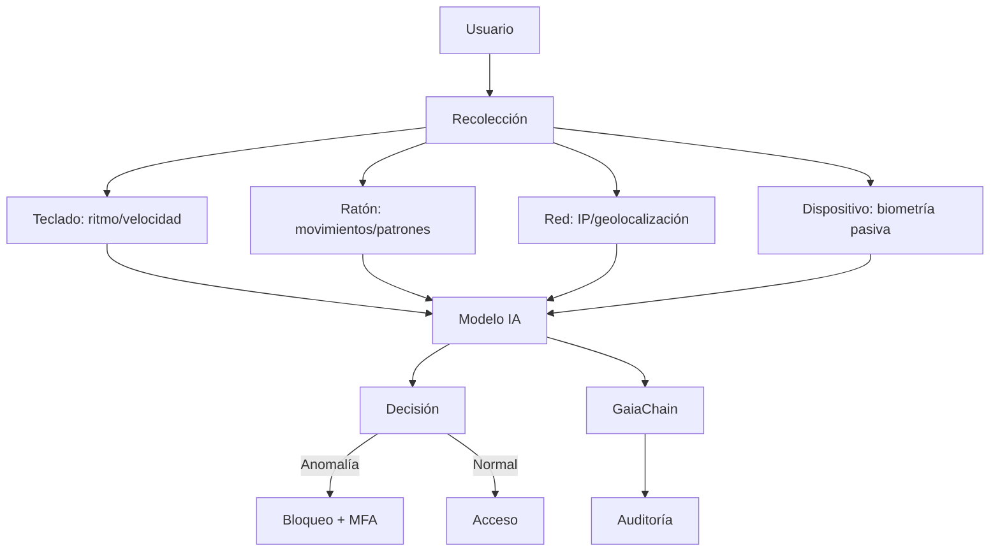

# Autenticación por comportamiento (IA)

**CASTÚO-SYSTEM™** — Detección de anomalías de comportamiento (teclado, ratón, geolocalización) con modelo opcional LSTM y registro en GaiaChain. Si se detecta anomalía, se solicita MFA (YubiKey/biometría).

---

## 1. Arquitectura



---

## 2. Modelo (Python)

- **Script**: `scripts/security/behavioral_auth_ai.py`
- **Con TensorFlow**: modelo LSTM (secuencia de 10 eventos × 12 características); se carga desde `model_path` si existe.
- **Sin TensorFlow**: regla por umbral (p. ej. velocidad media) y opcional registro en GaiaChain.
- Características por evento: `time_since_last`, `keyboard_speed`, `keyboard_pressure`, `mouse_speed`, `mouse_acceleration`, geolocalización, orientación, latencia de red, `time_of_day`.

Comandos:

```bash
# Monitorear usuario (eventos por stdin, JSON una línea por evento)
export CASTUO_BEHAVIORAL_USER=user_id
python3 scripts/security/behavioral_auth_ai.py monitor --user user_id

# Entrenar con historial (archivo JSON de eventos)
python3 scripts/security/behavioral_auth_ai.py train --user user_id --events events.json
```

---

## 3. Frontend (JavaScript)

- **Servicio**: `frontend/src/services/behavioralAuth.js`
- Captura: `keydown` (ritmo, presión estimada), `mousemove` (velocidad, aceleración), `geolocation` (si el usuario lo permite).
- Envía al backend cada 10 eventos: `POST /behavioral_auth/log` con `userId`, `events`, `timestamp`.
- Si la respuesta incluye `requiresMFA: true`, se muestra modal para OTP YubiKey y se llama a `POST /behavioral_auth/verify` con `otp`.

Inicialización (en app):

```javascript
import { BehavioralAuthService } from './src/services/behavioralAuth';
const behavioralAuth = new BehavioralAuthService();
behavioralAuth.initEventListeners();
```

---

## 4. Backend (FastAPI)

- **Router**: `api/behavioral_auth.py` (montado en `main.py`).
- **Endpoints**:
  - `POST /behavioral_auth/log` — body: `{ userId, events, timestamp }`; respuesta: `{ success, requiresMFA, anomalyScore }`.
  - `POST /behavioral_auth/verify` — body: `{ otp }`; verificación YubiKey (en producción con YubiCloud).
  - `GET /behavioral_auth/profile/{user_id}` — perfil (umbral, etc.).

Umbral configurable con `CASTUO_BEHAVIORAL_THRESHOLD` (por defecto 3.0). La lógica simple compara velocidad media con el umbral para marcar anomalía.

---

## 5. Registro en GaiaChain

Desde `behavioral_auth_ai.py`, si hay `GAIA_CHAIN_ADMIN_KEY` y firma (HSM o PEM), se envía a `POST /api/v1/behavioral_auth/log` el evento (sin campos sensibles), `is_anomaly`, `prediction_score`, `timestamp` y `signature`.

---

## 6. Flujo completo

1. Usuario inicia sesión (YubiKey + HSM o biometría).
2. Frontend inicia captura y envía eventos al backend.
3. Backend (o script Python) evalúa anomalía; si supera umbral, devuelve `requiresMFA`.
4. Frontend muestra MFA (YubiKey OTP); backend verifica y confirma sesión.
5. Eventos y resultados se registran en GaiaChain para auditoría.

---

**Referencias**: [Sistema-Seguridad-Extrema.md](Sistema-Seguridad-Extrema.md) | [Full-Integration-Guide.md](Full-Integration-Guide.md)
