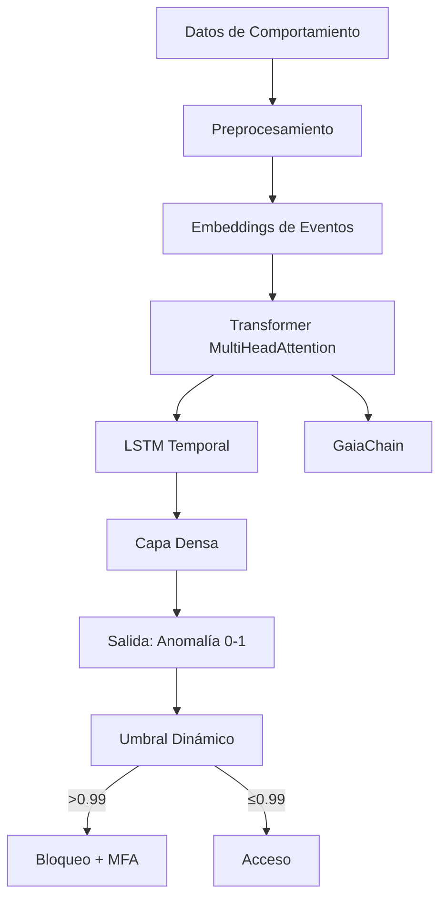

# Autenticación por comportamiento — Modelo Transformer + LSTM

**CASTÚO-SYSTEM™** — Detección de anomalías con arquitectura Transformer (MultiHeadAttention) + LSTM; opcional BERT para embeddings de texto. Registro en GaiaChain y MFA ante anomalías.

---

## 1. Arquitectura del modelo



- Secuencia de 20 eventos × 128 características (numéricas + categóricas).
- Sin TensorFlow: se usa regla por umbral sobre velocidad media.

---

## 2. Script Python

- **Script**: `scripts/security/behavioral_auth_transformer.py`
- **Comandos**:
  - `monitor --user <id>`: lee eventos JSON por stdin; si hay 3 anomalías consecutivas dispara MFA (biometric_auth.py).
  - `train --user <id> --events <file.json>`: entrena con historial (eventos + opcional campo `label`).

Variables: `CASTUO_BEHAVIORAL_USER`, `GAIA_CHAIN_ADMIN_KEY`, `HSM_USER_PIN` (opcional).

---

## 3. Frontend (Transformer)

- **Servicio**: `frontend/src/services/behavioralAuthTransformer.js`
- Captura: teclado (keydown/keyup), ratón (movimiento, clicks), geolocalización, orientación de dispositivo.
- Envío cada 5 s o al acumular eventos a `POST /behavioral_auth/log`.
- Si `requiresMFA`: modal para OTP YubiKey y `POST /behavioral_auth/verify`.

Inicialización:

```javascript
import { BehavioralAuthTransformerService } from './src/services/behavioralAuthTransformer';
// o en navegador: window.behavioralAuthTransformerService
```

---

## 4. Backend (FastAPI)

El router `api/behavioral_auth.py` ya expone `/behavioral_auth/log` y `/behavioral_auth/verify`. Para usar el modelo Transformer en servidor, se puede invocar `behavioral_auth_transformer.py` desde un worker o evaluar el mismo umbral/regla con los eventos recibidos.

---

## 5. Registro en GaiaChain

Desde el script Python, con `GAIA_CHAIN_ADMIN_KEY` y firma (HSM o PEM): `POST /api/v1/behavioral_auth/log` con `user_id`, `event`, `is_anomaly`, `prediction_score`, `model_version`: `TRANSFORMER-LSTM-v2`, `timestamp`, `signature`.

---

**Referencias**: [Behavioral-Auth-AI.md](Behavioral-Auth-AI.md) | [Full-Integration-Guide.md](Full-Integration-Guide.md) | [Full-Implementation-Guide.md](Full-Implementation-Guide.md)
