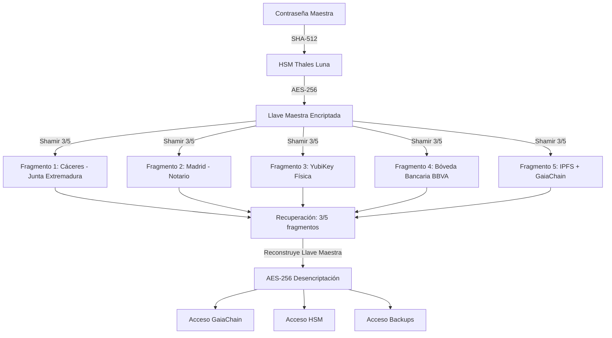

# Sistema de Llaves de Emergencia Fragmentadas (Shamir + HSM)

**CASTÚO-SYSTEM™** — Esquema 3-of-5 con fragmentos distribuidos y recuperación solo por el administrador.

---

## 1. Arquitectura de Llaves de Emergencia



- **Contraseña maestra**: solo en memoria del administrador; hash SHA-512 en HSM.
- **Llave maestra**: derivada (PBKDF2-SHA512, 256 bits); nunca se almacena entera en un solo sitio.
- **Shamir (3,5)**: 5 fragmentos; cualquiera 3 reconstruyen la llave.
- **Ubicaciones**: Cáceres (Junta), Madrid (Notario), YubiKey, BBVA/Santander/CaixaBank (bóvedas), IPFS+GaiaChain. Ver [Sistema-Seguridad-Extrema.md](Sistema-Seguridad-Extrema.md) para integración con bóvedas bancarias.

---

## 2. Scripts de Generación y Reconstrucción

| Script | Uso |
|--------|-----|
| `scripts/security/generate_emergency_keys.py` | Genera 5 fragmentos (3/5) y los guarda encriptados por ubicación. |
| `scripts/security/store_bank_vault_fragments.py` | Deposita fragmentos en bóvedas BBVA/Santander/CaixaBank (APIs por env). |
| `scripts/security/retrieve_bank_fragments.py` | Recupera fragmentos desde bóvedas bancarias para reconstruir. |
| `scripts/security/fireblocks_integration.py` | Almacena/recupera fragmento en Fireblocks Vault (MPC-CMP). |
| `scripts/security/store_fragment_in_fireblocks.sh` | Flujo integrado para almacenar fragmento 2 en Fireblocks. |
| `scripts/security/swiss_vault_integration.py` | Almacena/recupera fragmento en Swiss Vault (Zúrich). |
| `scripts/security/store_fragment_in_swissvault.sh` | Flujo integrado para almacenar fragmento 2 en Swiss Vault. |
| `scripts/security/reconstruct_master_key.py` | Reconstruye la llave maestra a partir de 3 fragmentos + contraseña. |

- Cada fragmento se almacena encriptado con AES-256-CBC (clave derivada de contraseña por ubicación).
- No se guarda la contraseña maestra en disco; se pide por prompt en cada ejecución.

---

## 3. Integración YubiKey (MFA física)

| Script | Uso |
|--------|-----|
| `scripts/security/setup-yubikey.sh` | Instala herramientas, configura PAM/SSH y slot PIV para GaiaChain. |
| `scripts/security/authenticate_with_yubikey.py` | Autenticación YubiKey OTP + contraseña maestra; emite sesión firmada. |

- YubiKey: autenticación SSH (PAM), firma de transacciones (PIV 9a), segundo factor para DMS/wipe.

---

## 4. Protocolos de Destrucción Segura

### 4.1 Dead Man's Switch (DMS)

- **Heartbeat** cada 5 min → si falla y no hay respuesta del admin en 10 min → activación DMS.
- DMS: zeroize HSM, GaiaChain solo lectura, borrado seguro de fragmentos, notificación a autoridades (AEMPS/USDA según contexto).
- Script: `scripts/security/secure-destruction-protocol.sh` (requiere contraseña maestra + YubiKey OTP).

### 4.2 Borrado físico (DoD 5220.22-M)

- Script: `scripts/security/secure-wipe-disks.sh` — 7 pasadas sobre discos; requiere contraseña + YubiKey.
- Registro del evento en GaiaChain para auditoría.

### 4.3 Revocación de YubiKey perdida

- Script: `scripts/security/destroy-lost-yubikey.sh <serial>` — revoca YubiKey en GaiaChain/HSM y notifica; requiere contraseña + YubiKey de respaldo.

---

## 5. Recuperación post-DMS

- Script: `scripts/security/post-dms-recovery.sh`
- Pasos: contraseña maestra + YubiKey OTP; aportar 3 rutas a fragmentos; reconstruir llave con `reconstruct_master_key.py`; restaurar HSM y GaiaChain desde backups; reconfigurar YubiKey; notificar recuperación.

---

## 6. Integración Darktrace

- Reglas en `config/darktrace/castuo-dms-trigger.json`:
  - **CASTUO-DMS-Trigger**: anomalía crítica (acceso HSM no autorizado, suplantación admin GaiaChain, manipulación Cursor, brute-force contraseña maestra) → opción de ejecutar DMS con confirmación (Slack, email, YubiKey OTP).
  - **CASTUO-YubiKey-Tampering**: múltiples fallos de autenticación YubiKey → bloqueo temporal y MFA reforzado.
  - **CASTUO-Master-Key-Access**: acceso no autorizado a `master_password.hash` / `gaiachain/master_key.pem` → terminar sesión, alerta, cuarentena.

---

## 7. Resumen de seguridad

| Componente | Protección | Acceso | Recuperación |
|------------|------------|--------|--------------|
| Contraseña maestra | Solo en memoria; hash SHA-512 en HSM | Solo administrador | Llaves emergencia (3/5) |
| YubiKey | MFA físico + firma transacciones | Solo administrador (física) | YubiKey de respaldo |
| GaiaChain | Claves derivadas AES-256 + RSA-4096 | Solo administrador | Fragmentos Shamir + YubiKey |
| HSM Thales Luna | Hash + claves derivadas | Solo administrador | Llaves emergencia |
| Fragmentos emergencia | 5 fragmentos (3 necesarios), AES-256 | Distribuidos | Solo administrador reconstruye |
| DMS | Destrucción segura + zeroize + solo lectura | Solo administrador activa/aborta | Recuperación con 3 fragmentos |

---

## 8. Protocolo de activación (paso a paso)

### Configuración inicial (una vez)

```bash
# 1. Registrar contraseña maestra en HSM
sudo /opt/castuo/scripts/security/register-master-password.sh

# 2. Configurar YubiKey
sudo /opt/castuo/scripts/security/setup-yubikey.sh

# 3. Generar y distribuir fragmentos de emergencia
python3 /opt/castuo/scripts/security/generate_emergency_keys.py

# 4. Activar monitoreo (Wazuh/Suricata/Darktrace)
sudo systemctl start wazuh-agent suricata
```

### Acceso diario

```bash
# Autenticación YubiKey + contraseña maestra
/opt/castuo/scripts/security/authenticate_with_yubikey.py

# Backup encriptado
/opt/castuo/scripts/security/encrypted-backup.sh
```

### Recuperación de emergencia

```bash
# Reconstruir llave con 3 fragmentos
python3 /opt/castuo/scripts/security/reconstruct_master_key.py

# Restaurar desde backup
/opt/castuo/scripts/security/restore-encrypted-backup.sh
```

### Destrucción segura

```bash
# Activar DMS (intrusión crítica)
/opt/castuo/scripts/security/secure-destruction-protocol.sh

# Borrado físico discos (DoD 5220.22-M)
sudo /opt/castuo/scripts/security/secure-wipe-disks.sh

# Revocar YubiKey perdida
/opt/castuo/scripts/security/destroy-lost-yubikey.sh <serial>
```

---

*Documento alineado con Sistema de Protección Absoluta y SABIONDA v10.1.*
