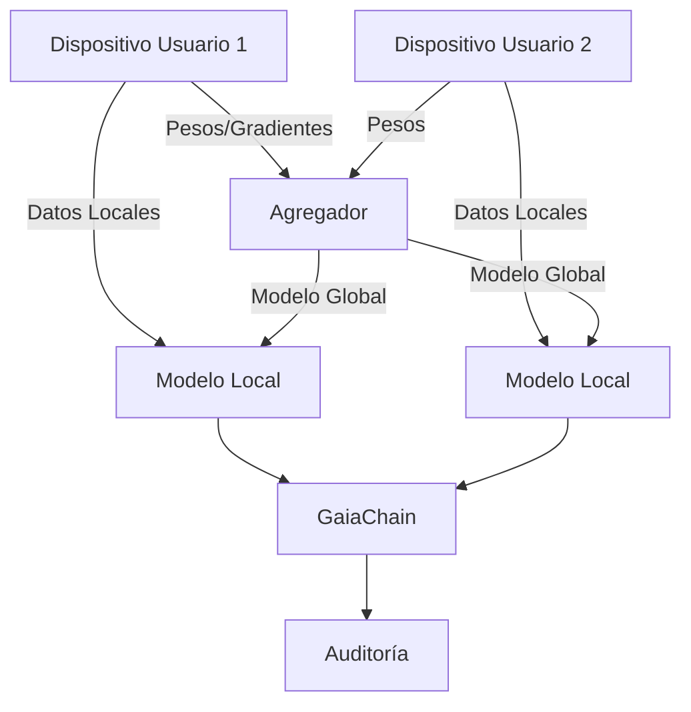

# Federated Learning para autenticación por comportamiento

**CASTÚO-SYSTEM™** — Entrenamiento federado del modelo de autenticación por comportamiento (Transformer + LSTM): datos locales por usuario, promediado de pesos sin compartir datos crudos, registro en GaiaChain.

---

## 1. Arquitectura



- Cada usuario entrena un modelo local con sus propios eventos (etiquetados).
- Se promedian los pesos de los modelos locales y se actualiza un modelo global.
- Los datos crudos no salen del entorno de cada usuario; solo se agregan pesos (o promedios).

---

## 2. Configuración

| Variable | Descripción |
|----------|-------------|
| `CASTUO_FEDERATED_USERS` | Lista de usuarios separada por comas (ej. `user1,user2,user3`) |
| `CASTUO_FEDERATED_EVENTS_FILE` | Ruta al JSON de eventos (por usuario o global) |
| `CASTUO_FEDERATED_LABELS_FILE` | Ruta al JSON de etiquetas |
| `CASTUO_FEDERATED_MODEL_PATH` | Ruta donde guardar el modelo global (ej. `.h5`) |
| `GAIA_CHAIN_ADMIN_KEY` | Token para registro en GaiaChain |

---

## 3. Scripts

### Añadir datos de un usuario

```bash
python3 scripts/security/behavioral_auth_federated.py add_user user1 --events events.json --labels labels.json
```

### Promediado federado

```bash
python3 scripts/security/behavioral_auth_federated.py federated_average user1 user2 user3
```

### Predicción

```bash
python3 scripts/security/behavioral_auth_federated.py predict user1 --events events.json
```

### Entrenamiento completo (script bash)

```bash
./scripts/security/train_federated_model.sh
```

Usa `CASTUO_FEDERATED_USERS`, `CASTUO_FEDERATED_EVENTS_FILE` y `CASTUO_FEDERATED_LABELS_FILE`. Si no existen los archivos de datos, se generan datos sintéticos en `/tmp/castuo_federated/` para prueba.

---

## 4. Registro en GaiaChain

- **Entrenamiento**: `POST /api/v1/federated_learning/log` (user_id, data_points, model_version, signature).
- **Actualización global**: `POST /api/v1/federated_learning/update` (participants, global_model_hash, signature).
- **Predicción**: `POST /api/v1/federated_learning/predict` (user_id, anomaly_score, is_anomaly, signature).

La firma se genera con HSM (PIN por env) o clave PEM local; no se almacenan contraseñas en código.

---

## 5. Privacidad

- Los datos de comportamiento no se envían a GaiaChain; solo se registran metadatos de entrenamiento (número de puntos, participantes, hash del modelo) y resultados de predicción (score, is_anomaly) para auditoría.

---

**Referencias**: [Behavioral-Auth-Transformer.md](Behavioral-Auth-Transformer.md) | [Behavioral-Auth-AI.md](Behavioral-Auth-AI.md) | [Full-Implementation-Guide.md](Full-Implementation-Guide.md)
