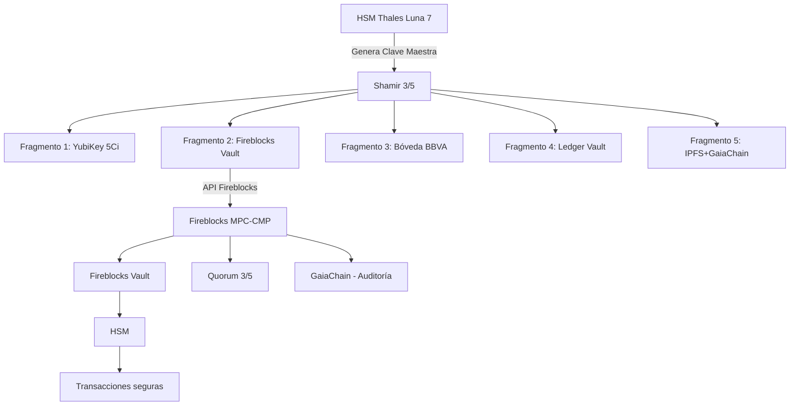

# Fireblocks — Custodia criptográfica avanzada (MPC-CMP)

**CASTÚO-SYSTEM™** — Almacenamiento del fragmento 2 (u otro) en Fireblocks Vault con políticas MPC y quorum 3/5; auditoría en GaiaChain.

---

## 1. Arquitectura



---

## 2. Configuración

| Variable | Descripción |
|----------|-------------|
| `FIREBLOCKS_API_KEY` | API key de Fireblocks |
| `FIREBLOCKS_API_SECRET_PATH` | Ruta a clave privada (JWT) si aplica |
| `FIREBLOCKS_API_URL` | Base URL (por defecto `https://api.fireblocks.io/v1`) |
| `FIREBLOCKS_VAULT_ACCOUNT_ID` | ID de cuenta vault (ej. `0`) |
| `FIREBLOCKS_ASSET_ID` | Identificador de activo (ej. `CASTUO_EMERGENCY_FRAGMENT`) |
| `GAIA_CHAIN_ADMIN_KEY` | Token para registro en GaiaChain |

---

## 3. Scripts

### Almacenar fragmento

**Flujo integrado (genera fragmentos y envía el 2 a Fireblocks):**

```bash
./scripts/security/store_fragment_in_fireblocks.sh
```

**Fragmento por stdin (33 bytes):**

```bash
cat fragment2.bin | python3 scripts/security/fireblocks_integration.py store 2
```

### Recuperar fragmento

```bash
python3 scripts/security/fireblocks_integration.py retrieve <tx_id> 2 > fragment2.bin
```

(Se solicita la contraseña de cifrado Fireblocks.)

---

## 4. API Fireblocks (referencia)

- En producción, las transacciones con payload grande pueden requerir almacenar el ciphertext en un sistema externo y solo registrar en Fireblocks el identificador o hash para auditoría.
- Crear transacción: `POST /v1/transactions` con `assetId`, `source`, `destination`, `note`, y metadatos según documentación oficial.
- Obtener transacción: `GET /v1/transactions/{txId}`.

---

## 5. Registro en GaiaChain

Endpoint: `POST /api/v1/emergency_fragment/fireblocks` con `fragment_id`, `fireblocks_tx_id`, `fireblocks_asset_id`, `metadata`, `signature`. La firma se genera con HSM o clave PEM local.

---

**Referencias**: [Emergency-Keys-Shamir-HSM.md](Emergency-Keys-Shamir-HSM.md) | [Ledger-Vault-Integration.md](Ledger-Vault-Integration.md) | [Sistema-Seguridad-Extrema.md](Sistema-Seguridad-Extrema.md)
