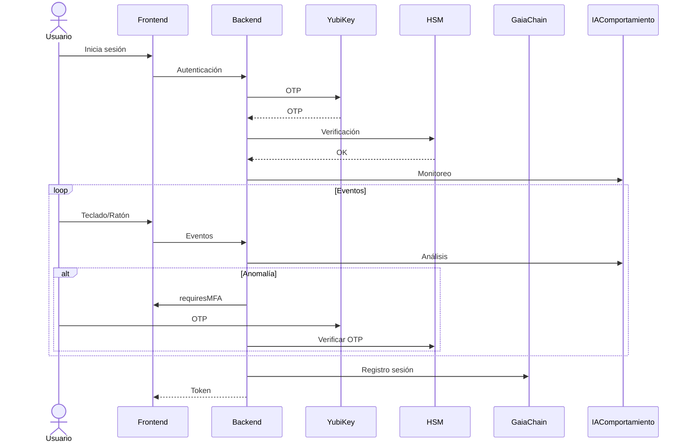

# Guía de integración completa — CASTÚO-SYSTEM™

Integración de Ledger Vault, protocolos cuánticos, autenticación por comportamiento, YubiKey, HSM y GaiaChain en un único flujo de seguridad.

---

## 1. Flujo de autenticación completo



---

## 2. Orden de configuración recomendado

### 2.1 HSM y YubiKey

```bash
sudo scripts/security/init-hsm.sh
sudo scripts/security/setup-yubikey.sh
```

### 2.2 Fragmentos Shamir y Ledger Vault

```bash
# Generar fragmentos
python3 scripts/security/generate_emergency_keys.py

# Almacenar fragmento 2 en Ledger Vault
./scripts/security/store_fragment_in_ledger.sh
# o flujo Python integrado (ver Ledger-Vault-Integration.md)
```

### 2.3 Autenticación por comportamiento

- Backend: el router `api/behavioral_auth` está montado en `api/main.py`.
- Frontend: cargar `frontend/src/services/behavioralAuth.js` e invocar `initEventListeners()`.
- Opcional: entrenar modelo con `behavioral_auth_ai.py train --user <id> --events <json>`.

### 2.4 Destrucción cuántica (simulador)

```bash
python3 scripts/security/quantum_destruction_simulator.py simulate caceres_quantum_dc
# Activación completa (auth + simulación + DMS opcional):
./scripts/security/activate_quantum_destruction.sh caceres_quantum_dc
```

### 2.5 Verificación rápida

```bash
# HSM
pkcs11-tool --login --pin $HSM_USER_PIN --list-objects

# YubiKey
ykman piv info

# API behavioral
curl -X POST http://localhost:8000/behavioral_auth/log -H "Content-Type: application/json" -d '{"userId":"test","events":[]}'
```

---

## 3. Script de integración (resumen)

No hay un único script que ejecute todo de forma automática con contraseñas; cada paso requiere autenticación o variables de entorno. Resumen de comandos:

```bash
# 1. Ledger Vault (fragmento 2)
./scripts/security/store_fragment_in_ledger.sh

# 2. Entrenar modelo de comportamiento (opcional)
python3 scripts/security/behavioral_auth_ai.py train --user authorized_admin --events events.json

# 3. Preparar simulador cuántico
python3 scripts/security/quantum_destruction_simulator.py backup /tmp/critical.bin

# 4. YubiKey
scripts/security/setup-yubikey.sh

# 5. HSM
pkcs11-tool --login --pin $HSM_USER_PIN --list-objects
```

---

## 4. Documentación por componente

| Componente | Documento |
|------------|-----------|
| Ledger Vault | [Ledger-Vault-Integration.md](Ledger-Vault-Integration.md) |
| Fireblocks | [Fireblocks-Custody.md](Fireblocks-Custody.md) |
| Destrucción cuántica | [Quantum-Destruction-Protocols.md](Quantum-Destruction-Protocols.md) |
| Destrucción cuántica QKD | [Quantum-Destruction-QKD.md](Quantum-Destruction-QKD.md) |
| Autenticación por comportamiento | [Behavioral-Auth-AI.md](Behavioral-Auth-AI.md) |
| Behavioral Transformer | [Behavioral-Auth-Transformer.md](Behavioral-Auth-Transformer.md) |
| Implementación producción | [Full-Implementation-Guide.md](Full-Implementation-Guide.md) |
| Llaves de emergencia | [Emergency-Keys-Shamir-HSM.md](Emergency-Keys-Shamir-HSM.md) |
| Protección absoluta | [Sistema-Proteccion-Absoluta.md](Sistema-Proteccion-Absoluta.md) |
| Seguridad extrema | [Sistema-Seguridad-Extrema.md](Sistema-Seguridad-Extrema.md) |

---

## 5. Variables de entorno críticas

| Variable | Uso |
|----------|-----|
| `LEDGER_VAULT_API_KEY` | Ledger Vault |
| `GAIA_CHAIN_ADMIN_KEY` | GaiaChain (registros, alertas) |
| `HSM_USER_PIN` | HSM (opcional; si no, se usa PEM) |
| `YUBICO_CLIENT_ID`, `YUBICO_API_KEY` | Verificación OTP YubiKey |
| `CASTUO_BEHAVIORAL_USER`, `CASTUO_BEHAVIORAL_THRESHOLD` | Autenticación por comportamiento |
| `GAIA_CHAIN_DIR` | Ruta a `master_key.pem` y config |

---

**Referencias**: [Sistema-Seguridad-Extrema.md](Sistema-Seguridad-Extrema.md) | [Emergency-Keys-Shamir-HSM.md](Emergency-Keys-Shamir-HSM.md)
