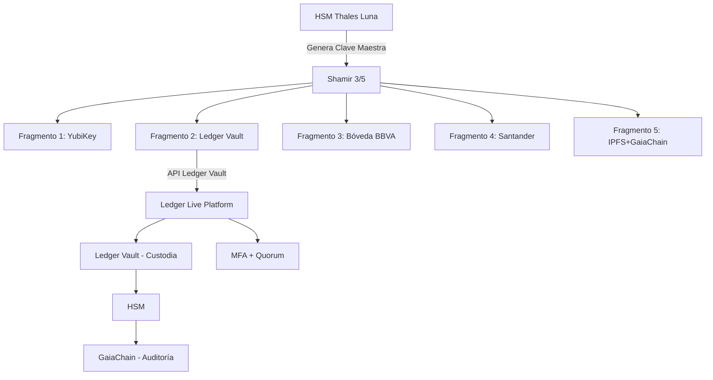

# Integración con Ledger Vault — Custodia de fragmentos Shamir

**CASTÚO-SYSTEM™** — Almacenamiento del fragmento 2 (u otro) en Ledger Vault con políticas de acceso (MFA, quorum) y registro en GaiaChain.

---

## 1. Arquitectura



- **Fragmento 2** (u otro índice) se cifra con AES-256-GCM (clave derivada PBKDF2-SHA512 desde contraseña).
- Se envía a la API de Ledger Vault; políticas (policy_id) permiten quorum 3/5 para recuperación.
- El registro (fragment_id, ledger_asset_id, firma) se guarda en GaiaChain.

---

## 2. Configuración

Variables de entorno (sin credenciales en código):

| Variable | Descripción |
|----------|-------------|
| `LEDGER_VAULT_API_KEY` | API key de Ledger Vault |
| `LEDGER_VAULT_API_URL` | Base URL (por defecto `https://api.ledger.com/vault/v1`) |
| `LEDGER_VAULT_POLICY_ID` | ID de política (quorum 3/5) |
| `LEDGER_VAULT_ASSET_TYPE` | Tipo de activo (por defecto `CASTUO_EMERGENCY_FRAGMENT`) |
| `GAIA_CHAIN_ADMIN_KEY` | Token para registrar en GaiaChain |
| `HSM_USER_PIN` | PIN del HSM (opcional; si no se usa, se firma con clave PEM local) |

---

## 3. Scripts

### 3.1 Almacenar fragmento en Ledger Vault

**Opción A — Flujo integrado (genera fragmentos y envía el 2):**

```bash
python3 -c "
import getpass, sys
sys.path.insert(0, 'scripts/security')
from generate_emergency_keys import generate_master_key, split_master_key
from ledger_vault_integration import store_fragment_in_ledger
pwd = getpass.getpass('Contraseña maestra: ')
import os
salt = os.urandom(16)
key = generate_master_key(pwd, salt)
fragments = split_master_key(key, 3, 5)
idx, payload = fragments[1]
blob = bytes([idx]) + payload
ledger_pwd = getpass.getpass('Contraseña Ledger Vault: ')
r = store_fragment_in_ledger(2, blob, ledger_pwd)
print('Ledger asset ID:', r.get('id'))
"
```

**Opción B — Fragmento por stdin (33 bytes: index + 32 bytes):**

```bash
cat fragment2.bin | python3 scripts/security/ledger_vault_integration.py store 2
```

### 3.2 Recuperar fragmento

```bash
python3 scripts/security/ledger_vault_integration.py retrieve <asset_id> > fragment2.bin
```

(Se pedirá la contraseña de cifrado Ledger.)

### 3.3 Script bash de ayuda

```bash
./scripts/security/store_fragment_in_ledger.sh
```

Indica el flujo recomendado y, si hay `generate_emergency_keys.py` y `ledger_vault_integration.py`, ejecuta el flujo integrado desde Python.

---

## 4. API Ledger Vault (referencia)

- **Crear activo**: `POST /assets` con `asset_type`, `name`, `metadata`, `data` (hex), `policy_id`.
- **Obtener activo**: `GET /assets/{asset_id}`.
- En producción, consultar la documentación oficial de Ledger Vault para políticas de acceso y quorum.

---

## 5. Registro en GaiaChain

Endpoint opcional: `POST /api/v1/emergency_fragment/ledger` con `fragment_id`, `ledger_asset_id`, `metadata`, `signature`. La firma se genera con HSM o con la clave PEM de `GAIA_CHAIN_DIR/master_key.pem`.

---

**Referencias**: [Emergency-Keys-Shamir-HSM.md](Emergency-Keys-Shamir-HSM.md) | [Sistema-Seguridad-Extrema.md](Sistema-Seguridad-Extrema.md)
