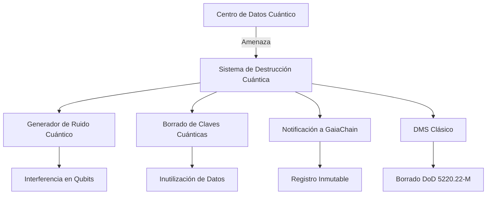

# Protocolos de destrucción cuántica (preparación)

**CASTÚO-SYSTEM™** — Simulador y preparación para futuros centros de datos cuánticos: ruido cuántico, registro en GaiaChain y activación de DMS clásico como respaldo.

---

## 1. Arquitectura



---

## 2. Simulador (Python)

### 2.1 Ruido cuántico

- **Con Qiskit**: se construye un circuito (Hadamard, CNOT, medidas) y se ejecuta en `qasm_simulator`; los conteos se envían a GaiaChain.
- **Sin Qiskit**: se simula con aleatoriedad (hash) y se registra igualmente.

### 2.2 Comandos

```bash
# Simular destrucción cuántica para un objetivo (registro en GaiaChain)
python3 scripts/security/quantum_destruction_simulator.py simulate caceres_quantum_dc

# Preparar backup “cuántico-resistente” (X448 + AES-256-GCM)
python3 scripts/security/quantum_destruction_simulator.py backup /ruta/datos_criticos.bin
```

Variables de entorno: `GAIA_CHAIN_ADMIN_KEY`, `GAIA_CHAIN_DIR` (clave PEM para firma), `HSM_USER_PIN` (opcional). Si se define `CASTUO_QUANTUM_TRIGGER_DMS=1`, tras simular se invoca `secure-destruction-protocol.sh`.

---

## 3. Backup resistente a computación cuántica

- **Algoritmos**: X448 (intercambio) + HKDF-SHA512 + AES-256-GCM.
- AES-256 sigue siendo seguro frente a Grover; X448 se considera post-cuántico en esquemas de intercambio.
- El payload se envía a `POST /api/v1/quantum_backup` (GaiaChain) con firma.

---

## 4. Activación del protocolo (script bash)

```bash
./scripts/security/activate_quantum_destruction.sh [target]
```

1. Autenticación (biométrica o YubiKey + contraseña).
2. Ejecución del simulador de destrucción cuántica (target por defecto: `caceres_quantum_dc`).
3. Pregunta de confirmación para activar DMS clásico.
4. Notificación a GaiaChain (`/api/v1/quantum_alert`).

---

## 5. Endpoints GaiaChain (referencia)

- `POST /api/v1/quantum_alert` — Alerta de destrucción cuántica (target, circuito, mediciones, firma).
- `POST /api/v1/quantum_backup` — Backup cuántico-resistente (data, signature).

---

**Referencias**: [Sistema-Seguridad-Extrema.md](Sistema-Seguridad-Extrema.md) | [Sistema-Proteccion-Absoluta.md](Sistema-Proteccion-Absoluta.md)
