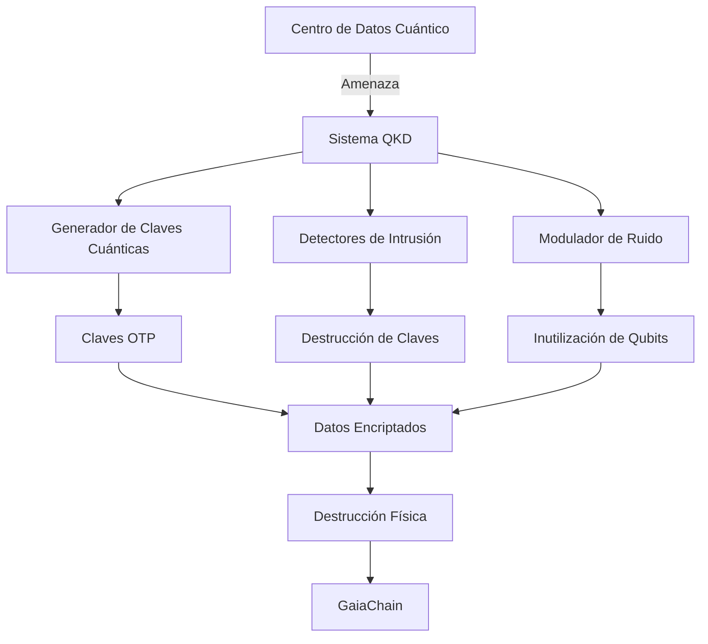

# Destrucción cuántica con QKD (Quantum Key Distribution)

**CASTÚO-SYSTEM™** — Integración con hardware QKD (ej. ID Quantique Cerberis XG): generación de claves cuánticas, derivación de clave de destrucción, registro en GaiaChain y opcional DMS.

---

## 1. Arquitectura



---

## 2. Configuración

| Variable | Descripción |
|----------|-------------|
| `QKD_SERVER_ADDRESS` | URL del servidor QKD (ej. `https://qkd.castuo-system.com`) |
| `QKD_API_KEY` | API key para solicitar claves |
| `GAIA_CHAIN_ADMIN_KEY` | Token para alertas en GaiaChain |
| `CASTUO_QUANTUM_TRIGGER_DMS` | Si está definido, tras activar se ejecuta el DMS clásico |

Sin QKD configurado, el script genera claves localmente (pseudoaleatorias) y registra igualmente en GaiaChain.

---

## 3. Scripts

### Activar destrucción cuántica

```bash
# Con servidor QKD configurado
export QKD_SERVER_ADDRESS=https://qkd.example.com
export QKD_API_KEY=...
python3 scripts/security/quantum_destruction_qkd.py activate caceres_quantum_dc
```

### Backup resistente a cuántica (QKD + AES-256-GCM)

```bash
python3 scripts/security/quantum_destruction_qkd.py backup /ruta/datos_criticos.bin caceres_quantum_dc
```

### Activación desde el script unificado

```bash
export QKD_SERVER_ADDRESS=...
./scripts/security/activate_quantum_destruction.sh caceres_quantum_dc
```

Si `QKD_SERVER_ADDRESS` está definido, se usa `quantum_destruction_qkd.py`; si no, se usa el simulador (`quantum_destruction_simulator.py`).

---

## 4. Endpoints GaiaChain

- `POST /api/v1/quantum_alert` — Alerta de destrucción (target, quantum_key_id, destruction_key_hash, signature).
- `POST /api/v1/quantum_backup` — Backup QKD (data, signature).

---

## 5. Hardware QKD

Para uso con ID Quantique Cerberis XG (u otro), configurar el servidor QKD que exponga una API para solicitar claves (por ejemplo `POST /api/v1/keys` con `length` y respuesta `key_material` en hex). El script usa esa API cuando `QKD_SERVER_ADDRESS` y `QKD_API_KEY` están definidos.

---

**Referencias**: [Quantum-Destruction-Protocols.md](Quantum-Destruction-Protocols.md) | [Sistema-Seguridad-Extrema.md](Sistema-Seguridad-Extrema.md)
