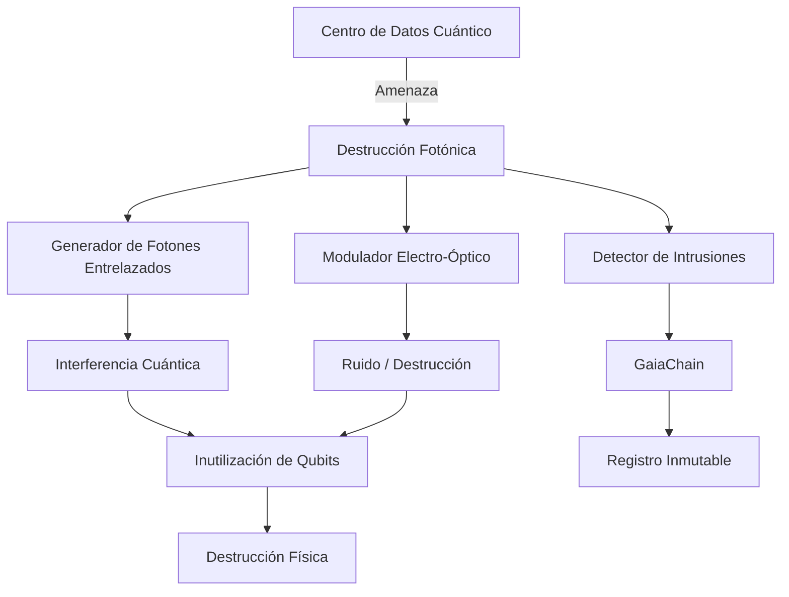

# Destrucción cuántica con fotónica integrada

**CASTÚO-SYSTEM™** — Protocolo de destrucción con pares de fotones entrelazados (simulación con Qiskit o ruido local), derivación de clave de destrucción y registro en GaiaChain. Opcional activación de DMS.

---

## 1. Arquitectura



---

## 2. Configuración

| Variable | Descripción |
|----------|-------------|
| `GAIA_CHAIN_ADMIN_KEY` | Token para alertas en GaiaChain |
| `CASTUO_PHOTONIC_TRIGGER_DMS` | Si está definido, tras activar se ejecuta el DMS clásico |
| `GAIA_CHAIN_DIR` | Ruta a `master_key.pem` para firma (o HSM) |

---

## 3. Scripts

### Activar destrucción fotónica

```bash
# Con autenticación previa
./scripts/security/activate_photonic_destruction.sh madrid_quantum_dc
```

### Simular ruido (sin enviar a GaiaChain)

```bash
python3 scripts/security/quantum_photonic_destruction.py simulate madrid_quantum_dc
```

### Desde Python

```bash
python3 scripts/security/quantum_photonic_destruction.py activate madrid_quantum_dc
```

---

## 4. Flujo técnico

1. **Pares entrelazados**: con Qiskit se simula un circuito de 2 qubits (H, CNOT, medida); sin Qiskit se usan bytes aleatorios.
2. **Clave de destrucción**: HKDF-SHA512 sobre los bits “entrelazados” con info `CASTUO-PHOTONIC-DESTRUCTION-{target}`.
3. **Registro**: se envía a `POST /api/v1/quantum_photonic_alert` (target, duration, entangled_pairs, destruction_key_hash, signature).
4. **DMS**: si `CASTUO_PHOTONIC_TRIGGER_DMS` está definido, se invoca `secure-destruction-protocol.sh`.

---

## 5. Hardware fotónico (producción)

Para uso con hardware real (ej. Quantum Xchange Phio TX), el servidor o dispositivo debe exponer una API o driver que el script pueda llamar para generar ruido o aplicar la señal de destrucción. El script actual utiliza generación local/simulada cuando no hay integración específica.

---

**Referencias**: [Quantum-Destruction-Protocols.md](Quantum-Destruction-Protocols.md) | [Quantum-Destruction-QKD.md](Quantum-Destruction-QKD.md) | [Full-Implementation-Guide.md](Full-Implementation-Guide.md)
