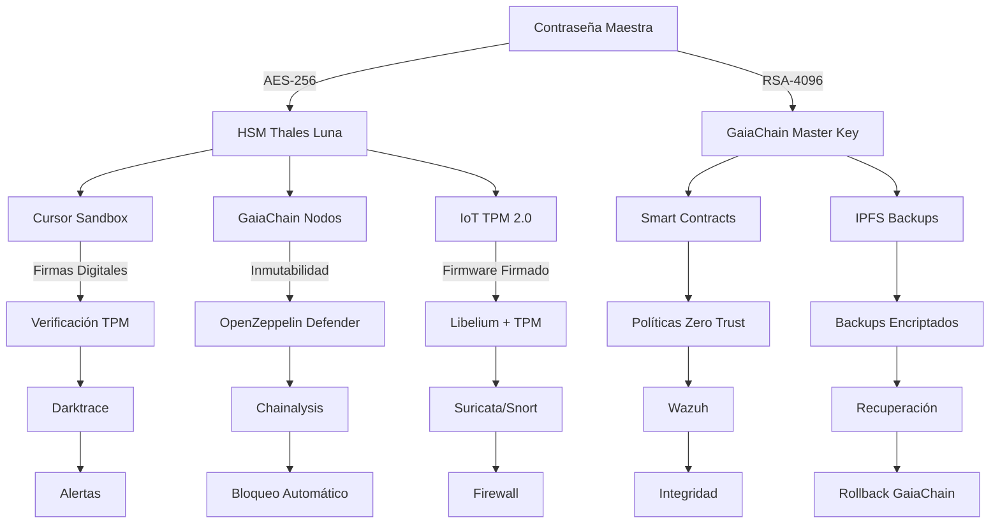

# Sistema de protección absoluta — CASTÚO-SYSTEM™

**Objetivo**: Proteger toda la infraestructura (GaiaChain, SABIONDA, IoT, Cursor, Smart Contracts) con:

- **Encriptación militar** (AES-256 + RSA-4096) basada en contraseña maestra (solo en memoria, nunca persistida).
- **Aislamiento total**: Cursor en sandbox, GaiaChain en red privada, IoT con TPM 2.0.
- **Inmutabilidad**: GaiaChain + IPFS + HSM Thales Luna.
- **Protección anti-Cursor**: firmas digitales, verificación TPM, políticas Zero Trust.
- **Borrado seguro** de la contraseña tras su uso (solo existe en la mente del administrador).
- **Capas adicionales**: Darktrace, Chainalysis, Suricata, Wazuh.

---

## 1. Arquitectura de seguridad en capas

---

## 2. Registro y verificación de contraseña maestra

- **Registro (una vez)**: `scripts/security/register-master-password.sh` — solicita contraseña por teclado, deriva claves (AES/RSA), almacena solo hash SHA-512 en HSM; borra la variable en memoria.
- **Verificación de acceso**: `scripts/security/verify-master-access.sh` — comprueba hash; si hay HSM, carga claves derivadas y exporta `GAIA_CHAIN_ADMIN_KEY` para sesión.

**Importante**: La contraseña maestra no se guarda en ningún archivo; solo su hash. Introducirla siempre por prompt (`read -s`) o por variable de entorno en memoria durante la sesión.

---

## 3. Protección de Cursor (sandbox + firmas + Zero Trust)

- **Kubernetes**: `k8s/cursor/cursor-restricted.yaml` — namespace `cursor-sandbox`, Secret con claves (rellenar en deploy), Pod con readOnlyRootFilesystem, capabilities drop ALL, NetworkPolicy solo a gaiachain-validator y HTTPS/DNS.
- **Verificación de firmas**: `scripts/cursor/verify_signature.py` — verifica firma RSA (script + .sig + clave pública); opcional TPM con `tpm_firmware_verifier`.
- **Políticas**: `k8s/cursor/zero-trust-policy.yaml` — PodSecurityPolicy restrictiva y ValidatingWebhook (sustituir CA_BUNDLE).

---

## 4. GaiaChain (inmutabilidad + HSM)

- **Contrato MasterAdmin**: `contracts/gaiachain/MasterAdmin.sol` — registro de hash de clave maestra, verificación de acceso, admins, ejecución de transacciones críticas con firma HSM.
- **Registro de clave en GaiaChain**: `scripts/gaiachain/register-master-key.sh` — envía hash (generado de forma segura) a la API; no incluir contraseña en script.

---

## 5. IoT (TPM 2.0 + firmware firmado)

- Verificación de firmware: `iot/tpm_verification/tpm_firmware_verifier.c` (OpenSSL) y opcional `secure_tpm_verifier` con contraseña en runtime (no incrustada en binario). Compilación: ver `iot/tpm_verification/README.md`.

---

## 6. Darktrace + Chainalysis

- **Reglas Darktrace**: `config/darktrace/castuo-master-protection.json` — acceso no autorizado a sistema maestro, manipulación Cursor, acceso no autorizado a GaiaChain, tampering firmware IoT. Usuario autorizado configurable.
- **Reglas DMS/emergencia**: `config/darktrace/castuo-dms-trigger.json` — activación DMS ante intrusión crítica, YubiKey tampering, acceso no autorizado a clave maestra (ver [Emergency-Keys-Shamir-HSM.md](Emergency-Keys-Shamir-HSM.md)).
- **Monitoreo Chainalysis**: `scripts/security/chainalysis-monitoring.py` — consulta alertas GaiaChain, análisis de riesgo y bloqueo/notificación si aplica.

---

## 7. Backups encriptados

- **Creación**: `scripts/security/encrypted-backup.sh` — pide contraseña maestra, deriva clave, comprime y encripta (AES-256-CBC), sube a IPFS (Pinata/Web3/Crust), registra en GaiaChain; borra contraseña de memoria.
- **Restauración**: `scripts/security/restore-encrypted-backup.sh` — pide contraseña, obtiene último backup de GaiaChain, descarga de IPFS, descifra y restaura.

---

## 8. Wazuh + Suricata

- **Wazuh**: `config/wazuh/castuo-master-wazuh.json` — agentes (nodo GaiaChain, Cursor), syscheck, rootcheck, comandos personalizados (verificación de acceso/TPM/firma Cursor), alertas a email/Slack/GaiaChain. No incluir contraseña en comandos; usar scripts que pidan interactivamente.
- **Suricata**: `config/suricata/castuo-master-password.rules` — detección de intentos de acceso a flujos de contraseña maestra y brute force, acceso HSM no autorizado (sin patrones de contraseña real).

---

## 9. Llaves de emergencia (Shamir 3/5 + HSM)

- **Documentación**: [Emergency-Keys-Shamir-HSM.md](Emergency-Keys-Shamir-HSM.md) — arquitectura de fragmentos (Cáceres, Madrid, YubiKey, BBVA, IPFS+GaiaChain), generación y reconstrucción.
- **Generación de fragmentos**: `scripts/security/generate_emergency_keys.py` — deriva llave maestra (PBKDF2), divide en 5 fragmentos (3 necesarios), guarda encriptados por ubicación.
- **Reconstrucción**: `scripts/security/reconstruct_master_key.py` — con 3 fragmentos + contraseña maestra reconstruye la llave (acceso HSM/GaiaChain/backups).
- **YubiKey**: `scripts/security/setup-yubikey.sh`, `scripts/security/authenticate_with_yubikey.py` — MFA físico; `scripts/security/destroy-lost-yubikey.sh` para revocar YubiKey perdida.
- **DMS (Dead Man's Switch)**: `scripts/security/secure-destruction-protocol.sh` — contraseña + YubiKey OTP; zeroize HSM, GaiaChain readonly, unpin IPFS, notificación autoridades, apagado. Recuperación: `scripts/security/post-dms-recovery.sh` (3 fragmentos + YubiKey).
- **Borrado físico**: `scripts/security/secure-wipe-disks.sh` — DoD 5220.22-M (7 pasadas); registro en GaiaChain.

## 10. Emergencia (bloqueo/desbloqueo)

- **Lockdown**: `scripts/security/emergency-lockdown.sh` — pide contraseña maestra, verifica hash, para servicios (gaiachain, cursor, suricata, wazuh), restablece UFW (deny in/out salvo DNS/NTP), notifica a GaiaChain, opcional parada de docker/kubelet.
- **Unlock**: `scripts/security/emergency-unlock.sh` — pide contraseña, comprueba último evento TOTAL_LOCKDOWN en GaiaChain, restaura UFW y arranca servicios, registra TOTAL_UNLOCK en GaiaChain.

---

## 11. Resumen de acceso

| Componente | Protección | Acceso |
|------------|------------|--------|
| Contraseña maestra | Solo en memoria; hash SHA-512 en HSM | Administrador autorizado |
| GaiaChain | Claves derivadas AES-256 + RSA-4096 | Quien conozca la contraseña maestra |
| Cursor | Sandbox + firmas + TPM | Verificación previa a ejecución |
| IoT | Firmware firmado TPM 2.0 | Verificador con contraseña en runtime |
| Backups | AES-256, clave derivada, IPFS + GaiaChain | Quien conozca la contraseña maestra |
| HSM | Hash + claves derivadas | PIN/contraseña HSM |
| Llaves emergencia | Shamir 3/5, fragmentos encriptados | 3 fragmentos + contraseña (solo administrador) |
| YubiKey | MFA físico + firma PIV | Solo administrador (física) |
| DMS / wipe | Contraseña + YubiKey OTP | Solo administrador autorizado |
| Darktrace/Chainalysis | Monitoreo 24/7 + GaiaChain | Alertas a administrador |
| Emergencia | Lockdown/unlock con verificación de hash | Solo administrador autorizado |

---

**Referencias**

- Scripts: `scripts/security/` (register-master-password, verify-master-access, generate_emergency_keys, reconstruct_master_key, store_bank_vault_fragments, retrieve_bank_fragments, encrypted-backup, restore-encrypted-backup, emergency-lockdown, emergency-unlock, setup-yubikey, authenticate_with_yubikey, authenticate, biometric_auth, register_biometrics, init-hsm, secure-access, secure-destruction-protocol, activate-dms, post-dms-recovery, emergency-recovery, secure-wipe-disks, secure-wipe, destroy-lost-yubikey, satellite-destruction, mount-sandisk), `scripts/cursor/verify_signature.py`, `scripts/cursor/verify-with-hsm.py`, `scripts/export/export_*_to_sandisk.sh`, `scripts/backup/automated-backup.sh`, `scripts/gaiachain/register-master-key.sh`.
- K8s: `k8s/cursor/cursor-restricted.yaml`, `k8s/cursor/secure-deployment.yaml`, `k8s/cursor/zero-trust-policy.yaml`.
- Contrato: `contracts/gaiachain/MasterAdmin.sol`.
- Config: `config/darktrace/castuo-master-protection.json`, `config/darktrace/castuo-dms-trigger.json`, `config/darktrace/castuo-hsm-cursor-gaiachain.json`, `config/wazuh/castuo-master-wazuh.json`, `config/suricata/castuo-master-password.rules`.
- [Sistema-Seguridad-Extrema.md](Sistema-Seguridad-Extrema.md) | [Emergency-Keys-Shamir-HSM.md](Emergency-Keys-Shamir-HSM.md) | [Sandisk-Secure-Storage.md](Sandisk-Secure-Storage.md) | [Anti-Hacking-System-v1.0.md](Anti-Hacking-System-v1.0.md) | [Anti-Tampering-Strategy.md](Anti-Tampering-Strategy.md)
