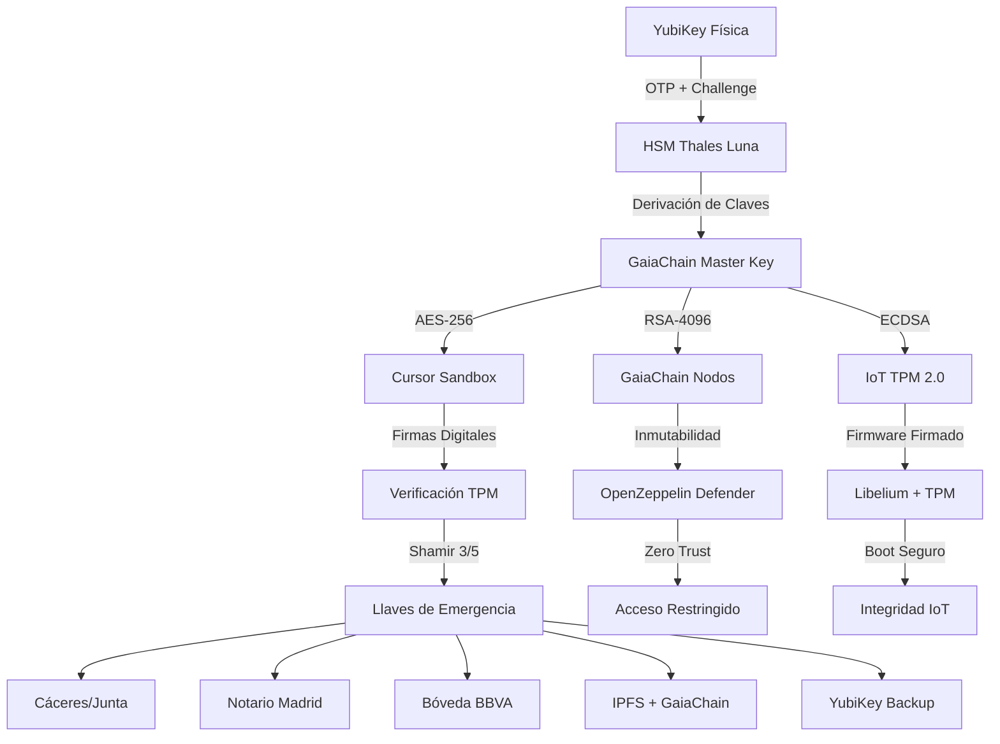

# Sistema de Seguridad Extrema — Confidencialidad Total

**CASTÚO-SYSTEM™** — Protección de toda la arquitectura (GaiaChain, SABIONDA, IoT, Cursor) con:

- **Cero almacenamiento de contraseñas** (ni hashes ni derivaciones en disco sin control).
- **Autenticación**: HSM + YubiKey + Shamir's Secret Sharing.
- **Llaves de emergencia** fragmentadas (3/5 para recuperación).
- **Destrucción segura** en caso de intrusión (DoD 5220.22-M, DMS, satélite).
- **Monitoreo**: Darktrace + Chainalysis + Wazuh.
- **Inmutabilidad** en GaiaChain.

---

## 1. Arquitectura (cero contraseñas almacenadas)

---

## 2. Integración con bóvedas bancarias

| Banco      | Fragmento | API (env)           | Uso                          |
|-----------|-----------|----------------------|------------------------------|
| BBVA      | 2         | `BBVA_API_KEY`, etc. | `store_bank_vault_fragments.py` / `retrieve_bank_fragments.py` |
| Santander | 3         | `SANTANDER_API_KEY`  | Idem                         |
| CaixaBank | 4         | `CAIXABANK_API_KEY`  | Idem                         |

- **Scripts**: `scripts/security/store_bank_vault_fragments.py`, `scripts/security/retrieve_bank_fragments.py`.
- Fragmentos encriptados AES-256; claves derivadas (PBKDF2) por banco. Sin contraseñas en código.

---

## 3. Destrucción remota vía satélite

- **Script**: `scripts/security/satellite-destruction.py` — firma comando con HSM, envía a endpoint (ej. SES-17).
- **Objetivos**: `caceres_dc`, `madrid_dc` (configurables por `CASTUO_RECEIVER_*`).
- Requiere `SES_API_KEY`, `SES_CLIENT_ID`; confirmación YubiKey OTP.

---

## 4. Autenticación biométrica (MFA)

- **Huella**: sensor (ej. DigitalPersona 4500) vía `pyfingerprint` (opcional).
- **Rostro**: OpenCV + FaceNet (opcional); embeddings en `/etc/gaiachain/biometric/`.
- **Scripts**: `scripts/security/biometric_auth.py`, `scripts/security/register_biometrics.sh`.
- Sin biometría instalada, el flujo usa solo YubiKey + contraseña/hash.

---

## 5. HSM y YubiKey

| Script            | Función                                      |
|------------------|-----------------------------------------------|
| `init-hsm.sh`    | Inicializar HSM (SO-PIN y User PIN por prompt)|
| `authenticate.py` | YubiKey OTP + challenge; token de sesión    |
| `setup-yubikey.sh` | PAM, PIV 9a, registro en GaiaChain          |

- No se almacenan PINs en scripts; solo variables de entorno en sesión o prompt seguro.

---

## 6. Llaves de emergencia (Shamir 3/5)

- **Generación**: `generate_emergency_keys.py` (local) y/o `store_bank_vault_fragments.py` (bancos).
- **Recuperación**: `reconstruct_master_key.py` (3 fragmentos + contraseña) o `retrieve_bank_fragments.py`.
- **Ubicaciones**: Junta Extremadura, Notario Madrid, YubiKey, BBVA/Santander/CaixaBank, IPFS+GaiaChain.
- Detalle: [Emergency-Keys-Shamir-HSM.md](Emergency-Keys-Shamir-HSM.md).

---

## 7. Protección de Cursor (sandbox + HSM)

- **K8s**: `k8s/cursor/secure-deployment.yaml` — socket HSM, readOnlyRootFilesystem, capabilities drop, NetworkPolicy.
- **Verificación**: `scripts/cursor/verify-with-hsm.py` — firma HSM o PEM; comparación con GaiaChain.

---

## 8. Protocolos de destrucción

| Protocolo   | Script                          | Requisitos              |
|------------|----------------------------------|--------------------------|
| DMS        | `activate-dms.sh` → `secure-destruction-protocol.sh` | Contraseña + YubiKey OTP |
| Borrado DoD| `secure-wipe.sh` → `secure-wipe-disks.sh`           | Idem + confirmación YES  |
| Satélite   | `satellite-destruction.py`       | Autenticación + target    |

---

## 9. Monitoreo (Darktrace, Chainalysis, Wazuh)

- **Darktrace**: `config/darktrace/castuo-dms-trigger.json`, `castuo-hsm-cursor-gaiachain.json` (HSM, Cursor, GaiaChain, DMS).
- **Chainalysis**: `scripts/security/chainalysis-monitoring.py`.
- **Wazuh**: `config/wazuh/castuo-master-wazuh.json`.

---

## 10. SanDisk 128GB (LUKS + exportación)

- **Montaje**: `scripts/security/mount-sandisk.sh` — LUKS (contraseña por prompt); opcional VeraCrypt interno.
- **Exportación**: `scripts/export/export_cursor_to_sandisk.sh`, `export_gaiachain_to_sandisk.sh`, `export_iot_to_sandisk.sh`, `export_legal_to_sandisk.sh`.
- **Backup automático**: `scripts/backup/automated-backup.sh` (cron 03:00).
- Estructura: `CASTUO_SECURE/{gaiachain,cursor,iot,legal,people,biometric,emergency,system}`.

---

## 11. Acceso seguro unificado

- **Script**: `scripts/security/secure-access.sh [gaiachain|cursor|hsm|backup|destroy]`.
- Flujo: autenticación (biométrica o YubiKey+contraseña) → token de sesión → despacho al sistema elegido.

---

## 12. Roles (RBAC/ABAC)

| Rol            | Permisos                         | Ámbito        |
|----------------|-----------------------------------|---------------|
| admin         | Acceso total                      | CASTÚO/CTAEX  |
| manager       | Gestión personas/contratos       | CASTÚO/CTAEX  |
| technician    | IoT/Cursor                       | CASTÚO        |
| auditor       | Solo lectura + auditorías         | CASTÚO/CTAEX  |
| ctaex_manager | Gestión personal CTAEX           | CTAEX         |
| ctaex_technician | IoT en fincas CTAEX            | CTAEX         |

- API: `/api/people` (paginación), `/api/ctaex/sync`.

---

## 13. Resumen de componentes

| Componente        | Protección                    | Acceso        | Recuperación   |
|-------------------|-------------------------------|---------------|----------------|
| Bóvedas bancarias | Fragmentos AES-256 en BBVA/Santander/CaixaBank | HSM + APIs    | 3/5 + YubiKey  |
| Satélite          | Comando firmado HSM; DoD 5220.22-M remoto      | YubiKey + HSM | Fragmentos     |
| Biometría         | Huella + rostro + YubiKey + HSM                | Solo admin    | —              |
| HSM               | Claves en HSM                  | YubiKey       | Llaves emergencia |
| GaiaChain         | Inmutabilidad + firmas        | Admin         | Fragmentos     |
| Cursor            | Sandbox + firmas HSM + TPM     | Admin         | Fragmentos     |
| DMS               | Destrucción segura             | Solo admin    | Fragmentos     |
| Darktrace/Chainalysis | 24/7 + respuesta automática              | Alertas admin | YubiKey + HSM  |

---

**Referencias**

- [Emergency-Keys-Shamir-HSM.md](Emergency-Keys-Shamir-HSM.md)
- [Ledger-Vault-Integration.md](Ledger-Vault-Integration.md) — Custodia de fragmentos en Ledger Vault.
- [Fireblocks-Custody.md](Fireblocks-Custody.md) — Custodia con Fireblocks MPC-CMP (fragmento 2).
- [Swiss-Vault-Integration.md](Swiss-Vault-Integration.md) — Custodia física Swiss Vault (Zúrich, Clase IV).
- [Quantum-Destruction-Protocols.md](Quantum-Destruction-Protocols.md) — Simulador y backup cuántico-resistente.
- [Quantum-Destruction-QKD.md](Quantum-Destruction-QKD.md) — Destrucción cuántica con hardware QKD.
- [Quantum-Photonic-Destruction.md](Quantum-Photonic-Destruction.md) — Destrucción con fotónica (pares entrelazados).
- [Behavioral-Auth-AI.md](Behavioral-Auth-AI.md) — Autenticación por comportamiento (IA).
- [Behavioral-Auth-Transformer.md](Behavioral-Auth-Transformer.md) — Modelo Transformer + LSTM.
- [Full-Integration-Guide.md](Full-Integration-Guide.md) — Flujo completo y orden de configuración.
- [Full-Implementation-Guide.md](Full-Implementation-Guide.md) — Guía de implementación en producción.
- [Federated-Learning-Behavioral-Auth.md](Federated-Learning-Behavioral-Auth.md) — Federated learning para autenticación por comportamiento.
- [Production-Implementation-Guide.md](Production-Implementation-Guide.md) — Guía de producción (Swiss Vault, fotónica, federated).
- [TRL11-Secure-SDLC.md](TRL11-Secure-SDLC.md) — Pipeline CI/CD inmutable, pre-commit, STRIDE, cifrado v1.1, zero-downtime.
- [NIST-PQC-Roadmap.md](NIST-PQC-Roadmap.md) — ML-KEM/ML-DSA (FIPS 203/204), híbrido AES+Kyber, roadmap 15/09/2026.
- [Sistema-Proteccion-Absoluta.md](Sistema-Proteccion-Absoluta.md)
- [Anti-Hacking-System-v1.0.md](Anti-Hacking-System-v1.0.md)
