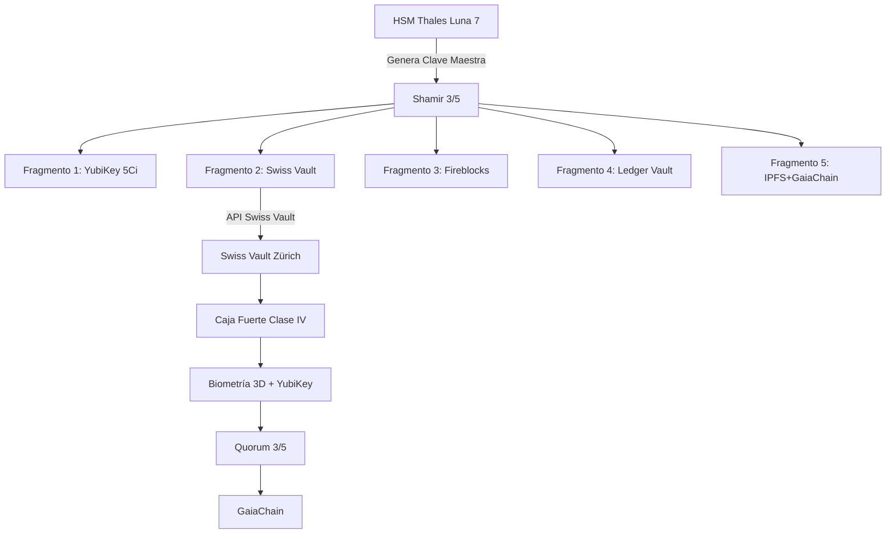

# Swiss Vault — Custodia física de alta seguridad (Zúrich)

**CASTÚO-SYSTEM™** — Almacenamiento del fragmento 2 (u otro) en bóveda física Swiss Vault (Zúrich): caja fuerte Clase IV, acceso con biometría 3D + YubiKey, quorum 3/5 y auditoría en GaiaChain.

---

## 1. Arquitectura



---

## 2. Configuración

| Variable | Descripción |
|----------|-------------|
| `SWISS_VAULT_API_KEY` | API key de Swiss Vault |
| `SWISS_VAULT_API_URL` | Base URL (por defecto `https://api.swissvault.ch/v2`) |
| `SWISS_VAULT_ID` | ID de bóveda (ej. `CASTUO-2026`) |
| `SWISS_VAULT_BOX_ID` | ID de caja (ej. `BOX-9876`) |
| `SWISS_VAULT_BIOMETRIC_TOKEN` | Token biométrico (opcional) |
| `GAIA_CHAIN_ADMIN_KEY` | Token para registro en GaiaChain |

---

## 3. Scripts

### Almacenar fragmento

**Flujo integrado (genera fragmentos y envía el 2):**

```bash
./scripts/security/store_fragment_in_swissvault.sh
```

Se solicita: contraseña maestra, contraseña Swiss Vault y OTP YubiKey. El fragmento no se pasa por argumentos.

**Fragmento por stdin (33 bytes):**

```bash
cat fragment2.bin | python3 scripts/security/swiss_vault_integration.py store 2
```

### Recuperar fragmento

```bash
python3 scripts/security/swiss_vault_integration.py retrieve <deposit_id> 2 > fragment2.bin
```

(Se pide contraseña y OTP YubiKey para login en Swiss Vault.)

---

## 4. API Swiss Vault (referencia)

- **Login**: `POST /auth/login` con `api_key`, `vault_id`, `yubikey_otp`, opcional `biometric_token`.
- **Depósito**: `POST /vaults/{vault_id}/boxes/{box_id}/deposits` con `items` (encrypted_data, metadata, access_policy).
- **Acceso**: `POST /vaults/{vault_id}/boxes/{box_id}/deposits/{deposit_id}/access` con `reason` y `quorum_approvals`.

En producción, consultar la documentación oficial de Swiss Vault.

---

## 5. Cifrado y registro

- Cifrado: AES-256-GCM con clave derivada por contraseña (PBKDF2-SHA512, 200.000 iteraciones). Sin contraseñas en código.
- Registro en GaiaChain: `POST /api/v1/emergency_fragment/swissvault` con `fragment_id`, `swissvault_deposit_id`, `vault_id`, `box_id`, `metadata`, `signature`.

---

**Referencias**: [Emergency-Keys-Shamir-HSM.md](Emergency-Keys-Shamir-HSM.md) | [Fireblocks-Custody.md](Fireblocks-Custody.md) | [Full-Implementation-Guide.md](Full-Implementation-Guide.md)
