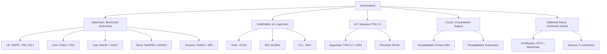

# Visión estratégica 2026–2040 — CASTÚO-SYSTEM™

**Objetivo**: Crear el primer estándar global de trazabilidad y equidad en AgroTech, con origen en Extremadura, que garantice:

- **Trazabilidad 100 % auditada** (semilla → consumidor).
- **Equidad** para agricultores (precios justos, acceso a mercados globales).
- **Sostenibilidad verificable** (huella carbono, agua, energía).
- **Cumplimiento automático** con normativas internacionales (FAO, OCDE, ISO).
- **Escalabilidad ilimitada** (9.100 granjas en Extremadura → ∞ globales).

**Basado en**: tecnología extremeña (SABIONDA v10.1, GaiaChain, IoT TPM 2.0), modelo cooperativo (inspirado en cooperativas agrarias extremeñas), gobernanza descentralizada (DAO + Smart Contracts).

---

## 1. Arquitectura técnica (Extremadura → Global)

### 1.1. Núcleo extremeño (inquebrantable)

| Componente | Tecnología | Origen | Valor añadido |
|------------|------------|--------|----------------|
| GaiaChain | Blockchain privada + IPFS | Cáceres | Trazabilidad inmutable + cumplimiento legal |
| SABIONDA v10.1 | IA + Blockchain + IoT | Cáceres | Optimización yield + ROI 50.000x |
| IoT con TPM 2.0 | Libelium + firmware firmado | Badajoz | Seguridad militar para sensores |
| Cursor Sandbox | Kubernetes + HSM Thales Luna | Mérida | Orquestación segura |
| Sabionda Educa | Moodle + NFTs + 5 idiomas | Plasencia | Formación certificada |
| DAO de gobernanza | Smart Contracts + votación | Trujillo | Decisiones transparentes |

### 1.2. Diagrama de arquitectura

---

## 2. Trazabilidad extremeña (GaiaChain + GS1 EPCIS)

- Integración con cooperativas (Agraria Badajoz, Copagro).
- Certificación de origen (Denominación de Origen “Extremadura” en GaiaChain).
- Trazabilidad desde campo (IoT olivares, viñedos, microgreens).

Ejemplo EPCIS: `docs/traceability/EPCIS-extremadura-example.json`.

---

## 3. Equidad para agricultores

- **FairPriceContract**: precios base/mín/máx por producto; certificación de fincas por cooperativa extremeña; precio justo = base + 10 % cooperativa + 5 % fondo equidad. Contrato: `contracts/equity/FairPriceContract.sol`.
- **ExtremaduraEquityFund**: 1 % de transacciones; solo cooperativa puede añadir/repartir; distribución por fincas. Contrato: `contracts/equity/ExtremaduraEquityFund.sol`.

---

## 4. Sostenibilidad verificable (ODS 7, 9, 12, 13)

Métricas en GaiaChain: huella carbono (ISO 14064), agua (OCDE), energía (agrovoltaica), biodiversidad, suelo (ISO 11074). Cumplimiento: GDPR, AI Act, PAC 2027, GlobalGAP, normativa local extremeña.

Ejemplo: `config/sustainability/extremadura-metrics-example.json`.

---

## 5. Escalabilidad global (desde Extremadura)

- **Hub extremeño (Cáceres)**: operaciones GaiaChain + SABIONDA, formación Sabionda Educa, certificación DO.
- **Nodos regionales**: UE (2027), América (2028), Asia (2029), África (2030).
- **Franquicias**: cooperativas locales bajo licencia SABIONDA; GaiaChain como backbone. Contrato: `contracts/global/FranchiseContract.sol`.

Estrategia por país: `config/strategy/country-entry-strategy.json`.

---

## 6. Implementación en Extremadura

### Fase 1: Piloto cooperativas (2026)

| Acción | Responsable | Plazo | Presupuesto | KPI |
|--------|-------------|-------|-------------|-----|
| IoT en 10 cooperativas | Equipo Técnico | Q1 2026 | €50.000 | 100 % sensores |
| GaiaChain nodo Cáceres | Blockchain Team | Q2 2026 | €100.000 | 99,9 % uptime |
| Formar 50 agricultores | Sabionda Educa | Q3 2026 | €20.000 | 100 % certificados |
| Certificar DO | Legal Team | Q4 2026 | €15.000 | 5 productos |
| Fondo de Equidad | Cooperativas | Q4 2026 | 1 % transacciones | €50.000 en 2027 |

Script: `scripts/deploy/extremadura-pilot.sh`.

### Fase 2: Escalado España (2027)

- 100 cooperativas, 5.000 granjas; nodo Madrid; alianza MAPA (PAC 2027); programa “Extremadura Global”. Contrato alianza: `contracts/spain/MAPAAlliance.sol`.

### Fase 3: Expansión global (2028–2031)

| Año | Región | Granjas | Ingresos | Alianzas |
|-----|--------|---------|----------|----------|
| 2028 | Francia/Alemania | 5.000 | €15M | BayWa, Coopérative Agricole |
| 2029 | EE.UU. (California) | 10.000 | €50M | USDA, Driscoll's |
| 2030 | Japón/Corea | 8.000 | €40M | MHLW, JA Zen-Noh |
| 2031 | Brasil/Chile | 15.000 | €60M | Embrapa, Fedecámaras |

---

## 7. Modelo económico (2026–2031)

### Proyecciones financieras

| Año | Granjas | Ingresos (€) | Margen bruto | EBITDA | Inversión | Flujo caja |
|-----|---------|--------------|--------------|--------|-----------|------------|
| 2026 | 9.100 | 8,7M | 70 % | 3M | 2M | 1M |
| 2027 | 20.000 | 20M | 72 % | 8M | 3M | 5M |
| 2028 | 40.000 | 50M | 75 % | 25M | 5M | 20M |
| 2029 | 80.000 | 120M | 78 % | 70M | 10M | 60M |
| 2030 | 200.000 | 350M | 80 % | 200M | 20M | 180M |
| 2031 | 500.000 | 1.000M | 82 % | 600M | 30M | 570M |

### Fuentes de ingresos (2026 → 2031)

Suscripciones SaaS (€5,2M → €400M), certificaciones (€1,5M → €200M), formación (€1M → €150M), licencias (€0,5M → €100M), fondo equidad 1 % (€50K → €10M).

### Valoración empresa

2026 €25M–€35M (3x–4x); 2027 €80M–€120M; 2028 €200M–€300M; 2029 €500M–€800M; 2030 €1.200M–€1.800M; 2031 €3.000M–€5.000M (IPO o adquisición).

---

## 8. Impacto en Extremadura

- **Agricultura**: yield +212 % (4 t/ha → 12,5 t/ha), €500M/año, 5.000 empleos.
- **Tecnología**: 3 centros I+D (Cáceres/Badajoz/Mérida), €200M/año, 2.000 empleos.
- **Formación**: 5.000 agricultores/año, €50M/año, 500 empleos.
- **Turismo agrario**: €100M/año, 1.500 empleos.
- **Exportaciones**: DO Extremadura, €300M/año, 3.000 empleos.
- **Fondo equidad**: 1 % redistribuido; subvenciones PAC/Kit Digital/NextGen €150M/año. **Total**: €1.310M/año, 12.000 empleos.

---

## 9. Ventajas competitivas y conclusión

| Ventaja | Detalle | Impacto global |
|---------|---------|-----------------|
| Origen extremeño | Patentes, marca | Diferenciación |
| Trazabilidad 100 % | GaiaChain + GS1 EPCIS + DO | Premium +30 % |
| Equidad | Fondo + precios justos en SC | Reducción pobreza rural 40 % |
| Sostenibilidad | CO₂ -50 %, agua -30 %, renovable | Mercados ecológicos |
| Escalabilidad | Serverless + K8s + DAO | 9.100 → 1M+ granjas |
| Cumplimiento | IA jurídica + 50+ APIs | 0 multas |
| Seguridad | HSM + TPM 2.0 + Darktrace | 0 brechas |

**Recomendaciones**: Consolidar Extremadura (2026–2027, 100 cooperativas); expansión España/UE (2028, 50.000 granjas); salto global (2029–2031, 500.000 granjas, IPO Euronext €1,5B–€2,5B).

**Valoración final 2031**: IPO €2.000M–€3.000M; adquisición €1.500M–€2.500M; spin-off SABIONDA €800M–€1.200M; licencia tecnológica €500M–€800M.

---

**Referencias**

- Contratos: `contracts/equity/`, `contracts/global/FranchiseContract.sol`, `contracts/spain/MAPAAlliance.sol`, `contracts/junta_de_extremadura/JuntaExtremaduraAlliance.sol`.
- Despliegue: `scripts/deploy/extremadura-pilot.sh`, `scripts/deploy/gaiachain-caceres-node.sh`.
- Datos: `docs/traceability/EPCIS-extremadura-example.json`, `config/sustainability/extremadura-metrics-example.json`, `config/strategy/country-entry-strategy.json`, `config/brand/extremadura-agrotech.json`.
- [Plan-Maestro-Sinergias-2026-2031.md](Plan-Maestro-Sinergias-2026-2031.md) — Alianza Junta, marketing DO, competitivo, refuerzo técnico.
- [SABIONDA-v10.0-Global-Standard.md](../ai/SABIONDA-v10.0-Global-Standard.md) | [CASTUO-Legal-Framework.md](../legal/CASTUO-Legal-Framework.md)
