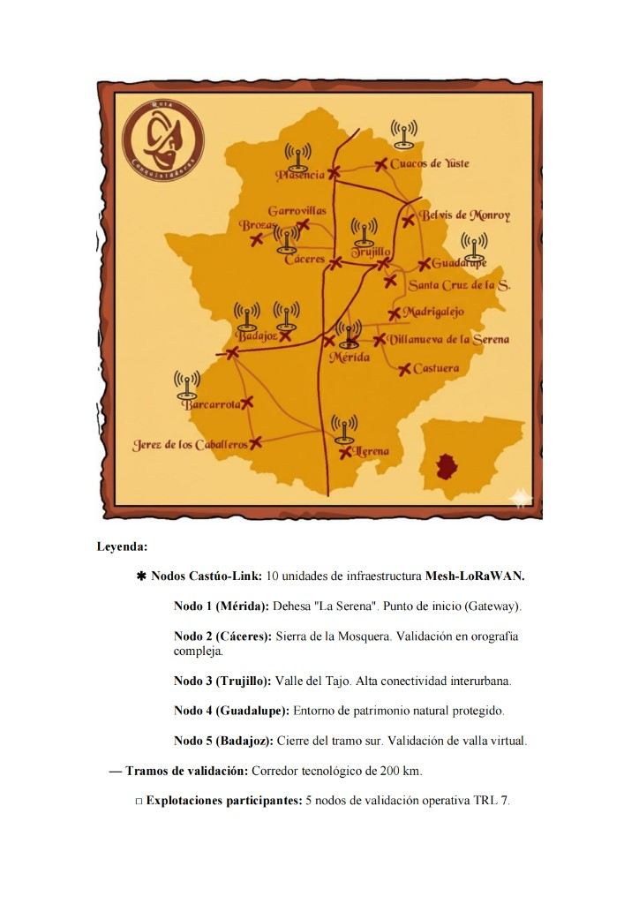
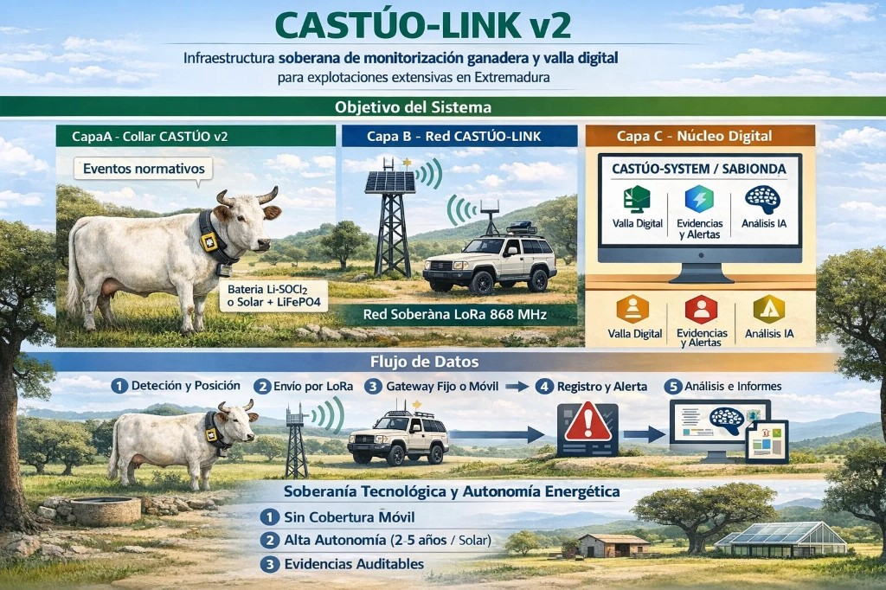
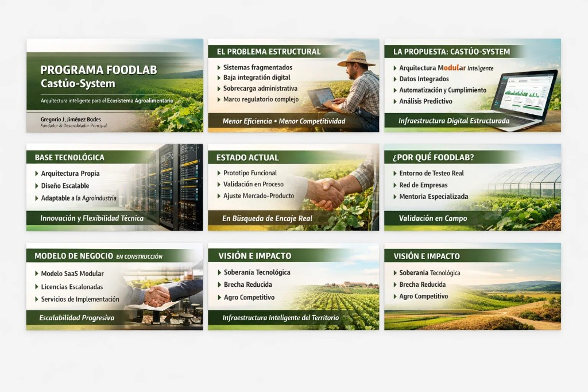
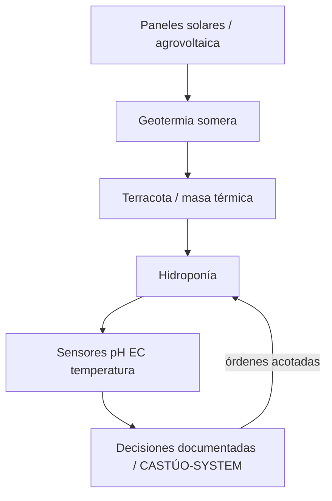

# Manual de formación — Cooperativa agrovoltaica Castúa + hidroponía inteligente

**Destinatarios:** socios/as, técnicos de campo y operadores de datos de una cooperativa que despliega **CASTÚO-SYSTEM** en un contexto **agrovoltaico** con **hidroponía asistida por sensores y decisiones documentadas**.

**Versión documental:** 1.1 · **Ámbito territorial:** Extremadura (dehesa, invernaderos mixtos, pilotos periurbanos comparables).

**Honestidad del repositorio:** este manual **ordena prácticas y objetivos**; no certifica subvenciones, patentes ni resultados de campo hasta informe de piloto. Las figuras son **ilustrativas** (ver §8).

**Relación:** [extremadura-agrovoltaica-terracota-2026.md](../../ops/pilotos/extremadura-agrovoltaica-terracota-2026.md) · [ARQUITECTURA-AGROVOLTAICA-API.md](../../ARQUITECTURA-AGROVOLTAICA-API.md) · [hidroponia.md](../../hidroponia.md) · [Training-Plan-2026-2027.md](../Training-Plan-2026-2027.md) · [PRONTUARIO-MAESTRO-CONSULTA-CRITICA-CASTUO-SYSTEM.md](../../legal/PRONTUARIO-MAESTRO-CONSULTA-CRITICA-CASTUO-SYSTEM.md) · [RUTA-CONQUISTADORAS-CASTUO-LINK.md](../../legal/RUTA-CONQUISTADORAS-CASTUO-LINK.md) (programa Castúo-Link / becas — planificación)

---

## 1. Introducción

**Objetivo:** formar en el uso **coordinado** de energía, agua, masa térmica (terracota), apoyo geotérmico y datos, para una agricultura **más eficiente en recurso hídrico** y **auditable** sin sustituir el criterio agrotécnico ni la normativa aplicable.

**Sistema cooperativa Castúa (resumen):**

- **Gobernanza:** decisiones colectivas sobre inversión energética, agua y política de datos (quién accede, con qué base legal).
- **Digital:** telemetría (pH, EC, temperatura, radiación), alertas y trazas alineadas a **contratos reales** del repositorio (API, IoT, auditoría donde aplique).
- **Territorio:** prioridad a **resiliencia** (cortes de red, olas de calor, sombra agrovoltaica).

---

## 2. Hidroponía inteligente

**Sistemas frecuentes en el marco Castúo / Sabionda (referencia técnica):**

| Sistema | Descripción operativa |
|---------|------------------------|
| **NFT (Nutrient Film Technique)** | Película nutritiva continua; exige pendiente y oxigenación adecuadas. |
| **DWC (Deep Water Culture)** | Raíces en volumen de agua; aeración activa crítica. |

**Sensores (prioridad en formación):**

| Parámetro | Rol |
|-----------|-----|
| **pH** | “Aliento” de la solución; deriva ⇒ estrés y bloqueo de nutrientes. |
| **EC** | “Riqueza” iónica; correlacionar con fase del cultivo y agua de partida. |
| **Temperatura** | Solución y, si aplica, aire invernadero; acoplar con terracota / geotermia. |
| **Oxígeno disuelto** (si procede) | Especialmente en DWC y recirculación. |

*Endpoints y despliegues concretos:* ver [hidroponia.md](../../hidroponia.md) y honestidad sobre puertos/entornos del clon.

---

## 3. Terracota y masa térmica

**Características:**

- **Modularidad:** paneles o piezas intercambiables según diseño del piloto (dimensiones en [extremadura-agrovoltaica-terracota-2026.md](../../ops/pilotos/extremadura-agrovoltaica-terracota-2026.md)).
- **Función:** amortiguación térmica pasiva bajo sombra agrovoltaica (objetivo a validar en ensayo).
- **Mantenimiento:** limpieza, revisión de juntas, fisuras y efflorescencias; registro en bitácora cooperativa.
- **Sensores:** temperatura en contacto o próxima a la masa; humedad ambiental correlacionada.

**Alineación piloto:** integración con riego, nutrientes y telemetría descrita en el documento de prototipo Extremadura 2026.

---

## 4. Geotermia

**Sistemas:**

- **Geotermia somera** (intercambiador / bomba de baja entalpía según proyecto): estabiliza temperatura de invernadero o de circuito hídrico; **no** sustituye gestión de pH/EC.
- **Acoplamiento con terracota:** cascada térmica (geotermia + masa de arcilla + sombra FV) — validar con datos antes de escalar potencia.
- **Indicadores:** impulsión/retorno, alarmas de fuga, rendimiento estacional.

**Requisitos:**

- **Permisos y licencias:** gestión administrativa **externa** a este manual (pozos, obra civil, ruido).
- **Obra civil:** integración con infra existente y plan de mantenimiento cooperativo.

---

## 5. Agrovoltaica

**Integración:**

- **Paneles fotovoltaicos:** electricidad para bombeo, control, comunicaciones; sombra parcial sobre cultivo (diseño de paso y cultivo compatible).
- **Riego y nutrición:** cuadrar horarios de bombeo con picos FV cuando sea posible; no comprometer uniformidad del NFT/DWC.
- **Monitoreo:** radiación, temperatura de módulo/suelo/cultivo; coherencia con alertas y umbrales documentados en el repo (`config/extremadura_climate.yaml`, marcos legales).

| Capa | Función | Riesgo si se omite |
|------|---------|-------------------|
| **Energía (FV)** | Sombra + kWh para servicios | Estrés térmico o déficit de potencia |
| **Agua y nutrición** | pH / EC estables | Deriva biótica |
| **Datos** | Calibración y retención acotada | RGPD / decisiones con ruido |
| **Personas** | Inspección física | Fallos que el dashboard no ve |

---

## 6. Red territorial Castúo-Link y figuras (corredor de validación — ilustrativo)

En entornos **sin cobertura móvil estable**, el diseño de referencia combina **mesh / LoRaWAN** hacia **gateways** y **backhaul** cuando exista. El mapa tipo **“Ruta Conquistadores”** resume una **narrativa de corredor tecnológico en Extremadura** (nodos conceptuales Mérida, Cáceres, Trujillo, Guadalupe, Badajoz, etc.):  

> **Matiz veraz:** cifras de nodos, kilómetros de corredor o TRL indicadas en material gráfico son **objetivos o storytelling de planificación** hasta respaldarse con **informes de piloto** y actas; este repositorio no las certifica por sí solo.

**Flujo de datos (collar / campo → núcleo digital):**

*Secuencia didáctica:* detección y posición → envío LoRa → gateway fijo o móvil → registro y alerta → análisis e informes.

**Programa FOODLAB / narrativa ecosistema:**

---

## 7. Diagrama integrador (agrovoltaica — geotermia — terracota — hidroponía)

---

## 8. Módulos de formación sugeridos (16–24 h)

| Módulo | Contenidos | Duración orientativa |
|--------|------------|----------------------|
| M1 | Agrovoltaica cooperativa: sombra, cultivo, reparto energético | 3 h |
| M2 | **Terracota** + monitorización térmica | 3 h |
| M3 | **Geotermia** + permisos y mantenimiento | 3 h |
| M4 | Hidroponía NFT/DWC: pH, EC, OD, calibración | 4 h |
| M5 | Red Castúo-Link / datos / RGPD mínimo en campo | 3 h |
| M6 | Taller en instalación o invernadero piloto | 4–8 h |

**Evaluación:** checklist de competencias + práctica conjunta de calibración.

---

## 9. Notas legales sobre figuras

> **Las imágenes incluidas tienen carácter ilustrativo y representan el concepto funcional del ecosistema Castúa / Castúo-System; no sustituyen la documentación técnica oficial, pliegos, ni certificaciones de producto o despliegue.**

---

## 10. Enlaces cruzados

| Documento | Uso |
|-----------|-----|
| [Training-Plan-2026-2027.md](../Training-Plan-2026-2027.md) | Calendario y presupuesto formación |
| [extremadura-agrovoltaica-terracota-2026.md](../../ops/pilotos/extremadura-agrovoltaica-terracota-2026.md) | Piloto terracota + geotermia en diagrama |
| [hidroponia.md](../../hidroponia.md) | Referencia técnica hidroponía / endpoints |
| [PRONTUARIO-MAESTRO-CONSULTA-CRITICA-CASTUO-SYSTEM.md](../../legal/PRONTUARIO-MAESTRO-CONSULTA-CRITICA-CASTUO-SYSTEM.md) | Consulta crítica y excelencia operativa |
| [RUTA-CONQUISTADORAS-CASTUO-LINK.md](../../legal/RUTA-CONQUISTADORAS-CASTUO-LINK.md) | Programa territorial Castúo-Link + becas (planificación) |

---

## 11. Próximos pasos cooperativos

1. Designar **responsable técnico** y **responsable de datos** (DPO si aplica).  
2. Vincular el manual al **plan de piloto** y revisiones trimestrales.  
3. Registrar lecciones aprendidas en documentación versionada o expediente cooperativo.

---

*Manual de formación — CASTÚO / Castúa. El agua bien gobernada nutre el territorio; el dato sin validación lo seca.*
