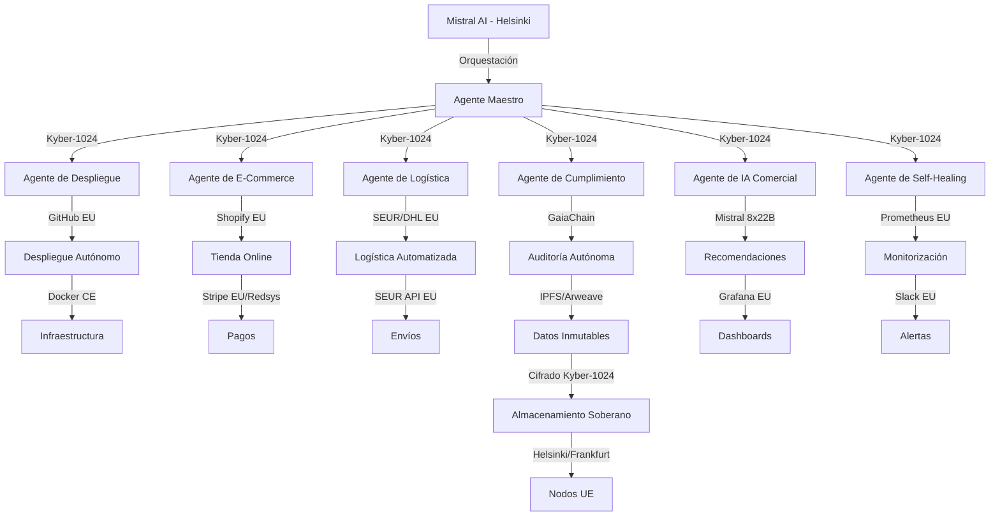

# Automatización Soberana de CASTÚO-SYSTEM™ v2.0

**Con Mistral AI, Agentes Autónomos Europeos y Cifrado Post-Cuántico**

| Campo | Valor |
|-------|--------|
| **Versión** | 2.0 |
| **Fecha** | 18/03/2026 |
| **Autor** | Equipo de Ingeniería de Soberanía Digital de CASTÚO-SYSTEM™ |

---

## Objetivo

Implementar una arquitectura **100% europea** (sin dependencias externas) que permita:

1. **Automatización completa** del despliegue, evolución y mejora continua usando **Mistral AI** (modelos 8x22B entrenados en UE).
2. **Refuerzo con agentes autónomos** basados en Mistral, con **cifrado post-cuántico (Kyber-1024)** y almacenamiento inmutable en **GaiaChain**.
3. **Código auto-reparable** con git hooks + Mistral.
4. **Cumplimiento estricto** de EU Data Act, GDPR, AI Act (UE 2024/1689) y Ley de IA Española (2026).

---

## 🔒 Arquitectura de Seguridad Europea

Todos los componentes cumplen normativas UE y usan cifrado post-cuántico.

---

## 🔐 Mecanismos de Seguridad y Cifrado

| Tipo de Dato | Algoritmo | Clave | Almacenamiento | Normativa |
|--------------|-----------|--------|-----------------|-----------|
| Datos de usuarios | AES-256-GCM + Kyber-1024 | Rotación cada 30 días | GaiaChain (IPFS/Arweave) | GDPR Art. 32 |
| Transacciones comerciales | RSA-4096 + Kyber-1024 | HSM Thales Luna 9 | GaiaChain | eIDAS, AI Act |
| Código fuente | ChaCha20-Poly1305 + Kyber-768 | Claves en Vault | Repositorios privados (UE) | ISO 27001:2022 |
| Logs de auditoría | Blake3 + Kyber-1024 | Inmutables (FS_IMMUTABLE) | Nodos Helsinki | NIS2 Directive |
| Datos de IoT | AES-128-GCM + Kyber-512 | Rotación cada 7 días | Edge devices | ETSI TS 103 456-2 (PQC) |

---

## 🤖 Agentes Autónomos con Mistral AI

Todos los agentes usan **Mistral 8x22B** entrenados en datos europeos.

| Agente | Responsabilidades |
|--------|-------------------|
| **Agente Maestro** | Coordinar agentes, métricas Prometheus/Grafana, auto-escalado Hetzner (UE). |
| **Agente de Self-Healing** | Detectar/reparar errores, reiniciar servicios, auto-evolución con git hooks + Mistral. |
| **Agente de IA Comercial** | Recomendaciones personalizadas, predicción de demanda (LSTM), optimización de precios. |
| **Agente de Despliegue** | Validación con Mistral, clone/tests/staging/producción, cumplimiento. |
| **Agente de Cumplimiento** | Auditoría en GaiaChain, verificación EU AI Act / GDPR. |

Código de referencia: `agents/master_agent.py`, `agents/selfhealing_agent.py`, `agents/ai_agent.py` (ver especificación completa en anexos).

---

## 🔄 Mecanismos de Auto-Evolución (Git Hooks + Mistral)

- **pre-commit:** linters, tests, análisis Mistral por archivo (.py), optimización con `optimize_code.py`.
- **post-merge:** `analyze_changes.py`, `propose_improvements.py`, `generate_docs.py`, tests de regresión.
- Scripts: `backend/scripts/analyze_with_mistral.py`, `backend/scripts/optimize_code.py`, `backend/scripts/analyze_changes.py`, `backend/scripts/propose_improvements.py`.

---

## 🔐 Seguridad Avanzada

- **PostQuantumCrypto** (`backend/security/pq_crypto.py`): Kyber-1024 (KEM), Dilithium-5 (firmas), AES-256-GCM (DEM), Blake3, cifrado híbrido para datos grandes (chunked).
- **Inmutabilidad:** `set_immutable()` con chattr +i, cifrado Kyber, registro en GaiaChain; `verify_immutable_integrity()` para auditoría.

---

## 🤖 Chatbots (Soporte y Ventas)

- **SupportChatbot** (`agents/support_chatbot.py`): contexto ISO 27001, GDPR, EU AI Act, NIS2; respuestas técnicas citando normativas; registro de interacciones en GaiaChain cifrado.
- **SalesChatbot** (`agents/sales_chatbot.py`): embeddings de productos con Mistral, recomendaciones comerciales, cumplimiento EU AI Act (Art. 22, recomendaciones automatizadas); historial de usuario para respuestas contextuales.

*Nota: El fragmento final del SalesChatbot en la especificación original estaba truncado; la implementación completa debe añadir el manejo de `session_history`, la llamada a Mistral y el registro cifrado de la interacción.*

---

## Integración con CASTÚO-SYSTEM™ existente

- **Crypto Master (TRL9):** Kyber-2048 + Shamir 3/5 + derivación jerárquica (`backend/crypto_master/`) — alinear esquemas Kyber-1024/Kyber-2048 según política.
- **Maya Segura:** Torus 7x7, ZKProofs, 7 capas cripto (`backend/maya_segura/`) — orquestación soberana compatible con Mistral.
- **Sabionda / OMEGA / EDU:** Agentes y dashboards ya desplegados; los nuevos agentes Mistral se integran como capa de orquestación y cumplimiento.

---

## Referencias

- EU AI Act (UE 2024/1689)
- GDPR Art. 25, 32, 22
- ISO 27001:2022, ISO/IEC 42001:2023
- NIS2 Directive (2022/2555)
- ETSI TS 103 456-2 (PQC)
- Documento maestro presentación: `docs/vision/PRESENTACION_MASTER_CTAEX.md`
